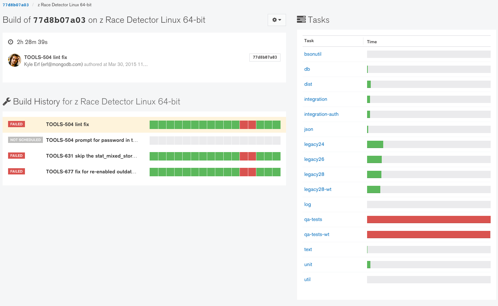

# Read Evergreen Results

This guide is meant as a quick reference for familiarizing yourself with reading results generated by the Evergreen continuous integration system.
The first time you saw Evergreen, you may have thought something like "well green is probably good and red is probably bad but I have no idea what I'm looking at."
Don't worry, though!
You'll find navigating Evergreen to be simple (and fun) once you have some direction.

## Models
In order to understand how Evergreen is laid out, it is essential to grasp its hierarchy of organization.
There are only a few main entities in Evergreen:

1. Project -- a given git branch being tracked
2. Version -- a single commit in a project
3. Variant -- an environment for running tests in; each version in a project can be run on multiple variants (e.g. Windows/Linux/OSX/Solaris, Enterprise, SSL-enabled, etc.)
4. Task -- a unit of work (usually a suite of tests or a compile); tasks are run in the environment established by the variant

In short, each commit to a git branch results in a new version, which runs multiple variants that each run a set of tasks.

## Project Visualizations

There are three ways to get a view of the state of a project:

## Waterfall

This is Evergreen's default view.
It displays a set of columns, each represents a version (commit) to the current project, the most recent commit being on the left (unlike it's namesake geographic formation, Evergreen's waterfall moves from left to right).
Each row in the column is a build variant, and each bar in a row is a task.
The tasks are colored green for success, yellow for in-progress, and red for failure.
Blank bars are not scheduled to run and gray bars are scheduled but waiting for execution. 
You can click on any task in order to see its task page, which contains detailed information and logs.

## Timeline

This view displays each version in a more verbose way than the waterfall page.
Each version is presented in its own section of the page, with each variant given its own box within that section. 
The variant headers or tasks can be clicked on for more information.

## Grid

This view shows the state of a single version.
It displays each task as a square in a grid of build variants plotted against tasks.
Clicking on a square will open a pop-up with task history information.
This view should be more familiar to users of other continuous integration tools, like Jenkins.

## Version, Build, and Task Visualizations

## Versions

The version page is mostly here to get you to other pages.
The page contains links to each build variant and task created for the given version. 
A panel on the right displays a condensed history of the versions for the commits surrounding it.

## Builds

The build page shows the status of one of a version's variants (e.g. Windows32 on commit 0bed4262da). 
This page shows the status and time taken by each of the variant's tasks.
The most recent completely-passing version for a build is given in the lower-left.

## Tasks

This is probably the page you'll be spending the most time with.
Versions and build variants are the skeleton holding up Evergreen; tasks are the organs and muscles.

The task page contains execution information of one task for one variant in a version.
It offers the results and logs of the tests executed as part of the tasks (right panel) and general logs from the task's execution (bottom panel).
On the left side of the screen, you can see the history for that task across version, along with test failure information.
This sidebar is your best friend when it comes to diagnosing test failures.

## Task Statuses

Evergreen's New UI has the following task statuses.  These statuses are described below. 
> 

* Succeeded - Task completed successfully
* Failed -  Task has failed. A task can fail either because a test failed or because a task command exited non-zero.
* Known Issue - This is a subset of Failed, and it means that a failed task contains a task annotation with a non-empty issues list.  Task annotations can be created by external services such as the Build Baron team’s failure triage tool, or can be added manually.  Task annotation permissions are managed through MANA. 
* Setup Failed -  Users can set a default failure type of "test", "system", or "setup". They can also set that type for individual commands. These cause a failing command to turn the task into a test (red), system (purple), or setup (lavender) failure.
* Task Timed Out -  A task timed out, whether due to a large cumulative time taken or a large amount of time for one single command.  Evergreen tasks have a default timeout duration of 6 hours, and Evergreen commands have a default timeout duration of 2 hours. [There](../01-Configure a Project/01-Project-Configuration-Files.md#pre-post-and-timeout) are two types of timeouts in Evergreen, exec_timeout_secs and timeout_secs, and they are further documented here. 
* Dispatched - Evergreen has started to dispatch a task to a host, but the task is not yet being executed. 
* Running - Task is currently running. 
* Will Run - Task is in the task queue and will run in the future. Hasn’t been dispatched. 
* Pending - Pending tasks have unmet dependencies, but they will be queued to run.

* System Unresponsive - System unresponsive means that the task has failed because Evergreen has not heard from the agent on that host in a while. 

* System Timed Out - System timed out means that there was a timeout (exec_timeout_secs or timeout_secs was reached) and the running command was labeled "system" (as opposed to "test" or "setup").

* System Failed - Either a host was reaped or the host was terminated by AWS for some reason or the task has failed and the failing command was labeled “system” on the project’s YAML, as opposed to “test” or “setup”. 
* Aborted - Task was aborted, either by the user or by Evergreen. There are several ways to abort a running task. For example, users can manually abort a task from the task page, and they can abort all running tasks from the UI or CLI when restarting a patch. Additionally, tasks can be aborted by Evergreen in scenarios where doing so would conserve execution resources. For example, Evergreen can abort tasks in a given commit queue build, if any one task fails in that commit queue build, since there's no need to continue executing the build in that case.  For PR-based workflows, a patch is created when you open a PR, and a new commit aborts all running tasks associated with the patch and creates a new patch. 
* Blocked -  Task is blocked on a dependency, and the dependency has finished with a status other than the one the task depends on. If the task is configured to override dependencies the task will be set to run instead. 
* Unscheduled - Unscheduled tasks are not scheduled to run, and require action from the user in order to be executed by Evergreen.

### Task Lifecycle
Broadly, the state of any given task can be described by one of 3 fundamental stages: **scheduled, in-progress, and finished.** The stage that a task is in dictates what operations are permitted on it by the user.
#### Scheduled
Statuses that correspond here are:
* Pending
* Will Run
* Dispatched  

This indicates that the task has yet to begin executing, but Evergreen has the intention of executing the task in the near-future. Since these tasks have not yet begun executing, they cannot be restarted nor can they be aborted. If you wish to prevent a scheduled task from being executed, you may unschedule it and Evergreen will ignore it until it is re-scheduled. For tasks that are not yet in the dispatched category, the priority for a task may also be modified, where a higher priority (up to 100) will prioritize the task running relative to other scheduled tasks, and the minimum priority that can be se is -1, which is akin to manually unscheduling a task.
#### In-progress
Statuses that correspond here are:
* Running 

A running task cannot be re-scheduled, and it cannot be restarted directly. We must either wait for it to complete, or we may prematurely abort the task, causing it to fail, at which point we may restart the task. Note that the task will likely not be able for restart immediately after it is aborted because clicking abort simply marks the task to get aborted, and it usually takes Evergreen a few seconds to notice this and stop the task's execution.
#### Finished
Statuses that correspond here are:
* Succeeded
* Failed
* Known Issue
* Setup Failed
* Task Timed Out
* System Unresponsive
* System Timed Out
* Aborted
* Blocked

These tasks may be immediately restarted, but they cannot be aborted or scheduled since they have already completed.

