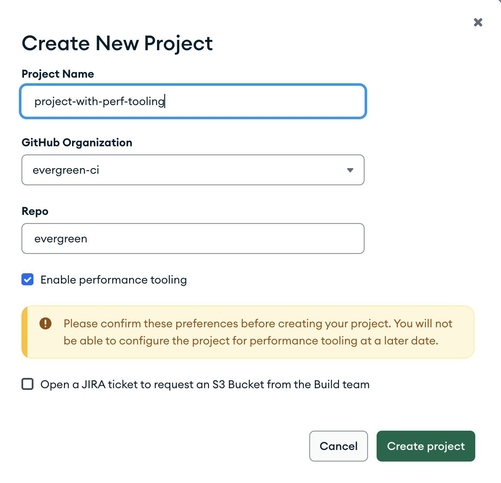

# Create Evergreen Projects

This guide is meant to help users create their own projects on Evergreen. 

## Authorization

To have access to create a project you must be either a super user or the admin of an existing project.
If you do not see the `New Project` button on the [project settings page](https://spruce.mongodb.com/project/YourProject/settings/general), or do not have access to the project settings page, create a JIRA ticket with the necessary information from the steps below.

Note that that projects can only be created in spruce as it has been deprecated from the legacy UI.

## Steps to Create

1. Visit the projects page in the new UI https://spruce.mongodb.com/projects/.
2. Click New Project. If you want to copy the current project, click Duplicate Current Project. Otherwise, click Create New Project.
3. Enter the project name, repo org ("Owner"), and repo name ("Repo").
4. **Do not set a Project ID unless you want to use the performance plugin.**
5. If this project needs AWS credentials for S3 bucket access, click the check mark to open a JIRA ticket. (You should see the JIRA ticket under "reported by me.")
6. Click "Create New Project".

## Limitations

Because Evergreen can only support so many projects, there are limitations to the number of projects that could be enabled. 
There is a total project limit, the total number of projects that Evergreen is currently willing to support, 
and a project per repo limit, a limit to the number of enabled projects that share the same GitHub owner and repo. 

If your GitHub owner and repo needs more than the allotted number of projects, create a JIRA ticket and request to override the repo limit.