# Commit Queue

Evergreen's commit queue merges changes after the code has passed a set of tests.

## Rationale 
Gating every merge on a green build means every commit on the tracked branch had a green build. This way: 
* No one bases their work on broken code.
* Every commit on the mainline branch is potentially releasable/deployable.

## Workflow
The following is what logically happens, though Evergreen will parallelize tests for speed.
1. Changes are ready to be introduced to the repo.

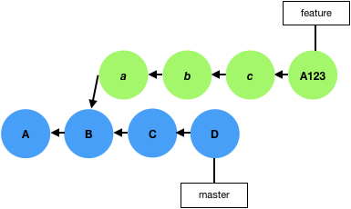

2. The changes are added to the end of the commit queue.

3. When the changes come to the front of the queue, a set of tests are run on the changes.
 
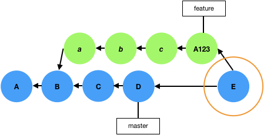

4. If the tests pass, the merge commit is pushed to GitHub.

## Modes of Operation
Changes can be added to the commit queue from pull requests, the CLI, or the UI.
### PR
For projects that use GitHub pull requests for code review, the commit queue integrates with the PR workflow. When the PR is approved and ready to be merged, changes are added to the queue through the PR and commit queue feedback is provided in status checks on the PR.
#### Trigger
Add a PR to the commit queue by adding a comment on the PR: `evergreen merge` 

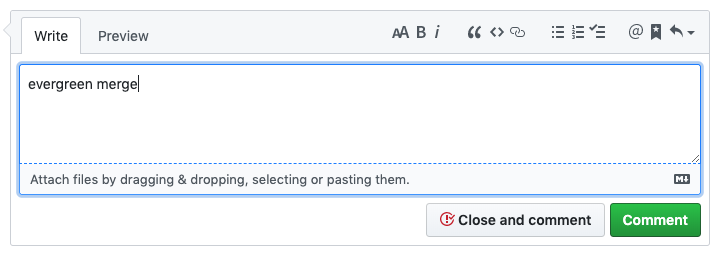

If successful, the PR will be merged with the PR title as the commit title. Any text after a newline in the "evergreen merge" comment will be added as the commit message.

#### Feedback
Evergreen sends a status to the PR when the changes are enqueued, when the merge test has begun, and when the merge test is complete. Once the merge test has begun, the status links to the version. Note that because the commit queue merge is itself a Github check, you should omit the "evergreen/commitqueue" check from branch protection settings, if you require that checks pass before a PR can merge.

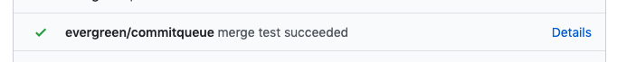
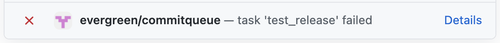

#### Set-Module
NOTE: this feature isn't currently working as expected. Fix is being tracked in [EVG-18256](https://jira.mongodb.org/browse/EVG-18256).
Add other PRs for repos defined as modules in the project's configuration file with the `--module MODULE:PR` option to the `evergreen merge` comment, where MODULE is the name of a module defined in the evergreen.yml project configuration file and PR is the PR number in the module's repo. When the test passes all the PRs will be merged. The option can be repeated for multiple modules. For instance: 

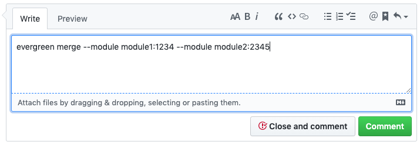

The module can only be set when initially adding the main PR to the commit queue since the test is immediately finalized.

### CLI
For projects using other code review tools, changes can be uploaded to Evergreen using the `evergreen commit-queue` subcommands in the Evergreen CLI. 
#### Trigger
`evergreen commit-queue merge --project <project_id>`

Enqueue the branch checked out in Git on the project's commit queue to be merged into the project's tracked branch.

##### Options
* `--pause`

Upload the changes, but don't begin to test the changes. Used in conjunction with `evergreen commit-queue set-module` when the changes include corresponding changes to a module.

* `--resume [ID]`

Enqueue changes previously uploaded and paused. [ID] is the patch ID printed to the console when uploading the paused (unfinalized) patch.

* `--commits [value], -c [value]`

Pass in either a single commit hash, or a range `<commit_hash1>..<commit_hash2>` where `<commit_hash1>` is excluded from the range, and hash1 is an ancestor of hash2.

* `--force` 

This flag forces the item to the front of the queue. Use this sparingly and only for urgent scenarios, such as an urgent revert.

#### Feedback
The merge is performed by a "Commit Queue Merge" task added to the patch when the changes reach the head of the queue.

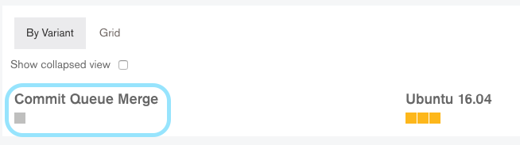

#### Set-Module
`evergreen commit-queue set-module --patch <id> --module <module>` 

Add changes to a project module.

##### Options
* `--patch [ID], --id [ID], -i [ID]` 

Add to patch ID created with `evergreen commit-queue merge --pause`

* `--module [module], -m [module]`

Module name as defined in the project configuration file.

##### CLI Set-Module Workflow
1. Upload the main changes to Evergreen. Retain the patch ID printed to the console.

`evergreen commit-queue merge --pause ...`

2. For each module to be merged, add the module to the patch

`evergreen commit-queue set-module --id <id> ...`

3. Enqueue the changes on the commit queue

`evergreen commit-queue merge --resume <id> ...`

### UI

You can enqueue a **successful** patch to the commit queue using the Add to Commit Queue button (assuming that you own the patch or are a project administrator).

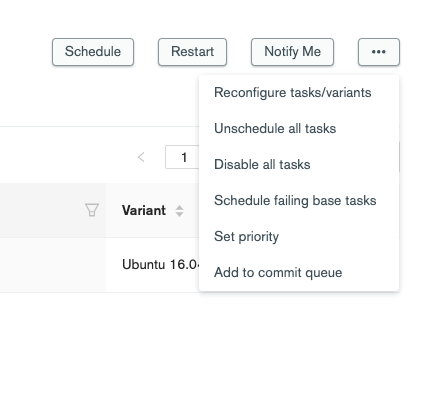

All commits in the patch will be squashed, unless the patch was created using `--preserve-commits`. In this case, the commits will be tested together but merged separately. The title of the testing patch will be "Commit Queue Merge: <commit 1> <- <commit 2>" and if merged successfully, each commit will be merged with the commit title (<commit 1> in the testing patch).

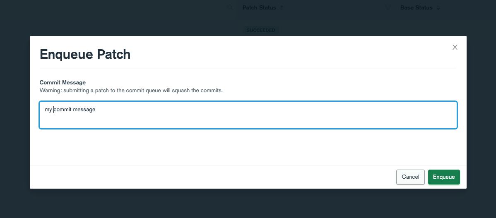

## Notifications
Adjust your notifications on commit queue milestones on the [Notifications page](https://evergreen.mongodb.com/notifications).

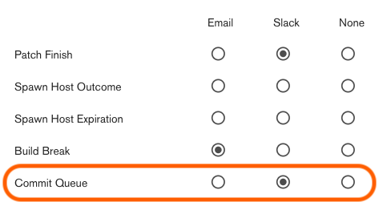

Milestones include:
* Changes reached the head of the queue and merge test has begun.
* Merge test passed/failed

## Configuration
Project admins configure the commit queue through the [Projects page](https://spruce.mongodb.com/projects) in the Evergreen UI. Some settings are only available on spruce, so using the legacy UI for project settings is not recommend. On a per project basis, admin can
* Enable and disabled the commit queue
* Add a message to the commit queue 
* Choose the [GitHub merge method](https://help.github.com/en/articles/about-merge-methods-on-github) (squash, merge, or rebase)
* Chose if signed commits are required 
* Chose how many approvals are required on pull requests before they can be enqueued 
* Add/remove patch definitions for tests to be run against PRs (tags or variant and task regexes)

## Queue Monitoring
The commit queue for a specified project can be viewed in the [web UI](https://spruce.mongodb.com/commit-queue/mongodb-mongo-master)
Additionally, the Evergreen CLI exposes two subcommands under `evergreen commit-queue` to monitor the commit queue 

### List
`evergreen commit-queue list --project <project_id>`

List the items on one project's queue.

#### Options
* `--project PROJECT, -p PROJECT` list the queue of PROJECT

### Delete
`evergreen commit-queue delete --item <item>`

Delete an item from a queue. Must be the user who uploaded the item or a project admin.
If the item is already picked up by the commit queue it will not be aborted.

#### Options

* `--item ITEM, -i ITEM` 

delete the ITEM specified. 
Item can be either the patch ID or PR number (if applicable)

## Backport
Trivial backports can be automated with the commit queue. Create a backport patch to test the changes on the target branch, choosing the tasks necessary to validate the changes on the target branch. When the backport patch passes the changes are automatically added to the target branch's commit queue. **The backport patch is not added to the commit queue until tasks chosen have passed.**

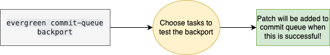

### Creating a backport patch
`evergreen commit-queue backport`

#### Options
* `--backport-project, -b`

Select the project corresponding to the target branch to backport onto.

* `--alias, -a`, `--variants, -v`, `--tasks, -t`

Specify the tasks to run in the backport patch.

* `--commit-sha, -s`, `--existing-patch, -e` (mutually exclusive)

Specify changes to backport. `--commit-sha` specifies a single commit to cherry-pick on top of the target project's tracked branch. `--existing-patch` is the id of an existing commit queue patch in another project to pull changes from.

## FAQ
> The merge test for a PR failed.  How do I resubmit?

Fix the PR and type another triggering comment. Do not restart the failing task.

> The commit queue hasn't picked up my changes for a while.

Check your position in the queue with the CLI. Evergreen checks the head of each queue about once a minute.

> My project's branch is protected and only signed commits can be merged. Can I use the commit queue?

Yes, but only if you add to the commit queue from pull requests.

> What will the commit message be?

For PRs, the commit message will be any text you type after the "evergreen merge" comment, separated by a newline. The commit title will always be the same as the PR title.

If submitted by the CLI, the commits are recreated from the commits in your local repo and will retain their messages.
