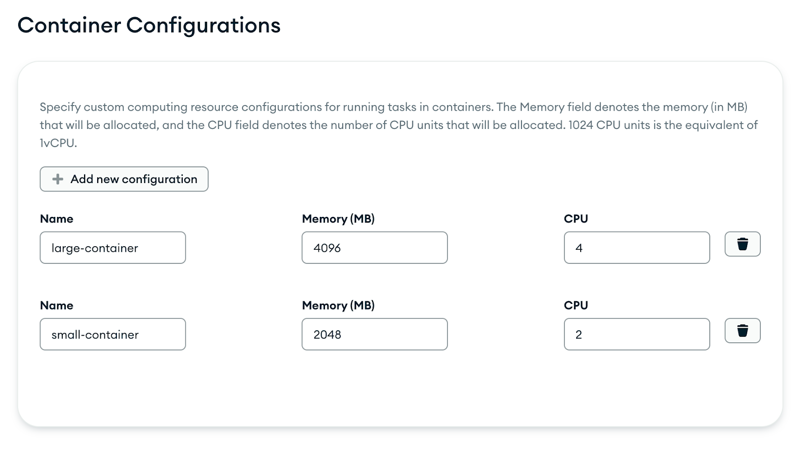
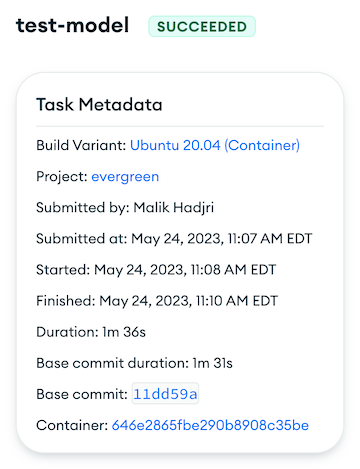

# Containerized Tasks Overview

We're excited to introduce the ability to run Evergreen tasks in
containers!

This offering is designed to streamline work and reduce friction caused
by software dependency requirements. Greater flexibility and control
over task environments is achievable with containers, ensuring that each
task runs in an isolated, dedicated space with its own specific set of
software dependencies.

## Warning: Container tasks are new and subject to ongoing changes

Container tasks at this time are subject to (potentially substantial) change as we iterate further on our
container roadmap. The feature may have bugs as it is not currently as battle-tested as our host-based infrastructure,
which should be considered if your goal is to port over a critical workflow to container tasks.

If you have any questions about container tasks or are interested in
exploring how this feature could benefit your project, we encourage you
to reach out to us in ***#evergreen-users***. We'll discuss its
potential applications and assist you in preparing for its broader
release.

It's important to distinguish that this feature is entirely separate
from the existing functionality Evergreen has to spin up docker containers
via the host.create command, as this feature is designed to run entire
tasks within containers, rather than spinning them up within the
existing model.

This feature is also distinct from the existing distro-based Docker
pools. These were created with the aim of running containers within our
existing host pool by having containers operate the Evergreen agent
inside our EC2 hosts that we initiated. However, this solution was slow
due to the necessity of the container distro rebuilding its image every
time the agent was released, which led to increased latency. It also
lacked flexibility of image choice, and each host could only run a
maximum of one container at a time, and the same container was also used
across tasks, leading to reusability issues.

This offering aims to be an improvement that addresses these issues by
leveraging the advantages of native containerization, enabling better
speed, flexibility, and efficiency for running tasks.

## What's Different

While tasks running on containers come with the same general
capabilities you're familiar with in regular host tasks, ultimately they
are not hosts themselves, meaning certain low-level system processes
such as systemd present on the host that may not be readily available
within a container. To learn more, the [docker security
documentation](https://docs.docker.com/engine/security/) explains the
features of Docker's isolation model. There are a couple of differences
to note as we roll out this new feature:

1.  Task Groups: The initial release of container tasks does not support
configuring task groups. This is something we aim to support in
future iterations.

2.  Priority: The priority setting feature will not be available during
the initial release for container tasks.

3.  Greater configurability: When running container tasks, resources
such as CPU and memory usage must be explicitly configured, unlike
in the current distro model. Users are also free to bring their own
custom image to use, where only the software dependencies required for
their particular workflow are downloaded during runtime. Furthermore, 
the container your task runs on is dedicated solely to that task and is not 
reused, so you are free to do whatever you want with it without needing to worry about
leaving the environment in a messy state for the next task.

## How To Get Started
This section will walk you through the steps to get started with running container tasks in Evergreen,
which are at a high level as follows:
1. Create your Dockerfile in accordance with our existing [secure image
   policy](https://docs.google.com/document/d/1MMePuL5YBjJQcNdtwzU2kMLPSsRLzDyE0rhTVkmXDqo/edit).
2. Follow the image creation and management steps [here](#creating-and-managing-your-container-images) to obtain a usable image URI
to run container tasks on.
3. Configure to your project YAML via the steps [here](#update-your-yaml-configuration) 
to create a variant that uses the new image and runs tasks in containers.
4. Schedule the tasks in your new container variant in a patch to test your changes.

### Creating a Dockerfile

Due to the fact that the custom images used for container tasks in Evergreen must follow company-specific
security requirements, Evergreen does not support using arbitrary images for container tasks, and the custom
Dockerfile you use must adhere to these [requirements](https://docs.google.com/document/d/1MMePuL5YBjJQcNdtwzU2kMLPSsRLzDyE0rhTVkmXDqo/edit).
At the moment, our image security automation is still [under
development](https://docs.google.com/document/d/1MMePuL5YBjJQcNdtwzU2kMLPSsRLzDyE0rhTVkmXDqo/edit#heading=h.ghiwibz2opmd),
so for the time being, you may create your own Dockerfile for use in container tasks but R&D Dev Prod will be temporarily
housing your Dockerfile in a managed [repository](https://github.com/evergreen-ci/container-initial-offering-dockerfiles).


### Creating And Managing Your Container Images

The following is the process by which you can create a usable image from your custom Dockerfile:

1.  Ensure you are properly permissioned to stage PRs in the centralized image
    repository, which hosts Dockerfiles for all teams participating in the
    experimental offering of running container tasks in Evergreen.
    Permission can be requested from MANA [here](https://mana.corp.mongodbgov.com/resources/64c464185f1589fbe7faec38).
2.  Stage a PR against the repo containing a relevant Dockerfile under a new directory
    that has the name of your project. Review should be requested from
    **evergreen-ci/evg-app**, and the PR's approval will be contingent
    on the Dockerfile following the [secure image
    policy](https://docs.google.com/document/d/1MMePuL5YBjJQcNdtwzU2kMLPSsRLzDyE0rhTVkmXDqo/edit)
    that we currently have in place.
3.  The PR, when approved and merged into the main branch, will trigger an automated Drone pipeline which
    builds the image and pushes it to Amazon Elastic Container
    Registry (ECR). You may then reference the URI of the newly built image.
    Its format will be as follows:
    
    > **557821124784.dkr.ecr.us-east-1.amazonaws.com/evergreen/&lt;DIRECTORY&gt;:&lt;SHA&gt;**

    Where **&lt;DIRECTORY&gt;** is your project's directory name in our image
    repository. For enhanced security, we need to use immutable image
    tags, so rather than the typical ":latest" tag, image URIs in your
    Evergreen YAML must also use a **&lt;SHA&gt;** tag, which would be the hash
    of the corresponding commit in our [image repository](https://github.com/evergreen-ci/container-initial-offering-dockerfiles).

The following is a template Dockerfile that abides by our [image
policy](https://docs.google.com/document/d/1MMePuL5YBjJQcNdtwzU2kMLPSsRLzDyE0rhTVkmXDqo/edit) and
includes commonly used tools and packages (e.g. Go, Python, NodeJS, etc.)
that you can copy/paste and use as a reference for creating your own. Note that directly copying and pasting this
Dockerfile isn't recommended as it may not be up to date with the latest versions of the tools and packages it installs.

``` dockerfile
# Use an approved base image
FROM ubuntu:latest

# Required label that points to an owning team, per our image policy
LABEL mongodb.maintainer="Your Team Name <team-email@company.com>"

# Update package inventory
ENV DEBIAN_FRONTEND=noninteractive
RUN apt-get update

# Common tools
RUN apt-get install -y \
    curl \
    wget \
    git

# Install Go
RUN wget https://dl.google.com/go/go1.21.3.linux-amd64.tar.gz -O go.tar.gz \
    # Must verify the checksum of downloaded file
    && md5sum go.tar.gz | cut -d ' ' -f 1 | grep -xq 5c3a4f142d3bb8080f9b705b84eeff06 \
    && tar -C /usr/local -xzf go.tar.gz \
    && rm go.tar.gz
ENV PATH=$PATH:/usr/local/go/bin

# Install Node.js and npm
RUN curl -sL https://deb.nodesource.com/setup_20.x -o nodesource_setup.sh \
    # Must verify the checksum of downloaded file
    && md5sum nodesource_setup.sh | cut -d ' ' -f 1 | grep -xq 6d2cee63baadd6b45fafca0cd0f4a269 \
    && bash nodesource_setup.sh \
    && apt-get install -y nodejs

# Install Python3 and pip
RUN apt-get update && apt-get install -y \
    python3 \
    python3-pip

# Default to bash shell, as required by the Evergreen agent
ENTRYPOINT ["/bin/bash"]

```

### Update Your YAML Configuration

Once you have a valid image URI that is ready to run tasks, you can test it
by configuring your YAML to to run tasks on this new image.
Container definitions are similar to distro configurations in that they
both are ultimately referenced in the **run_on** field of a build
variant. However, container configurations are defined by the user,
rather than distros which are configured by Evergreen admins.

Below is an example setup for configuring a build variant to run
container tasks:

``` yaml
containers:
  - name: example-container
    working_dir: /
    image: "557821124784.dkr.ecr.us-east-1.amazonaws.com/evergreen/your_repo:&lt;hash&gt;"
    resources:
      cpu: 1024
      memory_mb: 2048
    system:
      cpu_architecture: x86_64
      operating_system: linux
      
  - name: example-small-container
    working_dir: /
    image: "557821124784.dkr.ecr.us-east-1.amazonaws.com/evergreen/other_repo:&lt;hash&gt;"
    size: small-container
    system:
      cpu_architecture: x86_64
      operating_system: linux
```

Fields:

-   **name**: a user-defined name for the container that represents the
    task or the environment of the container

-   **working_dir**: the working directory for your tasks within the
    container. In the example, it's set to the root directory

-   **image**: the Docker image to use for the container. Initially,
    this must be one of our pre-approved base images. Users will be
    able to submit Dockerfiles to us for review, at which point we'll
    build them into a container registry. Defining arbitrary
    Dockerfiles will be unsupported to start as we need to vet them as
    we scope out the best image-building primitives that are both
    sustainable and secure.

-   **resources**: the resources allocated to the container: cpu and
    memory_mb set the CPU units and the memory (in MB), respectively,
    that the container is allocated

-   **size**: an alternative to the resources section, a preset size for
    the container configured within the UI

-   **system**: specification for the CPU architecture and the operating
    system to be used by your container (currently linux is the only
    supported operating system)

Once containers are configured, they must be referenced by a build
variant. Example:

``` yaml
buildvariants:
  - name: container-variant
    display_name: Container Variant
    run_on:
      - example-container
    tasks:
      - name: test-graphql
      - name: test-js
```

The container name must be put in the **run_on** field, in the same way
that a distro may alternatively be put there. Unlike the distro model,
where a primary and secondary distro can be specified in this field
(hence why the field is a list), only one container may be specified in
the **run_on** field for a containerized variant. If more than one
container name is specified, only the first entry will be recognized.

## UI Changes

Once configured properly, a variant with container tasks is ready to
schedule tasks. Once tasks get created, key differences to look for in
Spruce are:

### Container Project Settings

A new tab has been added to the project settings page for container
configurations. Users can create a list of resource configuration
presets that can be referenced by name in the size field of their
container YAML configurations.



Options:

-   Name: The name for the resource preset. Names must be unique within
    the list.

-   Memory: The amount of memory (in MiB) to allocate.

-   CPU: The CPU units the container can use. These values are expressed
    in 'vCPU Units'. 1024 CPU units is the equivalent of 1vCPU.

Users can define as many container configurations as needed, reflecting
different appropriate resource needs for various tasks.

### Task Metadata

A link to a container task's respective container replaces the typical
host link.



### Container Page

The link in the task metadata sidebar takes you to the container page,
which details the lifecycle of a container and their tasks. Like the
host page, event logs exist charting the journey of a container task
from initialization to termination. Task events such as container
assignment and status changes are also recorded, as well as the clearing
of a task from a container once it has run its course.


## Other Considerations

### Disk Space

For tasks that require a large amount of disk space, please be aware
that container tasks may **not** be the best fit for your use case at this
time.

Each instance is provisioned with 200GB of space; however, the actual
disk space available for each container task can vary depending on the
number and the nature of tasks sharing the same instance. In this sense,
while CPU and memory are isolated allocations to each container, disk
space is a shared resource across all containers on the same host. As
such, dedicating more memory and CPU for a container makes it less
likely to share the instance's disk space with other containers.
Conversely, less resource-hungry containers are more likely to share the
instance with others, so they will likely have a smaller share of the
available disk space.

In practical terms, this means that while each instance has a maximum of
200GB of disk space, please bear in mind that the effective disk space
available to your container tasks might be less and fluctuate, as other
containers take and release disk space as they get created and exit,
respectively. While we work on a more robust solution to this notion of
isolating disk space, we recommend that you keep your container task
disk space usage to a maximum of 10GB.

### Git Cloning Modules With SSH

In a containerized environment, cloning modules via SSH is unsupported in order to prevent
all teams from sharing the same SSH keys in their containers.

Instead, modules must be cloned via OAuth over HTTPS. This means
that if your modules' git clones rely on a host's SSH keys to clone a private
repository in your existing workflow, the cloning method will need to be
changed. This can be done by specifying an owner and repo instead of a url. e.g:
instead of: 

```yaml
modules:
  - name: evergreen
    repo: git@github.com:evergreen-ci/evergreen.git
```

use: 
```yaml
modules:
  - name: evergreen
    owner: evergreen-ci
    repo: evergreen
```

Note: the ssh clone method for modules is being deprecated and shouldn't be used for 
none container tasks either. 

### Host.create

Using our [host.create](https://docs.devprod.prod.corp.mongodb.com/evergreen/Project-Configuration/Project-Commands#hostcreate)
command will be unsupported for container tasks.


### Spawning Additional Containers
The ability to start additional containers to run alongside your task from within the task is a feature we are looking to support in the future, and researching as part of [EVG-20339](https://jira.mongodb.org/browse/EVG-20339).
