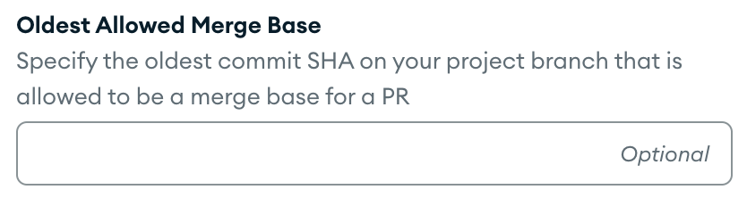

# General FAQ

## How and what commit is chosen when running `evergreen patch`?

The Evergreen CLI grabs the user's config file and determines what project should be used. The CLI then establishes a connection with the Evergreen server and retrieves that project's information, specifically the GitHub org + repo + branch (which we'll call, org, repo, and main respectively).

The CLI then fetches the corresponding [remote](https://git-scm.com/docs/git-remote) (which we'll call upstream).
Using that, it runs `git merge-base upstream/<PROJECT_BRANCH_NAME> HEAD` to find the common ancestor of the Evergreen project's tracking branch and the currently checked out branch. This is the commit that will be used as the base for the patch. Changes (including commits and uncommitted changes) made after this common ancestor will be included as diff changes in the patch rather than as commits.

Some Caveats to be aware of:

- Projects can configure an oldest allowed merge-base in their project settings. If the found merge-base is older than this, the CLI will error out and not allow the patch to be created. Here is an example of the project setting:

- If the local instance of the remote branch is out of sync, the CLI will get an older/incorrect merge base. This may result in an error or just unexpected behavior, it depends on how out of sync it is. To solve this, run `git fetch upstream`, where upstream is your remote.

## What is the difference between cron, batchtime, and periodic build?

- **Batchtime**: Delays activating a task on an existing mainline version until a specified time has passed since it's last run.
- **Cron**: Activates a task on an existing mainline version at a specified time or interval. All cron schedules run in UTC timezone regardless of your local timezone.
- **Periodic Builds**: Creates a new version that runs at a specified time or interval, regardless if the project has had any commits.

For more on their differences and examples, see [controlling when tasks run](Project-Configuration/Controlling-when-tasks-run).

## Why am I seeing a 'fatal: ...no merge base' error?

This is most likely because your repo was cloned with a specified depth and the merge base was outside the range of the depth. To fix this, rebase your HEAD to the latest master. If this happens often, we recommend increasing the clone depth in your project's [`git.get_project`](Project-Configuration/Project-Commands#gitget_project) to a more suitable depth.

## Why is Evergreen not running CI tests on my Graphite PR?

You may notice that Evergreen doesn't run CI tests on your Graphite PR immediately if that PR is being automatically
rebased by Graphite. You can tell if Graphite is automatically rebasing your PR if the PR base branch is currently named
`graphite-base/*` or the latest head commit to the PR was on the `graphite-base/*` branch (instead of the downstack
PR/trunk). Graphite may either be actively rebasing your PR right now (e.g. right after you merge a downstack PR) or it
may have failed to complete the rebase (e.g. due to a merge conflict).
Evergreen will not run CI tests while your PR is in this temporary state because [Graphite recommends not running CI
tests while it's
rebasing](https://graphite.dev/docs/setup-recommended-ci-settings#ignore-graphite%E2%80%99s-temporary-branches-in-your-ci).
Once Graphite finishes rebasing (which may happen automatically or may require manual intervention), the CI tests will
run.

Another reason Evergreen would not run CI tests on your Graphite PR is if the CI optimization is on. CI optimization
allows us to only run CI on certain PR's on the stack. For more information on CI optimization, please refer to the
[Graphite documentation](https://graphite.com/docs/stacking-and-ci). The default optimization rule is to only run CI on
only the top and bottom PR's in the stack.

If you're unsure about the state of your stacked PR, please check the PR in the Graphite UI instead of GitHub. The
Graphite UI can provide helpful warnings/errors and advice on how to fix them. If you find that your PR is still having
issues with Graphite's automatic rebasing, please make sure to review [the Graphite
docs](https://graphite.com/docs/merge-pull-requests) to understand how merging works with Graphite and make sure that
you're following the intended workflows. Specifically if you merge through the GitHub UI, [automatic
rebasing](https://graphite.com/docs/merge-pull-requests#automatic-rebasing) for your upstack PRs may not work properly,
so it's highly recommended that you merge PRs through the Graphite UI rather than GitHub to avoid issues.
