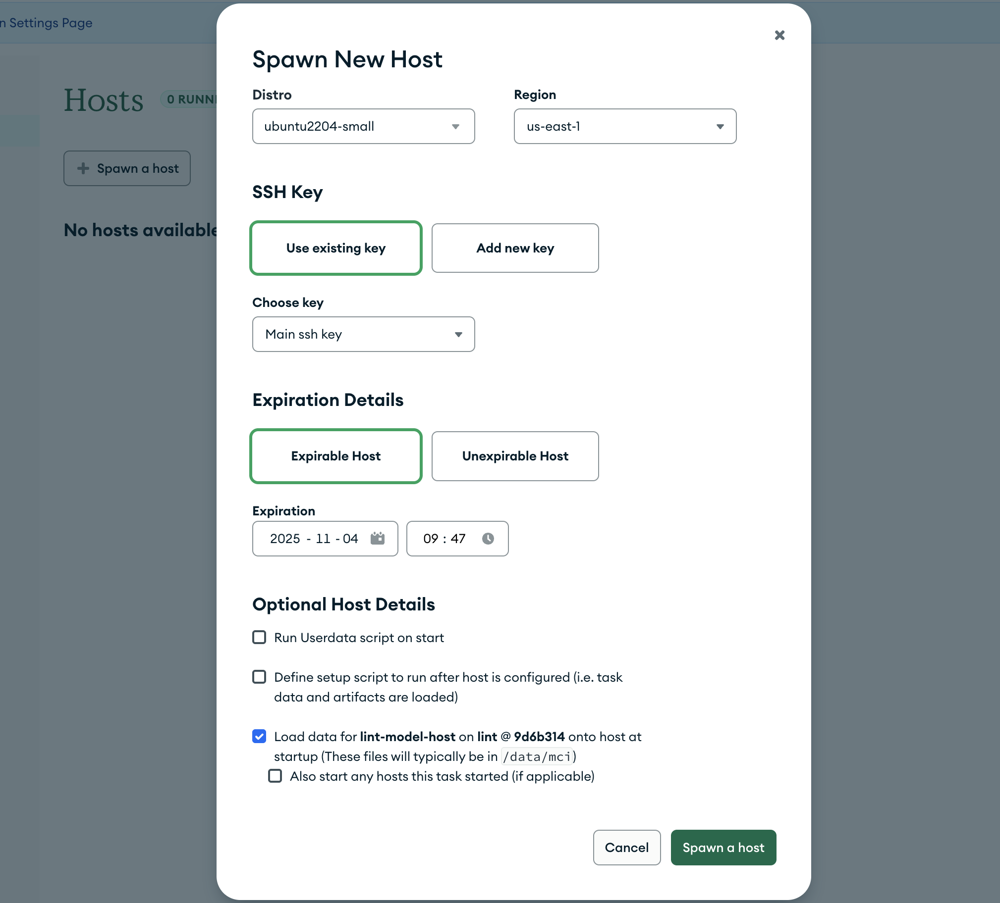

# Spawn Hosts

If a test fails on a platform other than the one you develop on locally, you'll likely want to get access to a machine of that type in order to investigate the source of the failure. You can accomplish this using the spawn hosts feature of evergreen.

## Troubleshooting connecting to a spawn host

If you are having trouble connecting to a spawn host:

- Make sure you are connected to the MongoDB network or VPN.
- Verify the host is in the "RUNNING" state and the DNS host name for the spawn host is correct. Note that if you pause and then start the host, it will get a new DNS name.
- Verify you are using the correct user. This can be found on the [My Hosts](https://spruce.mongodb.com/spawn/host) page under the Spawn Host detail drop down.
- Verify you are using the correct ssh key used when creating the Spawn Host. Use the -i argument to specify the location of your local private ssh key to use.
- Newer versions of macOS do not by default support older SSH algorithms. Please add these lines to the `Host *` stanza of your ~/.ssh/config:

```
  Host *
      HostkeyAlgorithms +ssh-rsa
      PubkeyAcceptedAlgorithms +ssh-rsa
```

## Hosting a server on a spawn host

To connect to your spawn host over a port (to, for example, test a UI or API),
please use SSH port forwarding:

```sh
ssh -L <local_port>:localhost:<remote_port> <user>@<remote_host>
```

Please do not attempt to make a port publicly accessible on the internet. This
is prohibited by our security policy.

## Making a distro "spawnable"

Evergreen administrators can choose to make a distro available to users for spawning by checking the box on the distro configuration panel labeled _"Allow users to spawn these hosts for personal use"_

Only distros backed by a provider that supports dynamically spinning up new hosts (static hosts, of course, do not) allow this option.

## Spawning a Host

Visit `/spawn` to view the spawn hosts control panel. Click on "Spawn Host" and choose the distro you want to spawn, and choose the key you'd like to use (or provide a new one).

## Spawning a Host From a Task

Alternately, for a task that ran on a distro where spawning is enabled, you will see a "Spawn..." or "Spawn Host" link on its task page.


Clicking it will pre-populate the spawn host page with a request to spawn a host of that distro, along with the option to fetch binaries and artifacts associated with the task and any tasks that it depended on.



Fetching artifacts can also be performed manually; see [fetch](../CLI#fetch) in the Evergreen command line tool documentation.

Artifacts are placed in /data/mci. Note that you will likely be able to ssh into the host before the artifacts are finished fetching.

If your project has a project setup script defined at the admin level, you can also check "Use project-specific setup script defined at ..." before creating the spawn host. You can check if there are errors fetching artifacts or running this script on the host page: `https://spruce.mongodb.com/host/<host_id>`.

EC2 spawn hosts can be stopped/started and modified from the Spawn Host page, or via the command line, which is documented in [Basic Host Usage](../CLI#basic-host-usage) in the Evergreen command line tool documentation.

## Spawn Host Expiration

By default, spawn hosts expire after one week. This expiration can be set (or the host can be made unexpirable) when
spawning the host or can be set later by pressing the "edit" button for the host. You can extend an expirable host's
lifetime up to 30 days past host creation.

If you'd like to get a notification before a host expires, you can [set up a
notification](../Project-Configuration/Notifications#spawn-host-expiration) for it.

## Unexpirable Host Sleep Schedules

Unexpirable hosts have a feature (which is enabled by default) called a sleep schedule that allows you to control when
you'd like your unexpirable host to be automatically turned on or off. A sleep schedule lets you choose recurring times
of the week when you want your host to be on, and when it's okay for it to be turned off. For example, you could set a
sleep schedule where your host is up and running during your work hours from 10 am to 6 pm between Monday and Friday and
otherwise let it turn it off overnight and during weekends. Setting a sleep schedule ensures your host is on during your
working hours, while also stopping the host when it's not being actively used. Powering down hosts when they're not
being used is important to ensure that hosts are being efficiently utilized and to avoid over-spending on idle
long-lived hosts.

Note that stopping the host during off hours means **shutting down the host**, not hibernating the host. If needed, see
[the FAQ](#faq) for more info.

**All users are assigned a default sleep schedule. If you'd like your
unexpirable host to use something other than the default settings, your options are:**

1. [Set a sleep schedule](#sleep-schedule) (Recommended for most users): Set a sleep schedule for each of your existing
   unexpirable hosts on by [pressing the "edit" button on the spawn host page](https://spruce.mongodb.com/spawn/host).
2. [Permanently exempt your host](#permanent-exemption): If you have a reason that your host cannot use the sleep
   schedule, you can request a permanent exemption for your host.

### Option 1: Sleep Schedule {#sleep-schedule}

This is the feature described [above](#unexpirable-host-sleep-schedules) to set times of the week when you want your
host to be on or off. You can set a recurring sleep schedule on your host from [the
UI](https://spruce.mongodb.com/spawn/host) by pressing the "edit" button your host.

In the Spruce UI, you can pick a sleep schedule for your host when creating the unexpirable host or editing an existing
unexpirable host:


The example sleep schedule above will automatically turn the host on from 8am to 8pm on Monday to Friday (Eastern Time).
The host will be automatically turned off overnight from 8pm to 8am on Monday to Friday, and will be off for the entire
weekend.

From the create/edit host modal, you can pick which days you'd like the host to be on, the time that you want your
host to be on for those days, and the time zone of the schedule. You can edit this schedule whenever you want.

#### Temporary Exemptions

If you need your host to temporarily ignore its sleep schedule, you can request a temporary exemption for your host.
During a temporary exemption, the sleep schedule will not take effect at all, so Evergreen will not stop/start your host
unless you stop/start it manually. This is useful if you have a one-off need to keep your host on without interruption.
For example, if you're running a test overnight on the host and you don't want the host to be stopped, you can use a
temporary exemption until tomorrow to keep the host on. Another example is if it's outside your working hours (and the
host has already automatically stopped for the night for its sleep schedule) but you want to check a file in your host,
you can request a temporary exemption and then turn your host on. The sleep schedule will let your host stay on, and
will ignore the host's sleep schedule until the temporary exemption ends.

You can set a temporary exemption in the Spruce edit host modal:


Alternatively, you can set a temporary exemption from the CLI:

```sh
evergreen host modify --host <HOST_ID> --extend-temporary-exemption <NUM_HOURS>
```

You can temporarily exempt your host from the sleep schedule for up to a month from today.

#### Keeping a Host Off

Your host's sleep schedule will regularly stop and start your host. However, there can be some use cases where you may
wish to turn your host off for an extended period of time. For example, if you are about to go on leave, you may wish to
leave your host off for the entire time since you won't need it.

To accommodate this, Evergreen offers an option to keeping the host off until the next time you start it back up
yourself. If you choose this option, Evergreen will let the host will remain off and will not start or stop your host
automatically for its sleep schedule. The sleep schedule will only take effect again when you start the host back up
manually.

If you'd like to manually turn off your host and keep it off until the next time you start it back up, you can press
pause on the host and check the option to keep the host off:


This can also be done through the CLI:

```sh
evergreen host stop --host <host_id> --keep-off
```

#### FAQ

**Q: Can I still manually stop and start my hosts if the schedule is running?**
A: Yes! Even though Evergreen will automatically stop and start your host on the configured schedule, you can still
manually stop and start your host whenever you need to. If you do this, it's recommended, you also [set a temporary
exemption](#temporary-exemptions) to ensure that you can use your host without being accidentally interrupted when the
sleep schedule tries to automatically stop/start your host.

**Q: Will the hostname change between restarts?**

A: You can get a hostname that doesn't change from your unexpirable host. While it's true that EC2 hosts typically do
change their DNS names every time the host restarts, Evergreen automatically assigns persistent DNS names to unexpirable
hosts. This persistent DNS name will let you use to a single, stable name to refer to your host even if it restarts. You
can view your host's persistent DNS name by copying the SSH command from the host page or by running `evergreen host list --mine`.

Once you have your persistent DNS name, you can use it in your SSH config file (`~/.ssh/config`). For example:

```sshconfig
Host <your_persistent_dns_name>
    User <ssh_username>
    Hostname <your_persistent_dns_name>
```

**Q: Can I have my host hibernate instead of shut down for the schedule?**

A: Evergreen's hosts do not currently support hibernation, they can only shut down. This means that the host will lose
current machine state (e.g. tmux sessions) when it turns off. Supporting hibernation may eventually be explored as
future work in [DEVPROD-8579](https://jira.mongodb.org/browse/DEVPROD-8579). In the meantime, if your workflow is
significantly impacted by the host shutting down and rebooting regularly on a schedule, you can [request a permanent
exemption](#permanent-exemption).

---

### Option 2: Requesting a Permanent Exemption {#permanent-exemption}

If for some reason your host cannot use a sleep schedule at all or your regular workflow is impacted by using it, you
can request that your host be permanently exempt from the sleep schedule feature. If your host is permanently exempt, it
won't have any sleep schedule set and Evergreen will not stop/start your host according to a recurring sleep schedule. A
permanent exemption from setting a sleep schedule would allow your host to be kept on 24/7.

If you'd like to request a permanent exemption, please file a DEVPROD ticket with the title "Permanent Exemption
Request" and set Evergreen App as the Dev Prod service. In it, please include your host ID and a brief description of
why you'd like your host to be permanently exempt from the sleep schedule.

## Hosts Page

The Spruce hosts page offers three batch actions applicable to hosts:

1. Update Status

   You can force a state change to these statuses:

   - Decommissioned: Terminate a host after it's done running its current task.
   - Quarantined: Stop a host from running tasks without terminating it or shutting it down. This is to do ops work on it like temporary maintenance, debugging, etc. Once the maintenance is done, it's usually set back to running to pick up tasks like normal. Quarantined is used almost exclusively for static hosts.
   - Terminate: Shut down the host.
   - Stopped: Stop the host.
   - Running: Start the host.

2. Restart Jasper

   This option will try forcing the Evergreen agent (which runs in a system process called Jasper) to start back up in a way that's less disruptive than just rebooting the host.

3. Reprovision

   Hosts need to have a few starter files on the file system before they can run tasks. Sometimes static hosts can get into bad states (e.g. the file system is corrupted) and stop functioning correctly. Reprovisioning a host will repopulate these files for static hosts.
