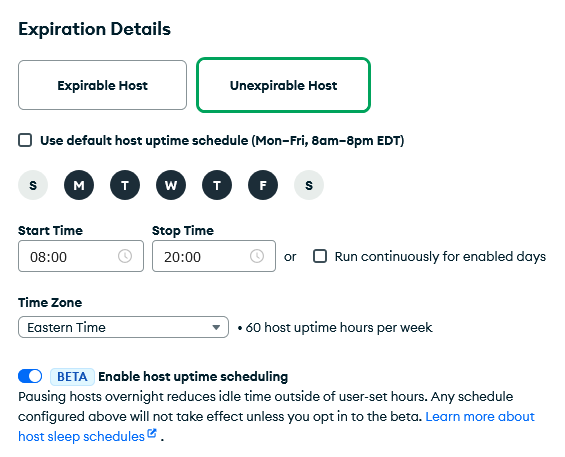

# Spawn Hosts

If a test fails on a platform other than the one you develop on locally, you'll likely want to get access to a machine of that type in order to investigate the source of the failure. You can accomplish this using the spawn hosts feature of evergreen.

## Troubleshooting connecting to a spawn host

If you are having trouble connecting to a spawn host:

- Make sure you are connected to the MongoDB network or VPN.
- Verify the host is in the "RUNNING" state and the DNS host name for the spawn host is correct. Note that if you pause and then start the host, it will get a new DNS name.
- Verify you are using the correct user. This can be found on the [My Hosts](https://spruce.mongodb.com/spawn/host) page under the Spawn Host detail drop down.
- Verify you are using the correct ssh key used when creating the Spawn Host. Use the -i argument to specify the location of your local private ssh key to use.
- Newer versions of macOS do not by default support older SSH algorithms. Please add these lines to the `Host *` stanza of your ~/.ssh/config:

```
  Host *
      HostkeyAlgorithms +ssh-rsa
      PubkeyAcceptedAlgorithms +ssh-rsa
```

## Making a distro "spawnable"

Evergreen administrators can choose to make a distro available to users for spawning by checking the box on the distro configuration panel labeled _"Allow users to spawn these hosts for personal use"_

Only distros backed by a provider that supports dynamically spinning up new hosts (static hosts, of course, do not) allow this option.

## Spawning a Host

Visit `/spawn` to view the spawn hosts control panel. Click on "Spawn Host" and choose the distro you want to spawn, and choose the key you'd like to use (or provide a new one).

## Spawning a Host From a Task

Alternately, for a task that ran on a distro where spawning is enabled, you will see a "Spawn..." or "Spawn Host" link on its task page.


Clicking it will pre-populate the spawn host page with a request to spawn a host of that distro, along with the option to fetch binaries and artifacts associated with the task and any tasks that it depended on.


Fetching artifacts can also be performed manually; see [fetch](../CLI#fetch) in the Evergreen command line tool documentation.

Artifacts are placed in /data/mci. Note that you will likely be able to ssh into the host before the artifacts are finished fetching.

If your project has a project setup script defined at the admin level, you can also check "Use project-specific setup script defined at ..." before creating the spawn host. You can check if there are errors fetching artifacts or running this script on the host page: `https://spruce.mongodb.com/host/<host_id>`.

EC2 spawn hosts can be stopped/started and modified from the Spawn Host page, or via the command line, which is documented in [Basic Host Usage](../CLI#basic-host-usage) in the Evergreen command line tool documentation.

## Spawn Host Expiration

By default, spawn hosts expire after one week. This expiration can be set (or the host can be made unexpirable) when
spawning the host or can be set later by pressing the "edit" button for the host. You can extend an expirable host's
lifetime up to 30 days past host creation.

If you'd like to get a notification before a host expires, you can [set up a
notification](../Project-Configuration/Notifications#spawn-host-expiration) for it.

### Unexpirable Host Sleep Schedules

**Summary: Please set a sleep schedule for your unexpirable hosts by editing them [in the
UI](https://spruce.mongodb.com/spawn/host) before `<DATE>`. In addition, please opt into the beta test to ensure that
your sleep schedule is working the way you want.**

For unexpirable hosts, Evergreen has introduced a new feature called a host sleep schedule, which allows you to control
when you'd like your unexpirable host to be automatically turned on or off. A sleep schedule lets you choose recurring
times of the week when you want your host to be on, and when it's okay for it to be turned off. For example, you could
set a sleep schedule where your host is on during your work hours from 10 am to 6 pm between Monday and Friday and
otherwise let it turn it off overnight and during weekends. Setting a sleep schedule ensures your host is on when you're
working, while also stopping the host when it's not being actively used. This is important to ensure that hosts are
being efficiently utilized and to avoid over-spending on long-lived AWS resources when they're idle.

In the Spruce UI, you can pick a sleep schedule for your host when creating the unexpirable host or editing an existing
unexpirable host:



From the create/edit host modal, you can pick which days you'd like the host to be on, and the time that you want your
host to be on for those days. The time zone for the host sleep schedule will be based on the time zone you choose in
your [Spruce preferences](https://spruce.mongodb.com/preferences/profile).

#### ***Important Note***: This Feature is in Beta Testing!

<!-- TODO (DEVPROD-4055): do not merge until comms are ready and a timeline for beta/full rollout is chosen.  -->

This feature is being rolled out in phases and is currently in beta testing. While it's in beta testing, _using the
sleep schedule feature is an opt-in_. During this beta testing period, you have until `<DATE>` to set a sleep schedule
for any of your existing unexpirable hosts. Until then, you should set a sleep schedule for any of your existing
unexpirable hosts. On top of setting a sleep schedule, you also have the option to participate in the beta test. If you
opt into the beta test, the sleep schedule that you set will take effect on your host, stopping and starting your host
according to the schedule you configure; if you do not opt in, your sleep schedule will be set but will have no effect
on your host. You can opt in or out freely during the beta test. **It's highly recommend for you to set a sleep schedule
for your unexpirable host(s) and opt into the beta to verify that your sleep schedule is configured the way you want.**

The beta test period will end on `<DATE>`, at which point the sleep schedule will take effect on all hosts so please
make sure to set a sleep schedule by then or [request a permanent exemption](#requesting-a-permanent-exemption). If you
do not set one, a default one will be automatically set for you when the beta test ends. Hosts that have been stopped
for more than two weeks will also be assigned a sleep schedule if you don't pick one by the end of the beta period, but
the host will be [kept off](#keeping-a-host-off) until you manually start it again.

#### Keeping a Host Off

Your host's sleep schedule will regularly stop and start your host. However, there can be some use cases where you may
wish to turn your host off for an extended period of time. For example, if you are about to go on leave, you may wish to
leave your host off for the entire time since you won't need it.

To accommodate this, Evergreen offers an option to keeping the host off until the next time you start it back up
yourself. If you choose this option, Evergreen will let the host will remain off and will not start or stop your host
automatically for its sleep schedule. The sleep schedule will only take effect again when you start the host back up
manually.

If you'd like to manually turn off your host and keep it off until the next time you start it back up, you can press
pause on the host and check the option to keep the host off:


This can also be done through the CLI:

```sh
evergreen host stop --host <host_id> --keep-off
```

#### Temporary Exemptions

If you need your host to temporarily ignore its sleep schedule, you can request a temporary exemption for your host.
During a temporary exemption, the sleep schedule will not take effect at all, so Evergreen will not stop/start your host
unless you stop/start it manually. This is useful if you have a one-off need to keep your host on without interruption.
For example, if you're running a test overnight on the host and you don't want the host to be stopped, you can request a
temporary exemption until tomorrow to keep the host on. Another example is if it's outside your working hours (and the
host has already automatically stopped for the night for its sleep schedule) but you want to check a file in your host,
you can request a temporary exemption and then turn your host on. The sleep schedule will let your host stay on, and
will ignore the host's sleep schedule until the temporary exemption ends.

You can set a temporary exemption in the Spruce edit host modal:


Alternatively, you can set a temporary exemption from the CLI:

```sh
evergreen host modify --host <HOST_ID> --extend-temporary-exemption <NUM_HOURS>
```

You can temporarily exempt your host from the sleep schedule for up to a month from today.

#### Requesting a Permanent Exemption

If for some reason your host cannot use a sleep schedule at all, you can request that your host be permanently exempt
from the sleep schedule feature. If your host is permanently exempt, it won't have any sleep schedule set and Evergreen
will not stop/start your host according to a recurring sleep schedule. A permanent exemption from setting a sleep
schedule would allow your host to be kept on 24/7.

**Requesting a permanent exemption is not recommended unless you have set up [the auto-sleep
script](#host-auto-sleep-script) (and want it to substitute for a recurring sleep schedule) or you have a particular
reason that your host must be kept on at all times.** This is because keeping hosts on 24/7 is not an efficient use of
AWS resources since the host incurs costs to run while it's not being actively used. In addition, users who only
occasionally need their host to be kept on for an extended period of time can set [temporary
exemptions](#temporary-exemptions) when needed.

If you'd like to request a permanent exemption, please file a DEVPROD ticket with Evergreen App as the Dev Prod service
and use the title "Permanent Exemption Request". In it, please include your host ID and an explanation of why you'd like
your host to be permanently exempt from the sleep schedule (and if relevant, why alternative options like temporary
exemptions would not be sufficient for your usage).

#### Host Auto-Sleep Script

The [host sleep script](https://github.com/evergreen-ci/host-sleep-script) is a standalone script-based option that can
be used alongside (or as a substitute for) the sleep schedule feature. The main benefit of the script over using the
sleep schedule feature is that it will stop your host based on whether it detects activity in the host (such as active
SSH sessions), rather than stopping and starting on a recurring weekly schedule. It will automatically turn off your
host once there is no activity detected in it for some time. Later on, when you SSH into the host, it uses a proxy
script on your local computer to turn it back on and SSH into your host.

In order to use it, you must install the script into your local computer and unexpirable host by following the
instructions in [this repo](https://github.com/evergreen-ci/host-sleep-script).

***Caution: Use At Your Own Risk!***
* This is not an Evergreen feature. It modifies your local computer SSH configuration and your unexpirable host's
  systemd configuration to automatically start and stop the host.
* The script may have bugs. It has been tested in only a handful of setups.
* It may not work exactly as you'd like for your use case.

If you choose to use the host sleep script, Evergreen can only provide limited assistance and is not responsible for
debugging your setup. You're highly advised to read over the script and understand how it works before installing it.

##### Requesting a Permanent Exemption with the Auto-Sleep Script

If you'd like to use the host sleep script _instead of_ the Evergreen sleep schedule feature, you can [request a
permanent exemption](#requesting-a-permanent-exemption). In the request, please:
* Mention that you're using the sleep script instead of the sleep schedule.
* Provide a text snippet of the script output.
* Show an example in your host's event logs where the host sleep script successfully stopped your host due to
  inactivity.

## Hosts Page

The Spruce hosts page offers three batch actions applicable to hosts:

1. Update Status

   You can force a state change to these statuses:

   - Decommissioned: Terminate a host after it's done running its current task.
   - Quarantined: Stop a host from running tasks without terminating it or shutting it down. This is to do ops work on it like temporary maintenance, debugging, etc. Once the maintenance is done, it's usually set back to running to pick up tasks like normal. Quarantined is used almost exclusively for static hosts.
   - Terminate: Shut down the host.
   - Stopped: Stop the host.
   - Running: Start the host.

2. Restart Jasper

   This option will try forcing the Evergreen agent (which runs in a system process called Jasper) to start back up in a way that's less disruptive than just rebooting the host.

3. Reprovision

   Hosts need to have a few starter files on the file system before they can run tasks. Sometimes static hosts can get into bad states (e.g. the file system is corrupted) and stop functioning correctly. Reprovisioning a host will repopulate these files for static hosts.
