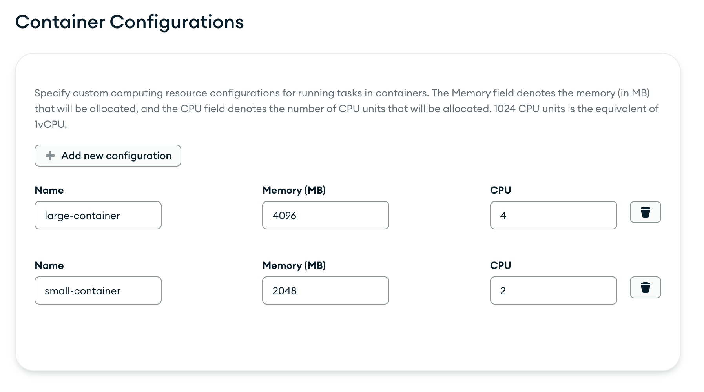
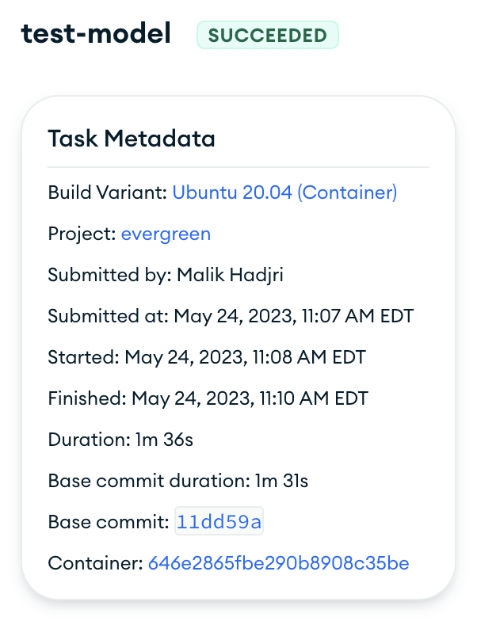
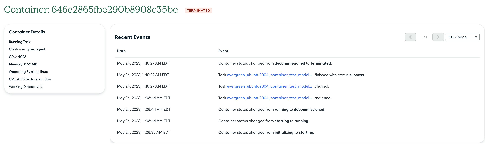

# Containerized Tasks

We're excited to introduce the ability to run Evergreen tasks in containers. 

This offering is designed to streamline work and reduce friction caused by software dependency requirements. 
Greater flexibility and control over task environments is achievable with containers, ensuring that each task runs in an isolated, dedicated space with its own specific set of dependencies. 

This means fewer conflicts, 
more consistent results, and the potential for more efficient execution as multiple tasks can run simultaneously on the same host, enabling more efficient utilization of resources, and reducing the likelihood of scheduling delays due to unavailable hosts.

## Important Note
Container tasks are still undergoing active testing and, at this stage, is used by the internal Evergreen team only.

If you have any questions about container tasks or are interested in exploring how this feature could benefit your project, we encourage you to reach out to us. 
We'll discuss its potential applications and assist you in preparing for its broader release.

## What's Different

While tasks running on containers come with all the capabilities you're familiar with in regular host tasks, there are a couple of differences to note as we roll out this new feature:

1. Task Groups: The initial release of container tasks does not support configuring task groups. This is something we aim to support in future iterations.

2. Priority: The priority setting feature will not be available during the initial release for container tasks.
## YAML Configuration


Configuring your project to use container tasks is done in YAML. 
Below is an example configuration:

``` yaml
containers:
  - name: example-container
    working_dir: /
    image: "custom/container-testing-image"
    resources:
      cpu: 1024
      memory_mb: 2048
    system:
      cpu_architecture: x86_64
      operating_system: linux
      
  - name: example-windows-container
    working_dir: /
    image: "custom/container-windows-image"
    size: small-container
    system:
      cpu_architecture: x86_64
      operating_system: windows
      windows_version: 2019
```
Fields:

-   `name`: a user-defined name for the container that represents the task or the environment of the container
-   `working_dir`: the working directory for your tasks within the container. In the example, it's set to the root directory
-   `image`: the Docker image to use for the container. As part of the initial offering, the images specificable in this field will be 
restricted to a predefined list of approved base images that our platform will specify.
-   `resources`: the resources allocated to the container: cpu and memory_mb set the CPU units and the memory (in MB), respectively, that the container is allocated
-   `size`: an alternative to the resources section, a preset size for the container configured within the UI
-   `system`: specification for the CPU architecture and the operating system to be used by your container

You can define as many containers as your project requires by adding more entries. 

Once containers are configured, they must be referenced by a build variant. Here is an example:

``` yaml
buildvariants:
  - name: container-variant
    display_name: Container Variant
    run_on:
      - example-container
    tasks:
      - name: test-graphql
      - name: test-js
```

The container must be put in the `run_on` field, in the same way that
a distro may be put there. Unlike the distro model, where a primary and
secondary distro can be specified in this field (hence why the field is a list),
only one container may be specified in the `run_on` field for a containerized
variant.

### UI Changes
Once configured properly, a variant with container tasks is ready to schedule tasks.
Once tasks get created, key differences to look for in Spruce are:

#### Container Project Settings
A new tab has been added to the project settings page for container configurations.
Users can create a list of resource configuration presets that can be referenced via alias in the `size` field of their container YAML configurations.



Options:

-   `Name`: The alias for the resource preset. Names must be unique within the list.

-   `Memory`: The amount of memory (in MiB) to allocate.

-   `CPU`: The CPU units the container can use. These values are expressed in 'vCPU Units'. 1024 CPU units is the equivalent of 1vCPU.

Users can define as many container configurations as needed, reflecting different appropriate resource needs for various tasks.

#### Task Metadata
A link to a container task's respective container replaces the typical host link. 



#### Container Page

The link in the task metadata sidebar takes you to the container page, which details the lifecycle of a container and their tasks. Like the host page, event logs exist charting the journey of a container task from initialization to termination.
Task events such as container assignment and status changes are also recorded, as well as the clearing of a task from a container once it has run its course.



### Disk Space Considerations
Each instance is provisioned with 200GB of space; however, the actual disk space available for each container task can vary depending on the number and the nature of tasks sharing the same instance. The more memory and CPU a task requires, 
the less likely it is to share an instance with other tasks. Conversely, less resource-hungry tasks are more likely to share the instance with other tasks, which means they will also be sharing the available disk space.

In practical terms, this means that while each instance has a maximum of 200GB of disk space, please bear in mind that the effective disk space available to your container tasks might be less, depending on what other tasks are running concurrently on the same instance.