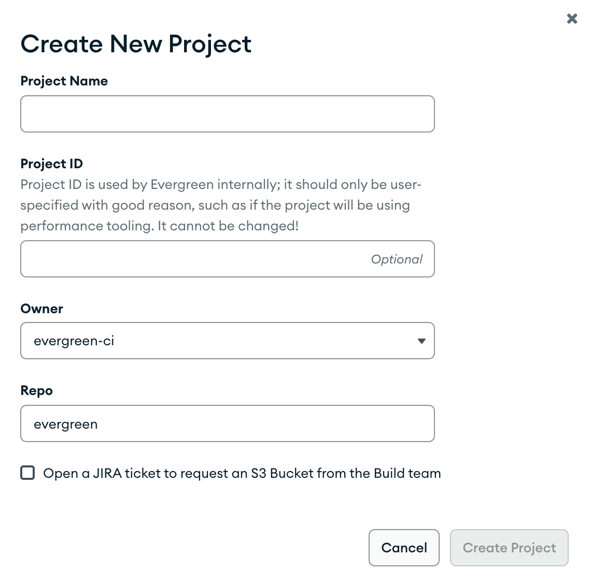

# Create a Project

This guide is meant to help users create their own projects on Evergreen.

## Authorization

To have access to create a project you must be either a super user or the admin of an existing project.

### Things to consider before creating a project

1. Why do you need this project? Can this need be met by an existing project instead?
2. Is this project branching off of a large project? If yes, consider reaching out to the admins of that project to ensure that all edge cases are considered.
3. Are you creating more than one project at the same time? Is there a way to avoid this?

### Steps to Request

If you do not see the `New Project` button on the [project settings page](https://spruce.mongodb.com/project/YourProject/settings/general):

1. Do you want to copy an existing project? If so, then you should ask an admin of that project to follow the steps under "For Project Admins". Note that the Evergreen team will not copy an existing project for you, but if you need help figuring out who the admins are you can ask in #ask-devprod-evergreen.
2. To request a new project, file a JIRA ticket in the DEVPROD project with the following information:
   1. GitHub repo organization (e.g., "10gen")
   2. GitHub repo name (e.g., "mongodb")
   3. Does the project need a new S3 bucket?
   4. Will your project be using the performance plugin? (In this case, please let us know what identifier you'd like for the project – this cannot be changed later)

## Steps to Create

1. Visit the projects page in the new UI <https://spruce.mongodb.com/projects/>.
2. Click New Project. If you want to copy the current project, click Duplicate Current Project. Otherwise, click Create New Project.
3. Enter the project name, repo org ("Owner"), and repo name ("Repo"). Note that only creating projects that track MongoDB owned organizations is supported. If the organization you need is not in the GitHub Organization drop-down, reach out to the Evergreen team to see if it can be supported. Forks are not supported by Evergreen.
4. **If you want to use the performance plugin, you need to check this box now.** In this case also, the identifier cannot be modified, so please choose carefully.
5. If this project needs an S3 bucket, click the check mark to open a JIRA ticket. (You should see the JIRA ticket under "reported by me.")

6. Click "Create New Project".

## Project Limitations

Because Evergreen can only support so many projects, there are limitations to the number of projects that could be enabled.
There is a total project limit, the total number of projects that Evergreen is currently willing to support,
and a project per repo limit, a limit to the number of enabled projects that share the same GitHub owner and repo.

If your GitHub owner and repo needs more than the allotted number of projects, create a JIRA ticket and request to override the repo limit.
