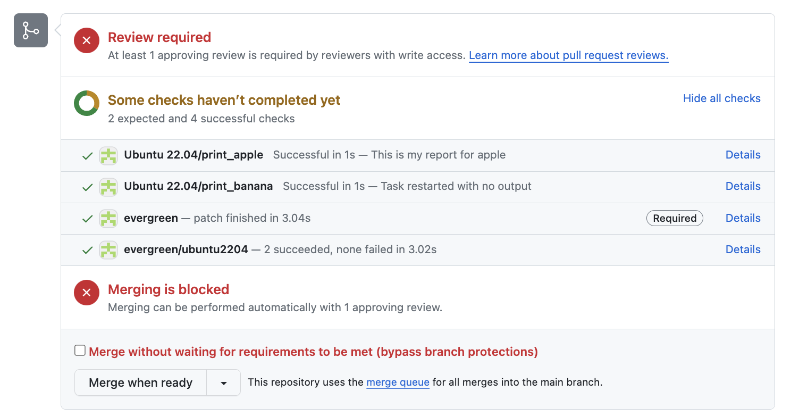
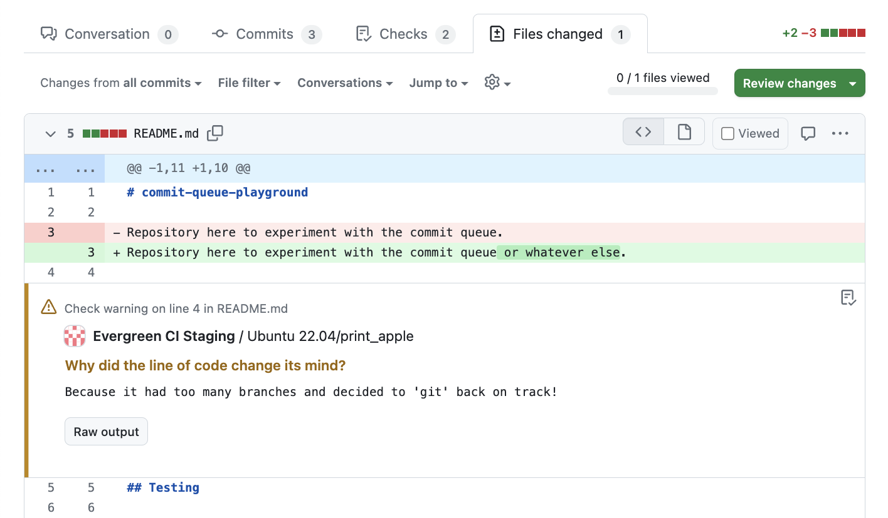
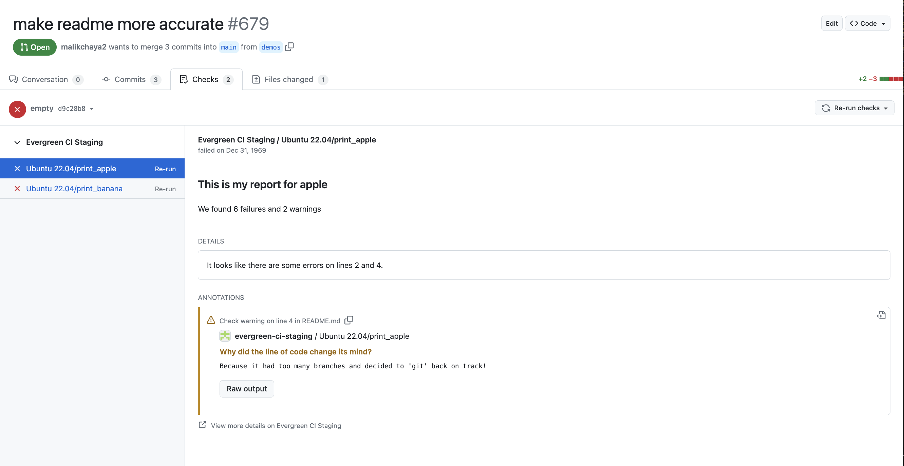

# GitHub Integration

Specific GitHub pull request behavior can trigger behavior in Evergreen.

## Help Text

```
evergreen help
```

We have documentation here but we also provide it on the PR itself. It will display commands that are available for your project, with some context about when to use them. If the commit queue is disabled but there is an available message, we will still display the message. If PR testing isn't enabled for the branch but [PR testing is set up for untracked branches](../Project-Configuration/Repo-Level-Settings#how-to-use-pr-testing-for-untracked-branches) then we will also still show the related GitHub Pull request commands (detailed below).

## GitHub Pull Request Testing

Evergreen has an option to create patches for pull requests and this can be defined on the project page.

If "Automated Testing" is enabled, Evergreen will automatically create a patch for each pull request opened in the repository as well as each subsequent push to each pull request.

If you'd like the option of creating patches but wouldn't like it to happen automatically, you can enable "Manual Testing".

You can read more about these options [here](../Project-Configuration/Project-and-Distro-Settings#github-pull-request-testing).

#### Retry a patch

```
evergreen retry
```

Sometimes Evergreen has trouble creating a PR patch, due to internal server errors or GitHub flakiness. Commenting `evergreen retry` will attempt to recreate this patch. This can also be used to submit a new patch.

Note that this is specific to GitHub PR checks; it won't retry a commit queue patch. For that, re-type `evergreen merge` (detailed below).

#### Set PR patches to reuse a patch definition

```
evergreen keep-definitions
```

By default, `evergreen retry` will create a new patch using the default GitHub PR patch definition. If you comment `evergreen keep-definitions`, the latest patch you ran (including all tasks that were manually scheduled) will be used to select tasks to run in newer PR patch definitions. Any new patches in the PR will reuse that template patch's definition.

Note that if you schedule more tasks in a patch created after `evergreen keep-definitions` and wish to overwrite the existing patch definition to use the new one, you'll have to comment `evergreen keep-definitions` again.

#### Stop PR patches from reusing a patch definition

```
evergreen reset-definitions
```

If you used `evergreen keep-definitions`, then `evergreen reset-definitions` will reset your PR patches back to using the original GitHub PR patch definition.

#### Skip CI Testing

Sometimes you may want to avoid having Evergreen create patches (perhaps because the work is in progress, or testing isn't relevant yet).
Simply including `[skip-ci]` or `[skip ci]` in the PR title or the first 100 characters of the description will prevent Evergreen from creating a patch (both from commits and `evergreen retry` comments)
until the label is removed and a new commit or `evergreen retry` comment is pushed.

#### Create a patch for manual testing

```
evergreen patch
```

If your project is configured for manual testing, then Evergreen will only add GitHub checks to the PR when prompted, as opposed to for every commit. Commenting `evergreen patch` will trigger this.

#### Refresh GitHub checks

```
evergreen refresh
```

Sometimes Evergreen has trouble sending updated GitHub statuses, so the checks on the PR may not accurately reflect the state of patch on Evergreen. This is especially troublesome when the repository requires passing checks. To re-sync the GitHub checks with Evergreen, comment `evergreen refresh` on the PR.

#### Handling same SHA PRs

GitHub only allows one set of statuses for every commit SHA. If you have a situation where you have two PRs where the HEAD commit is the same, Evergreen will only create a patch for the first one and will make a comment on the second one explaining why. In general, if your tasks do not require the context of the PR (most notably the branch name, which is known to be used in some s3.put tasks), then the status displayed for the PRs will be correct. If the tasks do require the context of the PR, you may comment 'evergreen retry' and force Evergreen to abort currently running patches in favor of a new one in the context of the PR you have commented on.

## Commit Queue

Evergreen's commit queue merges changes after the code has passed a set of tests. You can read more about this [here](Commit-Queue#commit-queue).

#### Add a PR to the commit queue

```
evergreen merge
<any text here will be added as the commit message>
```

To add a PR to the commit queue, comment `evergreen merge`. Any text after the newline will be added as the commit message.

## Github Check Runs

Evergreen offers integration with the GitHub checks API. Users have the option to specify check runs with or without output and they will then be sent to GitHub once the task finishes running. The check run will include basic information about the task such as the status and complete time as well as whatever information is sent as output.

#### Configuration

To add a check run to a task, specify it in the list of tasks in the build variant definition.

```
pre:
  - command: git.get_project
    params:
      directory: src
tasks:
  - name: print_apple
    commands:
      - command: shell.exec
        params:
          script: echo "this is a task"
buildvariants:
  - name: ubuntu2204
    display_name: Ubuntu 22.04
    run_on:
      - ubuntu2204-small
    tasks:
      - name: "print_apple"
        create_check_run:
          path_to_outputs: "src/output.json" ## for no output use ""
    expansions:
      checkRun_key: apple
```

The output json file can specify the following fields. Required fields are only required if an output file is specified. Please see [the github docs](https://docs.github.com/en/rest/checks/runs?apiVersion=2022-11-28#create-a-check-run) for the most up to date information on supported fields.

- `title`: required, title of the check
- `summary`: can use markdown
- `text`: optional
- `annotations`: optional, array of objects with the following parameters
  - `path`: required, path of the file to add an annotation to. For example, assets/css/main.css.
  - `start_line`: required, start line of the annotation. Line numbers start at 1.
  - `end_line`: required, end line of the annotation.
  - `start_column`: optional, start column of the annotation. Annotations only support start_column and end_column on the same line. Omit this parameter if start_line and end_line have different values. Column numbers start at 1.
  - `end_column`: optional, end column of the annotation. Annotations only support start_column and end_column on the same line. Omit this parameter if start_line and end_line have different values.
  - `annotation_level`: required, level of the annotation. Can be one of: notice, warning, failure
  - `message`: equired, short description of the feedback for these lines of code. The maximum size is 64 KB.
  - `title`: optional, title that represents the annotation. The maximum size is 255 characters.
  - `raw_details`: optional, details about this annotation. The maximum size is 64 KB.

Evergreen supports using expansions in the output file, but please be careful to not pass any keys or sensitive data.

##### Example output.json file:

```

{
  "title": "This is my report for ${checkRun_key}",
  "summary": "We found 6 failures and 2 warnings",
  "text": "It looks like there are some errors on lines 2 and 4.",
  "annotations": [
      {
      "path": "README.md",
      "annotation_level": "warning",
      "title": "Why did the line of code change its mind",
      "message": "Because it had too many branches and decided to 'git' back on track!",
      "raw_details": "Do you mean this other thing?",
      "start_line": 2,
      "end_line": 2
      }
  ]
}

```

#### Interacting with the GitHub UI

Once a check run is created with GitHub, a GitHub status will be posted to the PR.


When applicable, annotations will be visible in the files tab.


The checks can also be viewed in the checks tab.


The check run will include a `view more details` link which will link back to the corresponding evergreen task. The task can be restarted with the re-run button on the check run.

#### Restrictions

- Check runs only apply to PR patches
- There is a limit on how many check runs can be added per version. This limit is set by evergreen based on demand and available resources and is subject to change.

```

```
