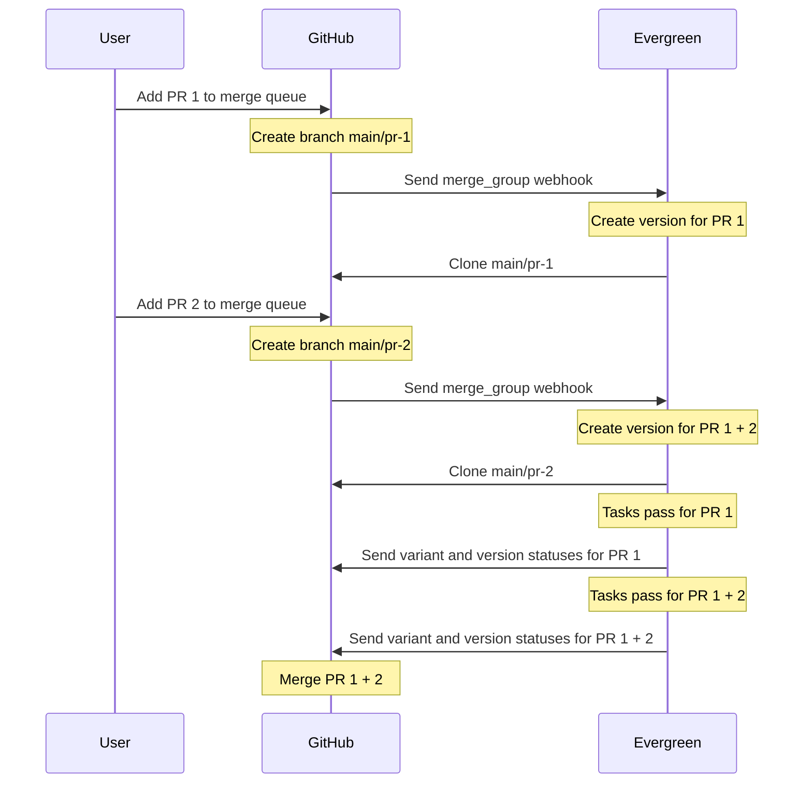

# GitHub Merge Queue

[GitHub's merge queue](https://github.blog/2023-07-12-github-merge-queue-is-generally-available/)
ensures that all pull requests pass required tests, rebased on HEAD, and it
batches pull requests to test them as a unit to increase throughput.

Gating every merge on a green build means every commit on the tracked branch had a green build. This way:

- No one bases their work on broken code.
- Every commit on the mainline branch is potentially releasable/deployable.

To turn it on, you must turn on Evergreen's merge queue integration, and then
turn on the GitHub merge queue in GitHub.

GitHub's merge queue requires that you have write access to the repository to
merge, like you would have to without the queue.

Evergreen will fail the entire version if any task in a merge queue version
fails, so only include tasks that must pass for a merge queue version to pass.
That is, in the GitHub section of your project settings in Evergreen, you can
set Patch Definitions for GitHub Pull Request Testing that select tasks beyond
those required by your GitHub branch protection rules. But in the Patch
Definitions for the Merge Queue, the selected tasks must be exactly those
required by your GitHub branch protection rules.

## Enable the merge queue

### Turn on Evergreen's merge queue integration

1. From <https://spruce.mongodb.com/>, from the More drop down, select Project Settings.
2. Select your project from the project dropdown.
3. From the GitHub section, set the Merge Queue to Enabled.
4. Add variant and task tags or regexes for the variants and tasks you wish to run when a pull request is added to the queue.

### Turn on the GitHub merge queue

To set a branch protection rule for the "evergreen" GitHub status, which is used by the merge queue, follow these steps:

1. Navigate to the repository's **Settings** page on GitHub.
2. Click on the **Branches** tab.
3. Scroll down to the **Branch protection rules** section and click on the **Add rule** or **Edit rule** button.
4. Enable the **Require a pull request before merging** option.
5. Enable the **Require status checks to pass before merging** option.
6. Uncheck **Require branches to be up to date before merging** unless you'd
   like to require users to rebase code on the branch. Note, however, that this
   would require users to manually update their PRs.
7. Under the **Status checks** section, select the **evergreen** check from the list of available status checks.
8. Enable **Require merge queue**.
9. Save the branch protection rule.

By setting this branch protection rule, the "evergreen" status will be required
to pass before any changes can be merged into the protected branch.
Alternatively, you can require a single or multiple variants to pass before
merging, instead of all variants.

## Merge Queue Behavior

Concurrency is on by default for the GitHub merge queue. If there are multiple
PRs in the queue, your PR might be tested with other commits. This means that
the Evergreen versions on a project patches page might be testing your PR even
if they have a different merge queue title. This title is the title of the
HEAD PR of a merge group, but the merge group could contain multiple PRs. Note
that GitHub merges all commits from each PR before adding that PR to a version,
so a given version has as many commits in it as there are PRs in it.

The merge queue is not trying to merge individual PRs, but groups of PRs. This
leads to some unintuitive behavior. Here is a typical sequence of events when a
user adds 2 PRs to the merge queue. In this case we assume "Minimum pull
requests to merge" is set to 1, "Maximum pull requests to merge" is set to 5,
and "Maximum pull requests to build" ("Build concurrency") is set to 5.

The diagram names its branches like "main/pr-1", but in reality they are named
like "gh-readonly-queue/main/pr-1-\<hash\>".



There is some unintuitive behavior to be aware of:

1. If main/pr-1 succeeds and main/pr-2 fails, only main/pr-1 will be merged.
   _But note that merging main/pr-1 waits for main/pr-2 to fail or for the timeout
   to be hit, because the "Maximum pull requests to merge" is set to 5. That is,
   GitHub conceptualizes the fundamental unit of work as the merge group, not the
   PR._
2. If main/pr-1 fails and main/pr-2 succeeds, GitHub will remove pr-1 from the
   queue and re-run main/pr-2 (not rebased on pr-1). _This is conceptually similar
   to the above. GitHub is trying to merge a group of PRs, not individual PRs._
3. If both succeed, main/pr-2 (rebased on pr-1) will be merged. _But merging
   main/pr-1 waits for main/pr-2 to succeed, because the maximum pull requests to
   merge is set to 5, and, again, GitHub is testing the entire group._

If, in the branch protection rules, "only merge non-failing pull requests" is
checked, then the merge will not happen if any of the PRs fail. Otherwise, if
main/pr-1 is red and main/pr-2 is green, then the latter will be merged, which
contains both PRs. Note that, although this says "pull requests," it's really
about merge queue behavior. All pull requests must pass the branch protection
rules before they can be added to the merge queue. This setting is only about
the behavior once they're in the merge queue.

The temporary branch gets deleted only after the the PR is merged, or if the PR
fails the check or is removed from the queue.

## Merge Queue Settings

GitHub's merge queue docs and UI hints can be confusing. The descriptions of the
merge queue settings in the repo branch protection rules and in the rulesets are
different, and the ones in the rulesets are more accurate. See the table below
for a comparison.

| Repo Setting                   | Repo Description                                                                   | Ruleset Setting                      | Ruleset Description                                                                                                                                                                                                     |
| ------------------------------ | ---------------------------------------------------------------------------------- | ------------------------------------ | ----------------------------------------------------------------------------------------------------------------------------------------------------------------------------------------------------------------------- |
| Maximum pull requests to build | Limit the number of queued pull requests running at the same time                  | Build concurrency                    | Limit the number of queued pull requests requesting checks and workflow runs at the same time.                                                                                                                          |
| Minimum pull requests to merge | no description                                                                     | Minimum group size                   | The minimum number of PRs that will be merged together in a group.                                                                                                                                                      |
| or after N minutes             | no description                                                                     | Wait time to meet minimum group size | The time merge queue should wait after the first PR is added to the queue for the minimum group size to be met. After this time has elapsed, the minimum group size will be ignored and a smaller group will be merged. |
| Maximum pull requests to merge | no description                                                                     | Maximum group size                   | The maximum number of PRs that will be merged together in a group.                                                                                                                                                      |
| Status check timeout           | Time a required status check must report a conclusion to not be considered failed. | Status check timeout                 | Maximum time for a required status check to report a conclusion. After this much time has elapsed, checks that have not reported a conclusion will be assumed to have failed.                                           |

## Useful Links for Troubleshooting

Here are example links for the 10gen/mongo repository:

- <https://github.com/10gen/mongo/activity?actor=github-merge-queue%5Bbot%5D> : View the branch creations and deletions by clicking the Activity link on the repository main page under the About section.
- <https://github.com/10gen/mongo/queue/master> : View the queue itself.
- <https://github.com/10gen/mongo/branches/all?query=gh-readonly> : View the active merge queue branches.

## FAQ

**Q:** I don't see any candidate statuses in the list of possible required
checks in the branch protection configuration.

**A:** This is probably because you haven't generated any in a while. GitHub only shows
recent statuses. To get some statuses to choose from, you can retrigger tests on
an existing PR by typing `evergreen retry`, open an empty PR, or commit an empty
commit.

**Q:** Is there a plan to have Evergreen send merge notifications?

**A:** No. We believe it makes more sense for notifications to come from GitHub,
since it manages the queue, and supports sending notifications.

**Q:** Is it possible to attribute the merge queue patch to your Evergreen user?

**A:** There’s a many-to-many relationship between versions and PRs. A version
can have multiple authors because GitHub’s merge queue supports concurrency, and a PR can
have multiple versions for the same reason. It’s also possible for a version to
succeed and not yield a merge on GitHub’s side. This makes it difficult to link back
from Evergreen versions to PRs. Instead, users can use the GitHub UI as the primary
starting point, and link to Evergreen builds from there.

**Q:** How can I get the commit titles of the PRs in a merge queue version?

**A:** Evergreen doesn't expose these as an expansion, as they aren't available in the
webhook message. You can use `git` to get them, where `<tracking branch>` is the
branch your project is tracking, usually main or master, since GitHub squashes
each PR's commits into a single commit with the PR title as its commit message.

```shell
git log --pretty=format:"%s" <tracking branch>...HEAD
```

**Q:** Is it possible to get a notification for a merge?

**A:** You can set up email notifications, but the Slack integration does not
send notifications for merges done by the GitHub merge queue.

**Q:** How do branch protection rules apply to PRs and the merge queue?

**A:** The same branch protection rules apply to PRs (which determine whether you can
add the PR to the merge queue) and the merge queue itself (which determines
whether or not GitHub will merge the PR). Nevertheless, you can run different
tasks in PRs and the merge queue with the separate settings on the GitHub &
Merge Queue project settings page.

Evergreen will post a status check called "evergreen" when the entire merge
queue build has finished, and it will post a status for each variant that
finishes called "evergreen/<variant_name>". Typically projects should set a branch
protection rule for "evergreen". However, it's also possible to instead to set a
branch protection rule for one or more "evergreen/<variant_name>" statuses. You
might wish to do this if you wish more variants to run in a PR than are actually
required to merge. For example, there may be long-running tasks which users care
about only some of the time, and you do not wish to block PRs or merges on those
tasks, but you still wish them to run automatically.

**Q:** How do I add a new branch protection rule for a new variant?

**A:** If you rely on having branch protection rules for individual variants, then changes for this need to be made both
in Evergreen and in GitHub. In Evergreen, at least one task from this variant needs to be added to both the PR aliases
and the merge queue aliases (as mentioned above, these rules apply to both the PR and
the merge queue). Ensure you've saved the page.

In GitHub, you can now add a new branch protection rule for the "evergreen/<variant_name>" status check.

**Q:** How can I turn off the merge queue to block users from merging?

**A:** Check the "Lock branch" setting in the branch protection rules. There are
no changes to make on the Evergreen side.

**Q:** Can I see the patch or patches associated with my merge attempt?

**A:** GitHub abstracts the process of making builds from the queue. There might be
many builds (which Evergreen calls versions) associated with your PR, and it
might not be obvious when GitHub decided to make them. To see the behavior of
the queue, you can look at the Activity page, accessible from under the About
section of a repo, and limit the user to "GitHub Merge Queue[bot]", e.g.,
<https://github.com/10gen/mongo/activity?actor=github-merge-queue%5Bbot%5D>. On
the Evergreen side, you can click on More -> Project Patches, and look for
patches prepended "GitHub Merge Queue:", e.g.,
<https://spruce.mongodb.com/project/mongodb-mongo-master/patches>. There is not
a way, however, to map directly from a GitHub PR to its patches.

**Q:** What does it mean if GitHub times out my merge queue request in my PR?

**A:** There is a setting called "Status check timeout" in the branch protection rules
or rulesets. This setting is the maximum time for a required status check to
report succcess or failed. This is _not_ the same as the makespan of an
Evergreen version, for two reasons:

1. Makespan does not start until the version starts running, but there is time
   in between when GitHub sends a webhook and when the version starts running. If
   Evergreen is under load, it might not schedule the version for some time.
2. The status checks might be configured to listen for variant statuses, not
   version statuses.

## Additional Resources

For more information on GitHub's merge queue feature and how to customize its
settings, refer to the [official GitHub documentation](https://docs.github.com/en/repositories/configuring-branches-and-merges-in-your-repository/configuring-pull-request-merges/managing-a-merge-queue).

## For Evergreen Developers

To troubleshoot why a merge group version is not being created, find the `event
= merge_group` message in Splunk. You can then search for the values of the
`head_sha` and `msg_id` properties to track merge intent creation and the amboy
job, as well as find the branch that Evergreen will clone for that project.
