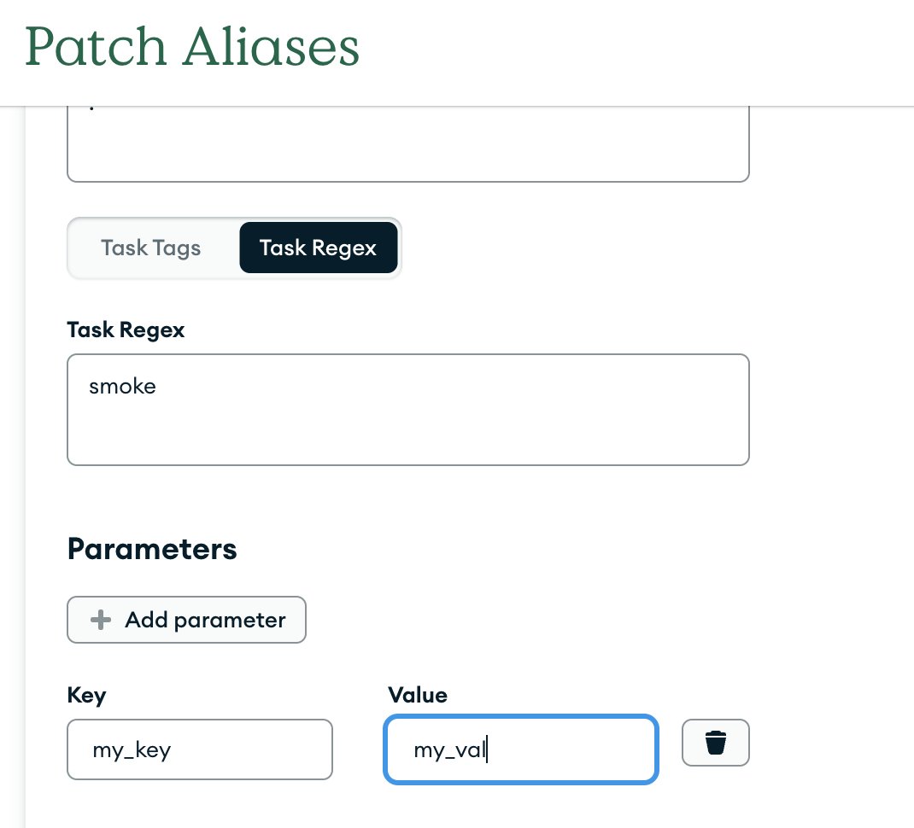

# Parameterized Builds

Users are now able to pass parameters during patch creation and configuration, which are then made available as expansions (i.e. a parameter `foo` with value `bar` will replace instances of `${foo}` with `bar` in the project configuration).

This allows projects to maintain non-secret project variables in their project config, rather than the project page, for wider edit/view access. Tests can be written to have different behavior for different parameter values, allowing patches to be more configurable. Parameters can also be used in dynamic variants.

**Secrets should not be passed in via Parameterized Builds, since these values are not private.**

## Hierarchy

Parameters can be defined in multiple different places, and can overwrite existing project variables. This leads to a specific hierarchy (listed from highest priority to lowest):

- Function/command variables.

- Parameters specified from the patch submission page.

- Parameters passed in from the command-line.

- Project-specific default parameters defined in the user’s local configuration.

- Default parameters defined for the patch alias on the Project Page, if applicable (only project admins have access to these).

- Default parameters defined in the project YAML.

- Project variables defined for the project (only project admins have access to these).

- Evergreen default expansions and build variant expansions.

## Usage

### Project Config

To define default values for parameters, as well as descriptions, parameters can now be added to the project YAML:

```yaml
parameters:
  - key: foo
    value: bar
    description: this is a demonstration
```

Note that value and description are not required. If value is not provided, the default value is the empty string.

If the project configuration is modified, patches will use this value unless overridden through a higher-priority method. For **Pull Requests**, no higher-priority method is available, so modified parameters will be used.

#### Command Line Usage

When creating a patch, use `--param KEY=VALUE` to define each parameter. These will override parameter defaults and project variables, if they exist for the key. Note that the `=` character is not acceptable in a parameter key or value. **Reminder that this should not be used to pass secrets, since these values are not private.**

If the user doesn't currently have parameter defaults (and hasn't included `--yes` to skip prompts), they will receive a prompt to add defaults to their local configuration. Defaults are added to the local configuration as a mapping:

```yaml
project:
  - name: evergreen
    parameters:
      foo: bar
```

If defaults are defined here, they will overwrite defaults in the project YAML.

### Project Page Usage

You can default parameters for specific patch aliases from the Project Page.
This is only available for CLI patches, not for PR patches or periodic builds.
As detailed in the hierarchy, these can be overwritten by users.



#### List Parameters

This is the only place where description is used by Evergreen.

```bash
evergreen list --parameters --project <project_id>
```

This returns the parameters defined in the project's config.

```bash
Name      Default       Description
----      -------       -----------
foo       bar           this is a demonstration
```

If testing local changes, you can use `--path <path_to_file>` instead of `--project`.

Parameters can also be retrieved with rest route [/projects/<project_id>/parameters](../API/REST-V2-Usage#get-current-parameters-for-a-project), although descriptions are not returned here.

#### Get Parameters for a Specific Patch

If parameters are defined, they can be seen in the Patch Parameters modal in the patch metadata section. Note that this will only include **user-defined** parameters, i.e. parameters defined in the project configuration will not be displayed (even if parameter defaults have been modified in the project YAML for this patch). They can also be viewed from the Reconfigure Tasks/Variants Parameters tab (although they will not be modifiable once the patch is scheduled).

If using rest routes to view your patch, parameters will now be included in this document.

### Q&A

If parameters override a private/restricted project variable, are they still private?

- Because parameters are defined in the project configuration or by the user, **parameters are not private**. This means that if a parameter is overriding a private or restricted project variable, this parameter value will not be private/restricted.

Can parameters be changed after a patch is finalized?

- No, parameters are **not configurable** after the patch is finalized (i.e. after Schedule Patch is pressed, or `--finalize` is used when creating the patch from the CLI). Dynamically modifying parameters in a patch could affect task runtime and result in difficulty reproducing task behavior.

Can I define separate parameters for PR patches?

- No, it's only possible to configure parameters from the CLI or the configure page,
  but PR patches are finalized immediately, so modifying from the configure page is unavailable.

There's another feature I'd like for parameters that don't exist. What should I do?

- File a ticket for the Evergreen project! There's room to make parameters even more configurable; if you have a use case that isn't covered let us know!
