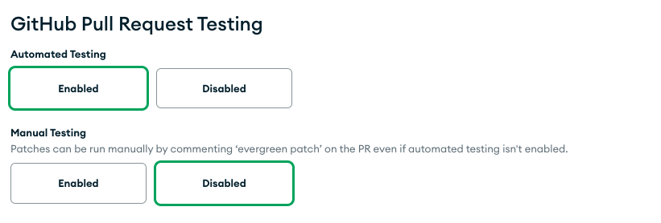
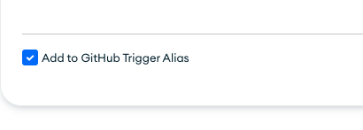
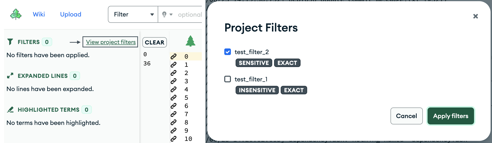

# Project and Distro Settings

The Project and Distro settings pages can be found at the right side
dropdown on the navigation menu. All users can access the distro
settings page and Project Admins and Superusers can access the project
settings page. All users can access basic project information via the /projects route
(this omits project variables, task annotation and workstation settings, and container secrets).

## Types of Special Users

### Superusers

Superusers can be set in the Evergreen settings file and have access to
all Evergreen projects and Evergreen distro settings.

### Project Administrators

Project Administrators have access to specific projects that they
maintain and can be set by an Evergreen Superuser in the Project
Settings page for that specific project. After adding the user's
Evergreen username to the list of Administrators, that user will be able
to access the Project Settings page for that project only and modify
repository information, access settings, alerts, and keys.

### Permissions Requested with Mana

Functionality has been added to Mana to make permission requests more
granular. Mana Entitlements can specify whether the user should have
read or write (or no) access to project settings, logs, task
annotations, and more. These can be requested for specific members or
for entire guilds. The project admins (or Evergreen admins, if no
project admins exist) are then able to approve/reject requested access
for their project.

If you'd like to use Entitlements for entire teams, then the team
should be part of a Guild, as this is refreshed every day and better
supports employees moving teams. Guilds can also dynamically add users
who match certain characteristics.

## Project Settings

The Project Settings file displays information about the Project itself,
as well as configurable fields for managing your project

There are two types of users that can view and edit these settings:
Superusers and Project Admins.

### General Project Settings

If a Project Administrator wants Evergreen to discontinue or start
tracking a project, it can be changed via the Enabled and Disabled radio
buttons. The display name field corresponds to what users will see in
the project dropdown on the navigation bar. Admins can change the
location or name of the config file in the repository if they would like
to have Evergreen run tests using a different project file located
elsewhere, or if they move the config file. The batch time corresponds
to the interval of time (in minutes) that Evergreen should wait in
between activating the latest version.

Admins can modify which GitHub repository the project points to and
change the owner, repository name, or branch that is to be tracked by
Evergreen.

Admins can also set the branch project to inherit values from a
repo-level project settings configuration. This can be learned about at
['Using Repo Level Settings'](Repo-Level-Settings.md).

### Access and Admin Settings

Admins can set a project as private or public. A private project can
only be seen by logged in users. A public project is viewable to those
who are not logged in as well. To set a Project Administrator edit the
Admin list (which can only be viewable by Superusers or Project Admins
for the project) for the project by adding the Evergreen username to the
list and saving the project settings.

Not pictured, the Restricted Project checkbox controls whether logged-in
users have basic access to the project (able to view tasks and logs,
able to submit patches). If checked, users will by default not have any
access, and access must be manually granted through an external system
via the REST API. The default for this setting is to allow logged-in
users basic access to this project. Note this is different from the
Private/Public setting above, which restricts access for users that are
not logged in.

### Scheduling Settings

Admins can enable the ability to unschedule old tasks if a more recent
commit passes.

### Variables

Admins can store project variables that can be referenced in the config
file via an expansion.

Options:

-   Checking **private** makes the variable redacted so the value won't
    be visible on the projects page or by API routes.
-   Checking **admin only** ensures that the variable can only be used
    by admins and mainline commits.

### Aliases

Aliases can be used for patch testing, commit queue testing, GitHub PRs,
GitHub checks, git tag triggers, project triggers, and patch triggers.

For most aliases, you must define a variant regex or tags, and a task
regex or tags to match. The matching variants/tasks will be included for the
alias. If matching by tags, alias tags support a limited set of the [tag
selector syntax](https://docs.devprod.prod.corp.mongodb.com/evergreen/Project-Configuration/Project-Configuration-Files/#task-and-variant-tags).
In particular, it supports tag negation and multiple tag criteria separated by
spaces to get the set intersection of those tags. For example, when defining
task tags:

- `primary` would return all tasks with the tag `primary`.
- `!primary` would return all tasks that are NOT tagged with "primary".
- `cool !primary` would return all items that are tagged "cool" and NOT tagged
  with "primary".

Each tag definition is considered independently, so as long as a task fully
matches one tag definition, it will be included. In other words, the matching
variants/tasks are the set union of all the individual tag definitions.

Aliases can also be defined locally as shown [here](../CLI.md#local-aliases).

### GitHub Pull Request Testing

Enabling "Automated Testing" will have Evergreen automatically create a patch for
each pull request opened in the repository as well as each subsequent
push to each pull request. In order for this to work, you must fill out
at least 1 row in the section titled "GitHub Patch Definitions," as
those define what tasks will be run in this patch.

The status of each build and the patch overall will appear as GitHub statuses
under your pull request. These will update as tasks in your PR complete. All the
tasks selected by the GitHub patch definition **must** pass for the patch to be
considered successful (except if they have specific activation conditions like
`activate: false`). For example, if you unschedule some of the tasks
automatically configured by the GitHub patch definition, the GitHub build status
will refuse to show a green check until all those tasks finish running.

If you'd like the option of creating patches but wouldn't like it to happen automatically,
you can enable "Manual Testing".



You can also have tasks run for a *different* project for
each pull request opened in the repository as well as each subsequent
push to each pull request. To do that, add a trigger aliases to the
"Github Trigger Alias" section. Before an alias can be added, it needs
to be defined in the "Patch Trigger Aliases" section.



For security reasons, commits by users outside of your organization will
not automatically be run. A patch will still be created and must be
manually authorized to run by a logged-in user.

### Github Checks

This supports Github checks on commits (i.e. to be visible at
<https://github.com/>\<owner\>/\<repo\>/commits). Task/variant
regexes/tags are required, and Github statuses will be sent with only
the status of those tasks on the mainline commit version.

### Trigger Versions With Git Tags

This allows for versions to be created from pushed git tags.

-   The tag must be pushed after the commit has been merged to ensure
    that the waterfall version has already been created for the
    revision.
    -   It is possible to push the tag on the same line as the commit
        using `&&` but this is recommended for low-risk commits only.
-   Versions are displayed on the waterfall page.
-   The author of the version matches the author from the original
    waterfall version.
-   The version is titled "Triggered From Git Tag '\<git tag\>':
    \<commit message for this revision\>"
-   The expansion `${triggered_by_git_tag}` is set to the git tag that
    was pushed.
-   If the revision exists for multiple projects, it will check if a
    version should be created for each project.

1.  **Configure what users/teams are authorized to trigger versions with
    git tags for the project.**

You can define this in a list on the project settings page. For users,
these should be Github users or bot names. For teams, this should be the
slug for the team (for example, the team Evergreen Users would be
evergreen-users), and any member in the team is authorized. Both teams
and individual users can be configured.

Alternatively, you can use Mana to give users permission to trigger git
tag versions for the project; however the user will need to add their
Github username to their [settings
page](https://evergreen.mongodb.com/settings) in order for us to connect
the Github user to an Evergreen user.

If the person who pushed the tag is not authorized, then the tag will
still be added to the existing version but no new version will be
triggered.

2.  **Add aliases to determine what tasks will run.**

There are two options for aliases:

-   **Define a new config file.** With this option, all tasks/variants
    in the config file will be used, so regexes/tags are not accepted.
    This is useful if you want to keep git-tag tasks and variants
    entirely separate from the main project config.
-   Use the default config file, and **define task/variant regexes or
    tags** to use with the existing project configuration (as you would
    for other aliases).

If you choose to use the project's existing project config file, you
can set `git_tag_only` to true for tasks you only want running on
git-tag-triggered versions, or `allow_for_git_tags` to false for tasks
you don't want to run on git-tag-triggered versions).

Ambiguous behavior is outlined here:

-   If the git tag that is pushed matches no git tag regexes, then no
    version will be created.
-   If the tag matches only one alias, then it will either use the file
    or use the task/variants defined.
-   If the git tag that is pushed matches multiple git tag regexes,
    then:
    -   If one or more have a file defined, then this is ambiguous and
        no version will be created.
    -   If all have variant/tasks configured, the union of these will
        determine what variants/tasks are created.

### Project Triggers

Users can specify that commits to another project (the "upstream"
project) will trigger builds in their project (the "downstream"
project). Configure triggers in the downstream project from the Project Triggers
section of the project configuration page. Click "Add Project Trigger".

Options:

-   Project: The upstream project.
-   Level: Accepted values are task, build, and push. Task and build levels will trigger
    based on the completion of either a task or a build in the upstream project. Push level triggers do 
    not require any upstream build or task to run, but instead trigger a downstream version once
    a commit is pushed to the upstream project.
-   Status: Only applicable to build and task level triggers. Specify which status of the upstream 
    build or task should trigger a downstream version.
-   Date cutoff: Do not trigger a downstream build if a user manually
    schedules a build older than this number of days.
-   Variant and task regexes: Trigger based on these variants (if
    build-level) or variants and tasks (if task-level) completing.
-   Definition file: The path to the downstream project's config file.
    This may be the same as the main project configuration file but does
    not have to be.
-   Alias: Run a subset of tasks by specifying an alias. Otherwise, all
    tasks run.
-   Unschedule Downstream Versions: If toggled, all tasks in the triggered 
    downstream version will be unscheduled by default, requiring manual scheduling. 
    Otherwise, all tasks will immediately scheduled once the downstream version is created.

### Patch Trigger Aliases

Users can create aliases that can be used in patch builds (in the
"upstream" project) to kick off a child patch (in the "downstream"
project). Create aliases in the upstream project in the Patch
Aliases section of the project configuration page. Click "Add Patch Trigger
Alias".

Options:

-   Alias: The name of the alias.
-   Project: The downstream project.
-   Module: Optionally specify a module to apply changes to.
-   Wait on: You can have the child patch wait on a complete(success or
    failed), success, or failed status from the parent. Otherwise the
    child patch will run immediately. If the patch depends on parent
    status, at least one parent task must be scheduled.
-   Patch alias, variant and task regexes: Run a subset of tasks in the
    downstream project by specifying an alias or by specifying task and
    variant regexes.

Once the Patch alias is created, you can use it when creating a patch
build, either by appending `--trigger-alias my_alias` to the evergreen
patch command when creating a patch via the CLI, or by selecting that
alias on the patch configure page on the new UI. The alias can also be
added as a Github Trigger Alias in the GitHub Pull Request Testing
section to kick off a child patch for each pull request opened in the
repository as well as each subsequent push to each pull request.

To pass information from the upstream patch to the downstream patch use
[downstream_expansions.set](Project-Commands.md#downstream_expansionsset)

### Periodic Builds

Evergreen has the capability to periodically run a set of tasks in the
project. The Periodic Builds section of the Project Settings page allows you to specify
what should be run periodically, and how often. **This is different than build variant crons** because
a build variant cron activates build variants on _existing waterfall commits_ based on the cron you specify
(so if you want it to run daily, it’ll activate the most recent build variant at that time daily),
whereas a new periodic build will be created each interval regardless of whether there are new commits.

Options:

- Interval: (Interval or cron required) Evergreen will create a version and run the specified tasks every X hours, with
    X being specified by this field. Unless set to a future time, the first run will happen immediately after the settings are saved.
- Cron: (Interval or cron required) Evergreen will create a version on the specified [cron schedule](https://crontab.guru/)
  (i.e. Min \| Hour \| DayOfMonth \| Month \| DayOfWeekOptional) in the user's timezone. This also accepts descriptors
  such as `@daily` (reference [cron](https://godoc.org/github.com/robfig/cron) for more example),
  but does not accept intervals. (i.e.`@every <duration>`).
- Config File: The .yml file that defines tasks to run. This can be
    the same one that defines tasks for commits in the project, or a
    different one.
- Patch Alias: Optional, you can specify an already-defined patch
    alias here to limit the tasks or variants that are run.
- Message: Optional, this will be saved as the description of the
    version that ends up being created when the tasks are run.


Periodic builds can be viewed on the project waterfall page, and can be
filtered on Spruce. You can also find out about the results of
periodic builds by adding a notification subscription on the project
settings page. In the notification popup, select "when any version
finishes" with Build Initiator = Periodic Build.

Also note that periodic builds cannot currently be used to schedule
tasks for which you hope to use performance tooling, like performance
monitoring charts. Use a cron to schedule your tasks if you'd like to
use performance tooling.

### Views and Filters
#### Project Health View
Customize the default behavior of the Project Health page by choosing to show failed task icons or all task icons. This setting corresponds to the toggle on the Project Health page (pictured below).


#### Parsley Filters
Define default filters for your project. Users can access these filters in Parsley and apply them directly to their logs.




### Task Sync

Enabling this feature allows users to push and pull their task working
directory to and from a remote store (S3). This can be done either using
the
[s3.push](Project-Commands.md#s3push)
or
[s3.pull](Project-Commands.md#s3pull)
project commands, or using it from [the CLI](../CLI.md#task-sync).

Options:

-   Enable for Project Config Commands: Users can use task sync commands
    in their Evergreen project config.
-   Enable for Tasks in Patches: Users can use task sync in their
    patches.

### Virtual Workstation Commands

Users can specify custom commands to be run when setting up their
virtual workstation.

Options:

-   Enable Git Clone: A git clone will automatically be run on the
    defined project, i.e. "git clone -b v20210623
    <git@github.com>:10gen/mms.git"
-   Commands: Specify commands to be run on the project in order using
    the setup CLI command from the workstation, allowing for an optional
    working subdirectory to be passed in.

### Performance Plugin

Users can enable the performance plugin for tracking historical
performance of tasks and tests.

### Build Baron

Configure the build baron to create build failure tickets under a
specific project from a list of projects to search for failures.

Options:

-   Ticket Create Project: The JIRA project to create build failure
    tickets in.
-   Ticket Search Projects: JIRA projects for the build baron to search
    in when looking for failures.

### Task Annotation Settings

Configure custom API integrations when generating build failure tickets.

Options:

-   Webhook: A custom setup for creating build failure tickets,
    specifying an endpoint an optional secret.
-   JIRA custom fields: Custom field and display test allowing for the
    creation of a specific field when displaying jira links.


### Metadata Links

Customize additional links to specify for your project under the Plugins section
of the project page, by specifying a link and title. 

Special Fields:
* `{version_id}` -- if this is included in the metadata link, we will sub in the ID when rendering the link

This may also be added to individual tasks using `metadata_links` 
for [task annotations](https://docs.devprod.prod.corp.mongodb.com/evergreen/API/REST-V2-Usage#task-annotations). 


## Distro Settings

The Distros page allows all users to see all available distros a project
can run tasks on. As a superuser or admin, one can also add new distro
configurations to be used by other users.

Distros describe machine configuration that run tasks as well as the
worker pools were tasks execute. As a result much of the available
configuration that controls how tasks execute occurs at the distro
level. For more information about available distro choices see [Guidelines around Evergreen distros](https://wiki.corp.mongodb.com/x/CZ7yBg)

### Scheduler Options

The process of scheduling tasks contains a number of distinct phases
that all execute independently:

1.  *Task Finding* identifies all runable undispatched runnable tasks
    for a distro. You can choose to include tasks which have unsatisfied
    dependencies, if the task dispatcher supports having these tasks in
    the queue. There are multiple implementations of the task finder in
    evergreen, which use different approaches to returning these
    queries. Evergreen typically uses the "Legacy" implementation in
    production because it is the most stable, but the other
    implementations are equivalent.

2.  *Task Planning* manages how tasks are ordered in the queue. There
    are two implementations, Evergreen's Legacy implementation which
    orders tasks using a short circuiting list of comparison operation,
    and the "Tunable" implementation which uses a point-based
    algorithim that makes it possible to tune the factors that impact
    the ordering of a task. The tunable factors are:

    -   Target time for the queue, or the number of minutes that the
        queue should take. (This will move to the host allocator
        settings after
        [EVG-703](https://jira.mongodb.org/browse/EVG-703)).
    -   *Patch Factor* how much to weight patches over non-patch builds.
        For most workloads, privileging patches over mainline builds
        will improve the throughput of your team to complete requests,
        if patch builds are a prerequisite to committing.
    -   *Time in Queue* how much to weight tasks that have been waiting
        for a long period of time over tasks that have entered the queue
        more recently. This factor privileges older patches and newer
        mainline tasks. Modifying this value may make it easier to meet
        SLAs for task latency.
    -   *Expected Runtime* how to weight longer tasks over shorter
        tasks. Generally running longer tasks first will lead to higher
        overall throughput, at the cost of increasing the latency for
        first responses.
    -   *Task Ordering* provides the operation to interleave patches and
        mainline builds; however, you can opt prefer patches over
        mainline tasks, at the risk of starving one or the other.
    -   *Group Versions* typically evergreen will sort individual tasks
        which allows tasks from different versions to run in parallel;
        however, you can tell evergreen to group all tasks from a single
        version in the queue together.

    If dependencies are included in the queue, the tunable planner is
    the only implementation that can properly manage these dependencies.

3.  *Host Allocation* controls the how Evergreen starts new machines to
    run hosts. The utilization-based implementation is aware of task
    groups, is the most recent implementation, and works well. All
    implementations have a slight over-allocation bias.

4.  *Task Dispatching* controls how Evergreen dispatches tasks to hosts.
    There are three implementations:

    -   legacy, is no longer used in production, and is deprecated.
    -   revised, is the most stable implementation and has first-class
        support for task groups, but does not support
    -   revised-with-dependencies, is a new scheduling system developed
        with the tunable planner and is the only dispatcher that can
        handle dependencies have not yet been satisfied.

## Version Control

Enabling version control for configurations on the project page will
allow a number of the settings detailed above to also be specified in
the project YAML alongside the settings that are specified in ['Project Configuration Files'](Project-Configuration-Files.md).
Evergreen will merge the settings in the project page, repo page, then the YAML, in that order. In case of duplicates, like aliases with the same names, the ones defined on the project page will take precedence over those
defined in the YAML.

Note: [included files](Project-Configuration-Files.md#include) do not currently support version-controlled configurations. Version-controlled configuration must
be defined in the main YAML file for it to take effect.

Below shows example configurations for these settings that can be
included within the project YAML and the configuration structure
associated with each setting.

## Aliases

[View setting
definition](#aliases)

### Patch Aliases

``` yaml
patch_aliases:
  - alias: "patch_alias_1"
    variant_tags: ["pr_check", "pr_check_all"]
    task_tags: ["pr_check"]

  - alias: "patch_alias_2"
    variant: "^ubuntu1604$"
    task: "^test.*$"
    parameters:
        - key: "myParam"
        - value: "defaultValue"
```

### Commit Queue Aliases

``` yaml
commit_queue_aliases:
  - variant: "^ubuntu1604$"
    task: "^smoke-test$"
```

### PR Aliases

``` yaml
github_pr_aliases:
  - variant: "^lint$"
    task: "^generate-lint$"
```

### Git Tag Aliases

``` yaml
git_tag_aliases:
    git_tag: "v*"
    remote_path: ""
    variant_tags: ["pr_check_all"]
    task_tags: ["pr_check"]
```

### GitHub Checks Aliases

``` yaml
github_checks_aliases:
 - variant: "^ubuntu1604$"
   task: "^test.*$"
```

### Scheduling Settings

[View setting
definition](#scheduling-settings)

``` yaml
deactivate_previous: true
```

### Virtual Workstation Commands

[View setting
definition](#virtual-workstation-commands)

``` yaml
git_clone: true
setup_commands:
- command: "./run-test.sh"
  directory: "/etc"
```

### Task Sync

[View setting
definition](#task-sync)

``` yaml
task_sync:
   config_enabled: true
   patch_enabled: false
```

### Build Baron

[View setting
definition](#build-baron)

``` yaml
build_baron_settings:
  ticket_create_project: EVG
  ticket_search_projects:
    - SERVER
    - EVG
```

### Task Annotation Settings

[View setting
definition](#task-annotation-settings)

``` yaml
task_annotation_settings:
  web_hook:
    endpoint: "/api/route"
    secret: ""
  jira_custom_fields:
  - field: "created_by"
    display_text: "owner"
```
