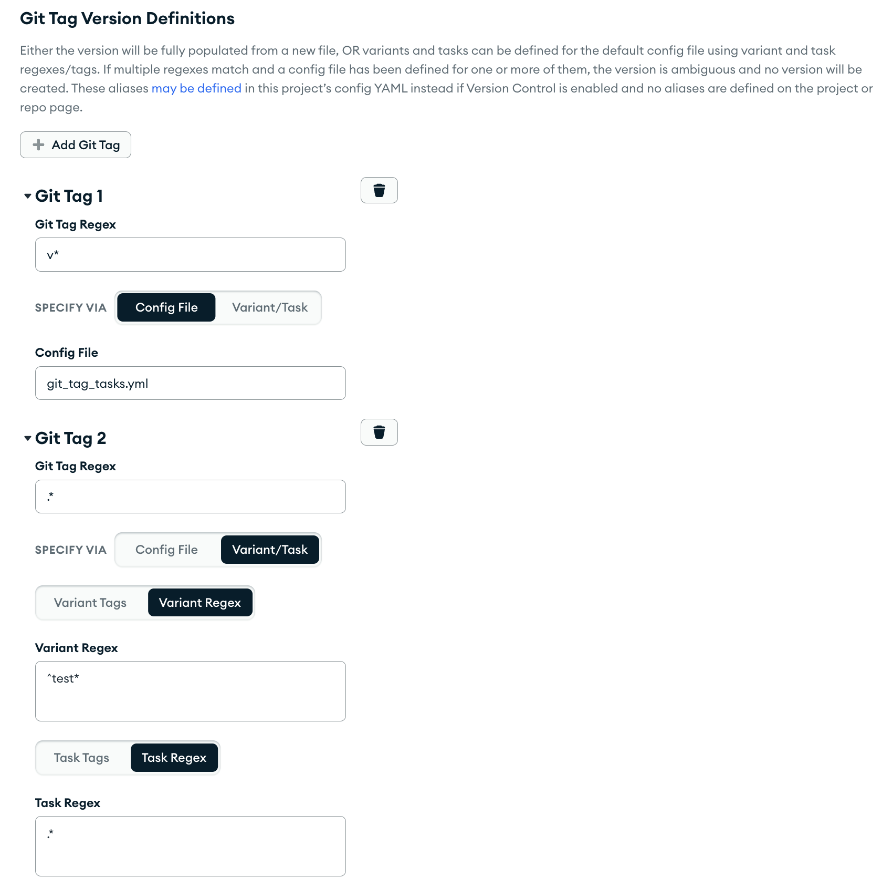
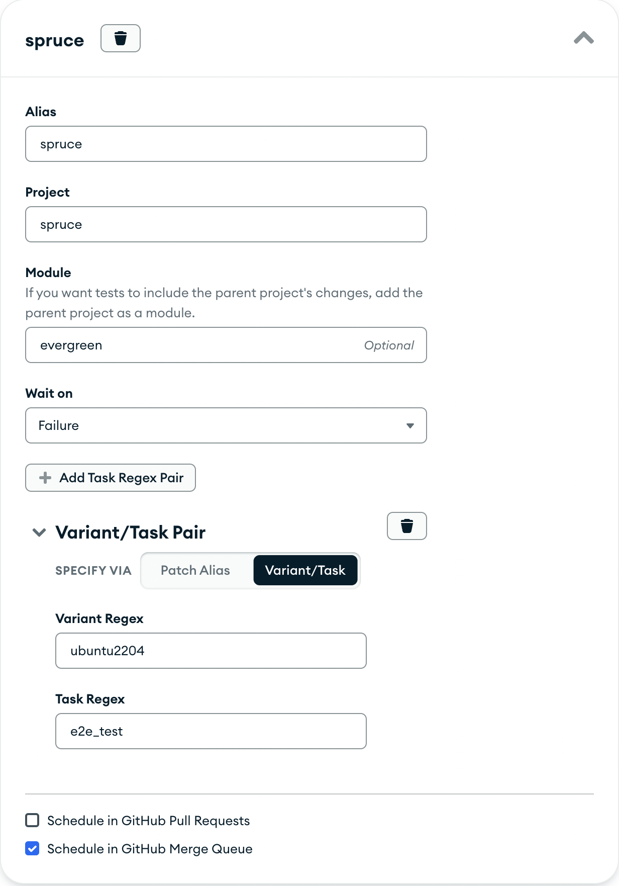

# Project and Distro Settings

The Project and Distro settings pages can be found at the right side
dropdown on the navigation menu. All users can access the distro
settings page and Project Admins and Superusers can access the project
settings page. All users can access basic project information via the /projects route
(this omits project variables, task annotation and workstation settings, and container secrets).

## Types of Special Users

### Superusers

Superusers can be set in the Evergreen settings file and have access to
all Evergreen projects and Evergreen distro settings.

### Project Administrators

Project Administrators have access to specific projects that they
maintain and can be set by an Evergreen Superuser in the Project
Settings page for that specific project. After adding the user's
Evergreen username to the list of Administrators, that user will be able
to access the Project Settings page for that project only and modify
repository information, access settings, alerts, and keys.

### Service Users

Service users cannot be managed through MANA. Instead, they have a special
role called `api_user_access`. This role grants them permission to submit
patches and to edit tasks (restart, set priority, abort) in unrestricted
projects. If a service user needs permission to submit patches on behalf
of another user, the Evergreen team must grant this explicitly.

### Permissions Requested with MANA

Functionality has been added to Mana to make permission requests more
granular. Mana Entitlements can specify whether the user should have
read or write (or no) access to project settings, logs, task
annotations, and more. These can be requested for specific members or
for entire guilds. The project admins (or Evergreen admins, if no
project admins exist) are then able to approve/reject requested access
for their project.

In order to access this functionality, you must look up the MANA resource
with the type `Evergreen Project` with the name of the project that
permissions need to be requested for on [MANA](https://mana.corp.mongodbgov.com/).
Using the filter icon to only view resources of type `Evergreen Project` makes this easier.
Once the project is selected, click on the `Request Access` button and fill out the
`Requesting for` field to see the specific types of permissions that can be
requested on Evergreen as pictured below.


If you'd like to use Entitlements for entire teams, then the team
should be part of a Guild, as this is refreshed every day and better
supports employees moving teams. Guilds can also dynamically add users
who match certain characteristics.

## Project Settings

The Project Settings file displays information about the Project itself,
as well as configurable fields for managing your project

There are two types of users that can view and edit these settings:
Superusers and Project Admins.

### General Project Settings

If a Project Administrator wants Evergreen to discontinue or start
tracking a project, it can be changed via the Enabled and Disabled radio
buttons. The display name field corresponds to what users will see in
the project dropdown on the navigation bar. Admins can change the
location or name of the config file in the repository if they would like
to have Evergreen run tests using a different project file located
elsewhere, or if they move the config file. The batch time corresponds
to the interval of time (in minutes) that Evergreen should wait in
between activating the latest version. For more on batch time and how
it differs from cron and [periodic builds](Project-and-Distro-Settings#periodic-builds), see [controlling when tasks run](Controlling-when-tasks-run).

Admins can modify which GitHub repository the project points to and
change the owner, repository name, or branch that is to be tracked by
Evergreen.

Admins can also set the branch project to inherit values from a
repo-level project settings configuration. This can be learned about at
['Using Repo Level Settings'](Repo-Level-Settings).

#### Spawn Host Script Path

The spawn host script path provides an option to run a script from your repo
when a spawn host starts. This should be specified as a file path relative to
the project root.

Warning: be careful if the script is meant to run on Windows. On Windows, this
script does _not_ run as Administrator but rather as a separate service user
(mci-exec), so you may see differences in things like file permissions and the
user's home directory (which is `/home/mci-exec` rather than
`/home/Administrator`). If the script is supposed to run on Windows spawn hosts,
your script has to handle user-specific things like using `/home/Administrator`
since user-dependent environment variables like `${HOME}` will not be what you
expect.

### Project Flags

Under project flags, admins have a number of options for users to configure what
runs for their project. For example, admins can enable the ability to unschedule old
tasks if a more recent commit passes, or configure tasks to stepback on failure to
isolate the cause.

Check out the settings on the page to see more options.

#### Stepback Bisection

By default, Evergreen does linear stepback which attempts to find out where a
task failed by activating previous commits as needed.

Admins can enable Stepback Bisection which recursively divides the commits
in half to reduce the tasks taken from O(n) to O(logn).

#### Repotracker Settings

By default, Evergreen creates mainline commits (also known as waterfall versions or
cron builds) for enabled projects.

Note that the repotracker requires at least one task to be scheduled to run for it to properly create a commit version. If all build variants or tasks have `activate: false`, the repotracker will not be able to pick up new commits. Ensure that at least one task in your project is configured to run to trigger the repotracker.

Admins can prevent projects from creating mainline commits by **disabling repotracking**,
while still allowing for other kinds of versions (periodic builds, patches, etc).

Additionally, admins can **Force Repotracker Run** to check for new commits if needed
(Evergreen occasionally misses commits due to misconfiguration or GitHub outages).

### Access and Admin Settings

To set a Project Administrator edit the
Admin list (which can only be viewable by Superusers or Project Admins
for the project) for the project by adding the Evergreen username to the
list and saving the project settings.

Not pictured, the Restricted Project checkbox controls whether logged-in
users have basic access to the project (able to view tasks and logs,
able to submit patches). If checked, users will by default not have any
access, and access must be manually granted through an external system
via the REST API. The default for this setting is to allow logged-in
users basic access to this project.

### Variables

Admins can store project variables that can be referenced in the config
file via an expansion.

Options:

- Checking **private** makes the variable redacted so the value won't be
  visible on the projects page or by API routes. Additionally, private
  variables will be redacted from task logs. After saving them, private
  variables cannot be retrieved.
- Checking **admin only** ensures that the variable can only be used
  by admins and mainline commits.

Project variables have some limitations:

- Project variable names can consist of alphanumeric characters, dashes (`-`),
  underscores (`_`), and periods (`.`). Other special characters are not
  allowed.
- Project variable names cannot contain the suffix `.gz`.
- Project variable names must be unique.
- Project variable names and values cannot be an empty string.
- A project variable's value cannot exceed 8 KB in length. If you need to store
  a value longer than 8 KB, you can store it in multiple variables and
  concatenate them together in a script when your task runs.

### Aliases

Aliases can be used for patch testing, merge queue testing, GitHub PRs,
GitHub checks, git tag triggers, project triggers, and patch triggers.

For most aliases, you must define a variant regex or tags, and a task
regex or tags to match. The matching variants/tasks will be included for the
alias. If matching by tags, alias tags support a limited set of the [tag
selector syntax](../Project-Configuration-Files/#task-and-variant-tags).
In particular, it supports tag negation and multiple tag criteria separated by
spaces to get the set intersection of those tags. Unlike the project tag selector
syntax linked above, alias tags should not be prefixed by a period.

For example, when defining task tags:

- `primary` would return all tasks with the tag `primary`.
- `!primary` would return all tasks that are NOT tagged with "primary".
- `cool !primary` would return all items that are tagged "cool" and NOT tagged
  with "primary".
- `!cool !primary` would return all items that are NOT tagged "cool" and NOT tagged
  with "primary".
- `!.cool !.primary` is invalid and will not work as expected. Alias tags should not
  be prefixed by a period.

Important note: Each tag definition is considered independently, so as long as a task
fully matches one tag definition, it will be included. In other words, the matching
variants/tasks are the set union of all the individual tag definitions.

For example:

- `["!cool", "!primary"]` would return all items that are not tagged "cool" OR not tagged
  "primary". That means that something with the tag "cool" (because it's !primary)
  and something with the tag "primary" (because it's !cool) will still be included.
- `["!cool !primary"]` would return all items that are not tagged "cool" AND not tagged
  with "primary". That means only items that don't have these tags will be included.

Aliases can also be defined locally as shown [here](../CLI#local-aliases).

### GitHub Pull Request Testing

Definitions for this section exist under the "GitHub" tab.

Enabling "Automated Testing" will have Evergreen automatically create a patch for
each pull request opened in the repository as well as each subsequent
push to each pull request. In order for this to work, you must fill out
at least 1 row in the section titled "GitHub Patch Definitions," as
those define what tasks will be run in this patch.

The status of each build and the patch overall will appear as GitHub statuses
under your pull request. These will update as tasks in your PR complete. All the
tasks selected by the GitHub patch definition **must** pass for the patch to be
considered successful (except if they have specific activation conditions like
`activate: false`). For example, if you unschedule some of the tasks
automatically configured by the GitHub patch definition, the GitHub build status
will refuse to show a green check until all those tasks finish running.

If you'd like the option of creating patches but wouldn't like it to happen automatically,
you can enable "Manual Testing".


You can also have tasks run for a _different_ project for
each pull request opened in the repository as well as each subsequent
push to each pull request. To do that, add a trigger aliases to the
"GitHub Trigger Alias" section. Before an alias can be added, it needs
to be defined in the "Patch Trigger Aliases" section.


For security reasons, commits by users outside of your organization will
not automatically be run. A patch will still be created and must be
manually authorized to run by a logged-in user.

#### Limiting when PR patches will run

You can optionally specify the oldest commit SHA that is allowed to be a merge base
for a PR, otherwise a PR patch will not be created. To do so, input the oldest SHA
on your project's branch you want to accept as the merge base via the 'Oldest Allowed Merge Base' field.

### GitHub Commit Checks

Definitions for this section exist under the "GitHub" tab.

This supports GitHub checks on commits (i.e. to be visible at
`https://github.com/<owner>/<repo>/commits`). Task/variant
regexes/tags are required, and GitHub statuses will be sent with only
the status of those tasks on the mainline commit version.

### Triggering Versions With Git Tags

Definitions for this section exist under the "GitHub" tab.

This allows for versions to be created automatically from pushed git tags,
and these versions will have the following properties:

- The author of the version will match the author from the original waterfall version.
- The tag must be pushed after the commit has been merged to ensure
  that the waterfall version has already been created for the
  revision.
  - It is possible to push the tag on the same line as the commit
    using `&&` but this is recommended for low-risk commits only.
- Versions are displayed on the waterfall page.
- The version is titled "Triggered From Git Tag '`<`git tag`>`':
  `<`commit message for this revision`>`"
- The expansion `${triggered_by_git_tag}` is set to the git tag that
  was pushed.
- If the same revision exists for multiple projects, Evergreen will check
  each project to determine if a git tag version should be created.

#### How to Configure Git Tag Versions

The following are the **required** steps needed to create versions from a
git tag:

##### Configure what users/teams are authorized to trigger versions with git tags for the project


This must be defined in a list on the project settings page. For users,
these should be GitHub users or bot names. For teams, this should be the
slug for the team (for example, the team Evergreen Users would be
evergreen-users), and any member in the team is authorized. Both teams
and individual users can be configured.

Alternatively, you can use Mana to give users permission to trigger git
tag versions for a project; however the user will need to add their
GitHub username to their [settings
page](https://evergreen.mongodb.com/settings) in order for us to connect
the GitHub user to an Evergreen user.

**NOTE**: If the person who pushed the tag is not part of the authorized users or
authorized teams, no version will be created. **If git tag versions are not being
created as you expect them to**, please first check that the tag pusher is part of
one of the above fields.

If you'd like for Git Tag triggered versions to be associated with the pusher,
ensure that they've set their GitHub username in
[their Evergreen preferences](https://spruce.mongodb.com/preferences/profile).

##### Add aliases to determine what tasks will run

There are two options for aliases:

- **Define a new config file.** With this option, all tasks/variants
  in the config file will be used, so regexes/tags are not accepted.
  This is useful if you want to keep git-tag tasks and variants
  entirely separate from the main project config.
- Use the default config file, and **define task/variant regexes or
  tags** to use with the existing project configuration (as you would
  for other aliases).

##### Ensure that a valid waterfall version is created for the commit you're tagging

Evergreen uses the existing yaml to validate that this is a valid project and simplify internal logic,
as well as to ensure that the tagged commit is tested.

Example:


If you choose to use the project's existing project config file, you
can set `git_tag_only` to true for tasks you only want running on
git-tag-triggered versions, or `allow_for_git_tags` to false for tasks
you don't want to run on git-tag-triggered versions).

Ambiguous behavior is outlined here:

- If the git tag that is pushed matches no git tag regexes, then no
  version will be created.
- If the tag matches only one alias, then it will either use the file
  or use the task/variants defined.
- If the git tag that is pushed matches multiple git tag regexes,
  then:
  - If one or more have a file defined, then this is ambiguous and
    no version will be created.
  - If all have variant/tasks configured, the union of these will
    determine what variants/tasks are created.

### Project Triggers

Users can specify that commits to another project (the "upstream"
project) will trigger builds in their current project (the "downstream"
project). Configure triggers **in the downstream project** from the Project Triggers
section of the project configuration page. Click "Add Project Trigger".

The purpose of a trigger is to trigger all needed tasks; as such **project triggers do not respect batchtime, cron,
or other activation settings.** To reduce the number of tasks/variants run in a trigger, we recommend supplying a
smaller config file, or an alias.

Options:

- **Project**: The upstream project identifier to listen to for commits.
- **Config file**: The path to the downstream project's config file.
  This may be the same as the main project configuration file but does
  not have to be.
- **Level**: Accepted values are task, build, and push. Task and build levels will trigger
  based on the completion of either a task or a build in the upstream project.
  - Push level triggers do not require any upstream build or task to run, but instead trigger a downstream version once
    a commit is pushed to the upstream project. This is helpful if the upstream project doesn't regularly run or create commit tasks.
  - For push level triggers, if the upstream project is a module of the downstream project's YAML,
    the manifest of the downstream version will use the commit hash of the upstream project's commit.
- **Status**: Specify which status of the upstream build or task should trigger a downstream version.
  (Only applicable to build and task level triggers.)
- **Date cutoff**: Do not trigger a downstream build if a user manually
  schedules a build older than this number of days.
- **Variant and task regexes**: Trigger based on these variants (if
  build-level) or variants and tasks (if task-level) completing.
- **Alias**: Run a subset of downstream tasks by specifying an alias. Otherwise, all
  tasks run. Aliases are defined on the Patch Aliases section.
- **Unschedule Downstream Versions**: If toggled, all tasks in the triggered
  downstream version will be unscheduled by default, requiring manual scheduling or stepback.
  Otherwise, all tasks will be immediately scheduled once the downstream version is created.

**Example:** to have new commits for the Evergreen project trigger end-to-end tests in Spruce,
a configuration like this could be added to **Spruce's project page:**


In this example, notice that Spruce tasks matching the e2e alias will trigger _only if_ the Evergreen dist task succeeds (and is less than one day old, per the date cutoff), and by default the Spruce tasks are unscheduled.
(This is helpful if you only want these tasks to be available for manual scheduling or stepback.)

### Patch Trigger Aliases

Users can create aliases that can be used in patch builds (in the
"upstream" project) to kick off a child patch (in the "downstream"
project). Create aliases **in the upstream project** in the Patch
Aliases section of the project configuration page. Click "Add Patch Trigger
Alias".

Options:

- **Alias**: The name of the alias.
- **Project**: The downstream project identifier.
- **Module**: If you want tests to include the upstream project's changes,
  add the upstream project as a module in the downstream project yaml, and specify that module name here.
- **Wait on**: You can have the child patch wait on a complete (success or
  failed), success, or failed status from the parent. Otherwise, the
  child patch will run immediately. If the patch depends on the parent
  status, at least one parent task must be scheduled.
- **Patch alias, variant and task regexes**: Run a subset of tasks in the
  downstream project by specifying an alias or by specifying task and
  variant regexes.

Once the Patch alias is created, you can use it when creating a patch
build, either by appending `--trigger-alias my_alias` to the evergreen
patch command when creating a patch via the CLI, or by selecting that
alias on the patch configure page on the new UI. The alias can also be
added as a GitHub Trigger Alias in the GitHub Pull Request Testing
section to kick off a child patch for each pull request opened in the
repository as well as each subsequent push to each pull request. If the
child patch tracks the same project and branch as the parent patch, the
child patch will also include the changes from the parent patch.

To pass information from the upstream patch to the downstream patch use
[downstream_expansions.set](Project-Commands#downstream_expansionsset)

**Example**: to allow testing Spruce tasks as part of patches for the Evergreen project,
a configuration like this could be added to **Evergreen's project page:**



This makes it possible to optionally add tasks matching the defined regex to any patch.

You can select "Schedule in GitHub Pull Requests" or "Schedule in GitHub Merge Queue" to have these tasks run automatically for each PR or merge queue patch.

Additionally, because "evergreen" is defined as a module in the yaml (pictured below), the Spruce tasks will incorporate the patch changes.


### Periodic Builds

Evergreen has the capability to periodically run a set of tasks in the
project. The Periodic Builds section of the Project Settings page allows you to specify
what should be run periodically, and how often. **This is different than build variant crons** because
a build variant cron activates build variants on _existing waterfall commits_ based on the cron you specify
(so if you want it to run daily, it’ll activate the most recent build variant at that time daily),
whereas a new periodic build will be created each interval regardless of whether there are new commits. For
more on those differences, see [controlling when tasks run](Controlling-when-tasks-run).

Options:

- Interval: (Interval or cron required) Evergreen will create a version and run the specified tasks every X hours, with
  X being specified by this field. Unless set to a future time, the first run will happen immediately after the settings are saved.
- Cron: (Interval or cron required) Evergreen will create a version on the specified [cron schedule](https://crontab.guru/)
  (i.e. Min \| Hour \| DayOfMonth \| Month \| DayOfWeekOptional) in the user's timezone. This also accepts descriptors
  such as `@daily` (reference [cron](https://godoc.org/github.com/robfig/cron) for more example),
  but does not accept intervals. (i.e.`@every <duration>`).
- Config File: The .yml file that defines tasks to run. This can be
  the same one that defines tasks for commits in the project, or a
  different one.
- Patch Alias: Optional, you can specify an already-defined patch
  alias here to limit the tasks or variants that are run.
- Message: Optional, this will be saved as the description of the
  version that ends up being created when the tasks are run.

Periodic builds can be viewed on the project waterfall page, and can be
filtered on Spruce. You can also find out about the results of
periodic builds by adding a notification subscription on the project
settings page. In the notification popup, select "when any version
finishes" with Build Initiator = Periodic Build.

Also note that periodic builds cannot currently be used to schedule
tasks for which you hope to use performance tooling, like performance
monitoring charts. Use a cron to schedule your tasks if you'd like to
use performance tooling.

### Views and Filters

#### Parsley Filters

Define default filters for your project. Users can access these filters in Parsley and apply them directly to their logs.


### Virtual Workstation Commands

Users can specify custom commands to be run when setting up their
virtual workstation. See more info [here](../Hosts/Developer-Workstations#project-setup).

Options:

- Enable Git Clone: A git clone will automatically be run on the
  defined project, i.e. "git clone -b v20210623
  <git@github.com>:10gen/mms.git"
- Commands: Specify commands to be run on the project in order using
  the setup CLI command from the workstation, allowing for an optional
  working subdirectory to be passed in.

### Performance Plugin

Users can enable the performance plugin for tracking historical
performance of tasks and tests.

### Project-Level Notifications

Project admins can set up notifications for when some events happen within the project. Admins can set up events when:

- Any version/build/task finishes/fails - these can be filtered by build initiator (commit, patch, PR,
  periodic build).
- First failure occurs in a version, for each build or for each task name - these can be filtered by build initiator
  (commit, patch, PR, periodic build).
- A previously-passing task fails - these can be filtered by failure type (any, test, system, setup). Furthermore, to
  reduce the amount of notifications received, the re-notification interval can be explicitly set.
- A previously-passing test fails - these can be filtered by test name and failure type (any, test, system, setup).
  Furthermore, to reduce the amount of notifications received, the re-notification interval can be explicitly set.
- The runtime for any/failed task exceeds some duration (in seconds).
- The runtime for a successful task changes by a percentage.

When the event happens, the notification can be delivered via:

- Jira comment under a specific Jira issue.
- New Jira issue - must specify a Jira project and issue type.
- Slack channel or user.
- Email address.
- Webhook URL - Notifications will be sent to the specified URL, and the payload
  body will contain the same data as would be returned from [the REST API](../API/REST-V2-Usage). For
  example, if receiving notifications whenever versions finish, it'll return the
  same JSON data as requesting [a single version from the REST API](../API/REST-V2-Usage#tag/versions/paths/~1versions~1{version_id}/get).
  Admins can configure the behavior for resending notifications in case of transient failure.

### Ticket Creation

Configure task Failure Details tab options.

#### Jira Ticket Search and Create

Specify Jira projects to create and search tickets for.

Options:

- Ticket Search Projects: Jira projects for Evergreen to search
  in when looking for failures to populate the "Related Tickets
  from Jira" Failure Details tab section
- Ticket Create Project: The Jira project to file tickets for using
  the "File Ticket" Failure Details tab button. Additionally, you
  can configure the issue type.

#### Custom Ticket Creation

Specify the endpoint and secret for a custom webhook to be called when the
File Ticket button is clicked on a failing task.

Options:

- Webhook Endpoint: The endpoint to be called.
- Webhook Secret: The secret to be used for the given endpoint.

### Task Annotation Settings

Configure custom API integrations when generating failure tickets.

Options:

- Webhook: A custom setup for creating failure tickets,
  specifying an endpoint an optional secret.

### Metadata Links

Customize additional links to show on patch metadata under the Plugins section
of the project page. Projects can specify a maximum of 5 different metadata links.

Special Fields:

- `{requesters}` — defines what kind of patches to show the metadata link on (e.g. only show the link on periodic builds)
- `{version_id}` — if this is included in the metadata link, we will sub in the ID when rendering the link

This may also be added to individual tasks using `metadata_links`
for [task annotations](../API/REST-V2-Usage#task-annotations).

## Distro Settings

The Distros page allows all users to see all available distros a project
can run tasks on. As a superuser or admin, one can also add new distro
configurations to be used by other users.

Distros describe machine configuration that run tasks as well as the
worker pools were tasks execute. As a result much of the available
configuration that controls how tasks execute occurs at the distro
level. For more information about available distro choices see [Guidelines around Evergreen distros](https://wiki.corp.mongodb.com/x/CZ7yBg)

### Scheduler Options

The process of scheduling tasks contains a number of distinct phases
that all execute independently:

1. _Task Finding_ identifies all runable undispatched runnable tasks
   for a distro. You can choose to include tasks which have unsatisfied
   dependencies, if the task dispatcher supports having these tasks in
   the queue. There are multiple implementations of the task finder in
   evergreen, which use different approaches to returning these
   queries. Evergreen typically uses the "Legacy" implementation in
   production because it is the most stable, but the other
   implementations are equivalent.

2. _Task Planning_ manages how tasks are ordered in the queue. We currently
   use the "tunable" implementation, which uses a point-based
   algorithm that makes it possible to tune the factors that impact
   the ordering of a task. The tunable factors are:
   - _Target Time_ is the ideal maximum number of minutes that a
     task should be in the queue.
   - _Patch Factor_ how much to weight patches over non-patch builds.
     For most workloads, privileging patches over mainline builds
     will improve the throughput of your team to complete requests,
     if patch builds are a prerequisite to committing.
   - _Time in Queue_ how much to weight tasks that have been waiting
     for a long period of time over tasks that have entered the queue
     more recently. This factor privileges older patches and newer
     mainline tasks. Modifying this value may make it easier to meet
     SLAs for task latency.
   - _Expected Runtime_ how to weight longer tasks over shorter
     tasks. Generally running longer tasks first will lead to higher
     overall throughput, at the cost of increasing the latency for
     first responses.
   - _Task Ordering_ provides the operation to interleave patches and
     mainline builds; however, you can opt prefer patches over
     mainline tasks, at the risk of starving one or the other.
   - _Group Versions_ typically evergreen will sort individual tasks
     which allows tasks from different versions to run in parallel;
     however, you can tell evergreen to group all tasks from a single
     version in the queue together.

   If dependencies are included in the queue, the tunable planner is
   the only implementation that can properly manage these dependencies.

3. _Host Allocation_ controls how Evergreen starts new machines to
   run hosts. The utilization-based implementation is aware of task
   groups, is the most recent implementation, and works well. All
   implementations have a slight over-allocation bias.

4. _Task Dispatching_ controls how Evergreen dispatches tasks to hosts.
   There is currently only one implementation, revised-with-dependencies,
   which is a scheduling system developed with the tunable planner and is the only dispatcher that can
   handle dependencies have not yet been satisfied.

## Version Control

A subset of the above project settings can also be specified in [config YAML](Project-Configuration-Files).
To enable this feature, the "version control" flag must be enabled on the project settings page.


Once toggled, the settings specified [below](#available-fields) may be defined in YAML, rather than in the project or repo settings page.

**Note**: [included files](Project-Configuration-Files#include) do not currently support version-controlled configurations. Version-controlled configuration must
be defined in the main YAML file for it to take effect.

### Hierarchical Inheritance

Since these settings may be defined in either the project settings page, repo settings page, or YAML, there is a hierarchy of inheritance,
which is as follows:

1. Project settings page
2. Repo settings page
3. YAML

This means that YAML settings are overridden by repo page settings, which are overridden by project page settings. For example,
if the YAML defines a [field](#available-fields) such as `patch_aliases`, and the project / repo settings page also defines
patch aliases, the YAML settings will be ignored until the corresponding project / repo settings are cleared. This
is applicable for all settings that may be defined in YAML.

### Available Fields

The following are example configurations for how to define each setting that may be
defined in the project YAML, along with a link to its equivalent project setting.

### Project Aliases

[View setting
definition](#aliases)

### Patch Aliases

```yaml
patch_aliases:
  - alias: "patch_alias_1"
    variant_tags: ["pr_check", "pr_check_all"]
    task_tags: ["pr_check"]

  - alias: "patch_alias_2"
    variant: "^ubuntu1604$"
    task: "^test.*$"
    parameters:
      - key: "myParam"
        value: "defaultValue"
      - key: "myOtherParam"
        value: "anotherOne"
```

### Merge Queue Aliases

These apply to the [GitHub merge queue integration](../Merge-Queue).

```yaml
commit_queue_aliases:
  - variant: "^ubuntu1604$"
    task: "^smoke-test$"
```

### PR Aliases

```yaml
github_pr_aliases:
  - variant: "^lint$"
    task: "^generate-lint$"
```

### Git Tag Aliases

```yaml
git_tag_aliases:
  git_tag: "v*"
  remote_path: ""
  variant_tags: ["pr_check_all"]
  task_tags: ["pr_check"]
```

### GitHub Checks Aliases

```yaml
github_checks_aliases:
  - variant: "^ubuntu1604$"
    task: "^test.*$"
```

### Scheduling Settings

[View setting
definition](#scheduling-settings)

```yaml
deactivate_previous: true
```

### Virtual Workstation Commands

[View setting
definition](#virtual-workstation-commands)

```yaml
git_clone: true
setup_commands:
  - command: "./run-test.sh"
    directory: "/etc"
```

### Ticket Creation

[View setting
definition](#ticket-creation)

```yaml
build_baron_settings: # This name is a holdover from legacy naming.
  ticket_create_project: EVG
  ticket_search_projects:
    - SERVER
    - EVG
```

### Task Annotation Settings

[View setting
definition](#task-annotation-settings)

```yaml
task_annotation_settings:
  web_hook:
    endpoint: "/api/route"
    secret: ""
```

## Test Selection Settings

Test selection is an experimental feature to help projects reduce testing that provides low signal. For example, if you
submit a patch for your change but one of the tests fails due to a known issue that's not related to your change, then
the test did not need to run because it's giving a false negative signal about your patch's mergeability. This can
improve the signal of a project's tests, reduce time for versions to finish, and save on the cost of running low-signal
tasks.

To allow any test selection features to be used in your project, first go to "Test Selection" -> "Project-Level Test
Selection" and enable it. Doing this will allow any test selection features to be used. Patches in the project may use
the [test selection command](Project-Commands#test_selectionget) (note: only supported in patches currently).

To enable test selection by default for all patch tasks, go to "Test Selection" -> "Task-Level Test Selection" and
enable it. Doing this will enable the usage of the [test selection command](Project-Commands#test_selectionget) in all
patch tasks by default. This default can still be overridden by choosing specific variants/tasks in which to enable test
selection from [the CLI](../CLI.md#test-selection).
