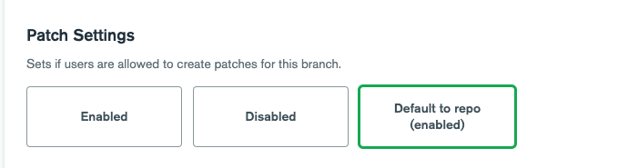

# Repo-Level Settings 

With the completion of [PM-610](https://jira.mongodb.org/browse/PM-610), it’s now possible to share settings across multiple different branches by “attaching” projects to the parent repo.

Once a project is attached, any undefined fields will default to the repo's fields. Attached projects will be grouped under the owner/repo that they're attached to in the sidebar.

An attached branch project is only read-only on the legacy UI, since this UI hasn't been extended to handle values inherited from the repo project, so to use the legacy UI or opt back out of the feature, the project will need to be detached. Additionally, changing owner or repo for a branch project will result in it inheriting values from a different repo value, so there is a new operation "Move to New Repo".

## How It Works
Branch projects can either have settings defined individually, or they can be set to default to the repo-level setting (repo-level settings can be defined on the repo project page itself). Entire sections of the project settings can be defaulted by clicking Default to Repo on Page at the top corner. 

For example, the below setting indicates that is defaulting to the repo-level setting, which we can see here is true.

Similarly, lists can either be defined explicitly for the branch project ("Override") or can be set to default, in which case the repo settings will be available as read-only for convenience. For example, the following patch alias has been set at the repo-level, so it's visible from it's branch pages but cannot be modified.

Text box fields can be defaulted simply by leaving them empty, and the default value will be displayed.

Exceptions to this behavior: 

- **Admins**: Branch admins and repo admins have slightly different permissions. Repo admins are admins over the whole repo, meaning that they can edit repo settings and branch settings for any attached branch project. Branch admins are only admins over the branches they are listed for, and can _view_ repo settings, but cannot make edits, making their permissions a subset of the repo admin's permissions.

- **Variables**: It's expected that branches may have many variables in common, with a few variables that are branch specific. Because of this, branches will use both repo-level variables and branch-level variables, however if there's a conflict between variable names then the branch-level definition will take precedent. For example, the following project has ``jiraserver`` defined in both the repo and branch settings, so the branch setting value ``different-jira.mongodb.org`` will be used, as well as the branch-defined ``var1`` and the repo-defined ``num_hosts``. 

## How to Use PR Testing for Untracked Branches

A highly requested feature is to allow PR testing to be possible for untracked branches (i.e. branches without an explicit project, waterfall, etc). To create PR patches for any Github PR for a repo, simply set a config file path, define PR aliases, and toggle PR testing to Enabled on the repo settings page. 

To explicitly disallow this behavior for any individual branch, either override the PR aliases on the branch project page or set PR testing to Disabled for that branch.

