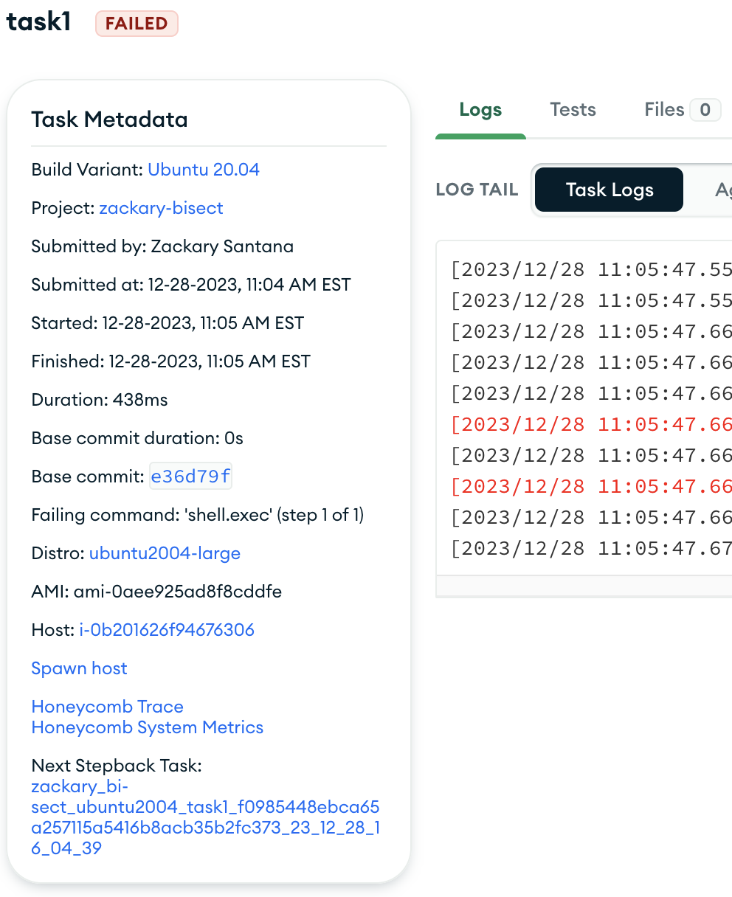
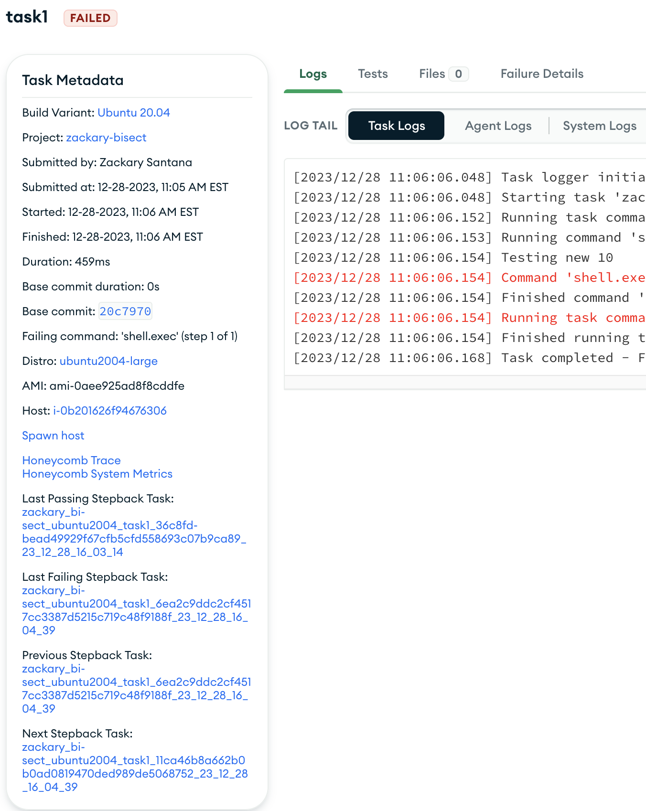

# Stepback Bisection
Evergreen's stepback bisection performs stepback by continuously reducing the amount of commits needed to test by half. To enable it, go to the project settings 'general' tab.

## Workflow
Stepback is Evergreen's workflow for finding a commit in a chain of untested commits that breaks a test. A chain of untested commits happens when many commits are pushed upon the tracking branch at once so a patch is only ran for the HEAD commit (patches are made for the commits between the HEAD and the previous HEAD, but they are unscheduled). If a test fails, Evergreen performs stepback (if stepback is enabled in the project configuration file / project settings).

## Strategy
Traditionally, Evergreen performed linear stepback only. This is testing each previous commit one by one. If stepback bisection is enabled, Evergreen with use bisection instead of linear.

Stepback bisection tests the commit between the HEAD and last passing commit, effectively breaking the searchable area in half. If there is no clean mid commit, it will take the earlier commit. It continues this until we have a failing and passing commit side-by-side (see the example below).

Cases:
- If the test passes, bisection is performed between the HEAD and the commit that was just tested.
- If the test fails, bisection is performed between the commit that was just tested and the last passing commit.

### Navigation

Tasks involved in stepback bisection will have additional information added to their card: 'Last Failing Stepback Task', 'Last Passing Stepback Task', 'Previous Stepback Task', and 'Next Stepback Task'.

The HEAD commit that initiated stepback will only have a 'Next Stebpack Task'. Tasks that are currently running will not have a 'Next Stebpack Task' until they finish. The final task in stepback will also not have a 'Next Stepback Task'.

Initial task that initiates stepback (HEAD commit):

Tasks between the initial and final stepback task:

Final stepback task:

## Example
Below is an example where we have a past passing commit labeled 'Passing commit', 10 commits labeled 1-10, then a HEAD failing commit labeled 'Latest commit'. The commit labeled '3' is our offending commit stepback is attempting to find. The 'Latest commit' and commits labeled 1-10 were pushed at the same time. The waterfall will appear as:

Once the latest commit finishes and reports a failing status, Evergreen will activate the task associated with the commit between our 'Latest commit' and 'Passing commit'.

As the middle commit task (aka commit labeled '5' fails), Evergreen will activate the task between '5' and 'Passing Commit'.

As commit '2' passes, Evergreen will activate the task between '5' and '2'.

Finally, commit 3 fails, ending stepback and declaring commit labeled '3' as the offending commit.

