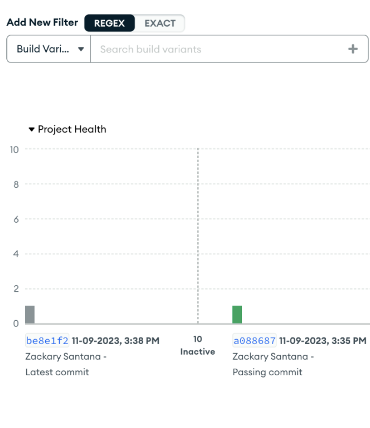
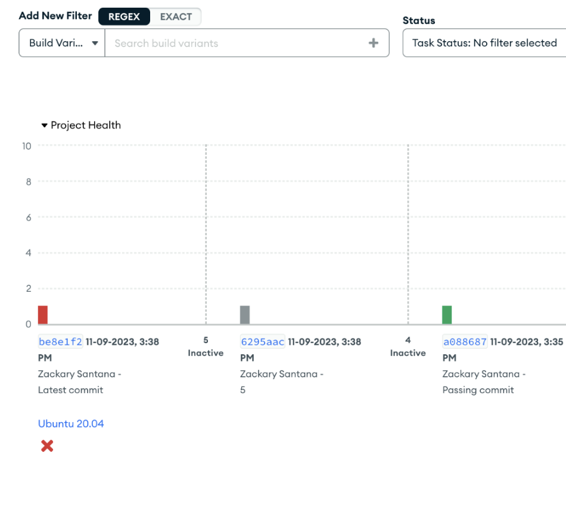
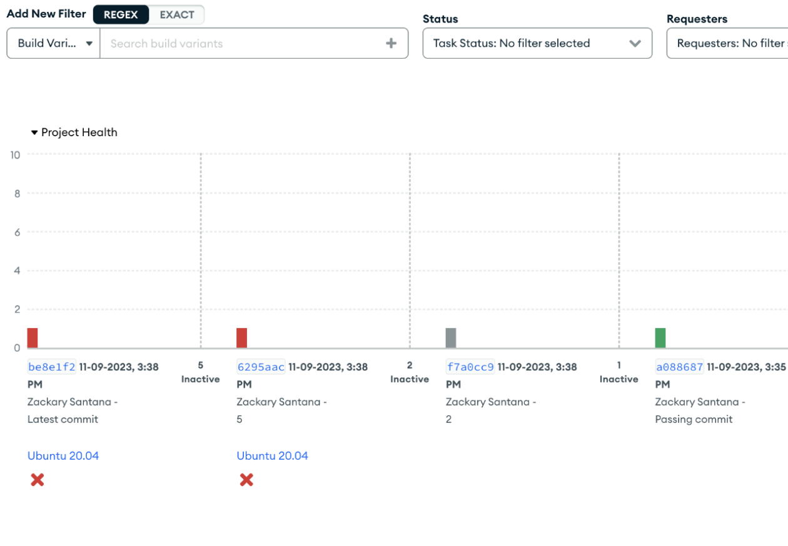
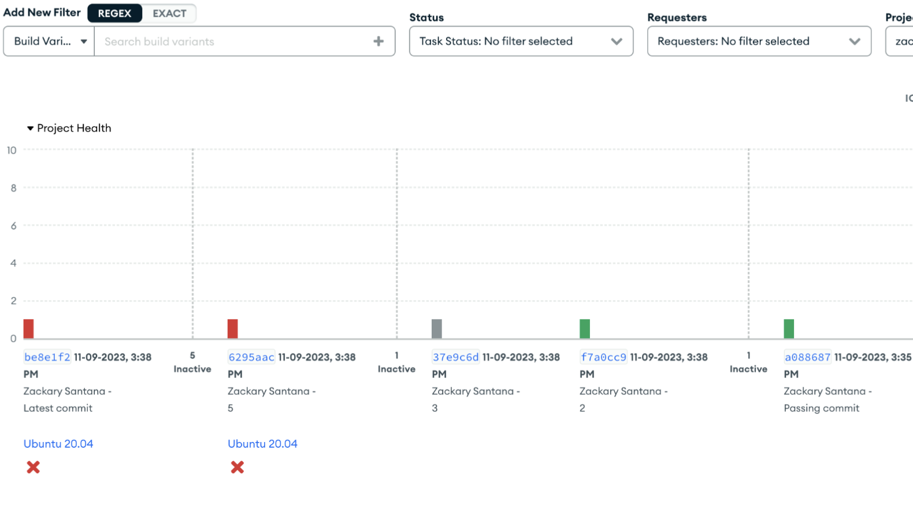
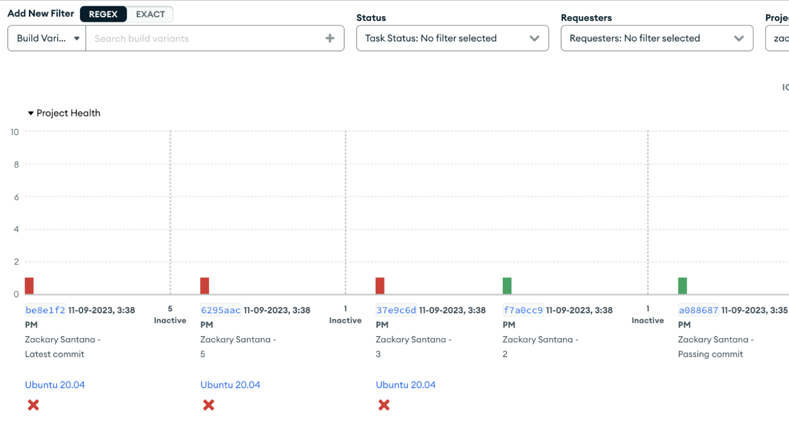

# Stepback Bisection

Evergreen's stepback bisection performs stepback by continuously reducing the amount of commits needed to test by half. To enable it, go to the Project Settings page "General" tab and enable the 'Stepback Bisection' flag. For this flag to work, the 'Stepback' flag will also need to be enabled. As well, stepback only activates on tasks that have failed normally and not for more specific reasons (like setup failed, system failed, etc.).

## Navigation

Once activated, tasks going through stepback biscection will have a new metadata tag labeled "Stepback" that indicates the progress of stepback (linear stepback will not have this). If it states completed, you can navigate to the commit that broke\* this test by going to the top right "Relevant Commits" dropdown and selecting "Go to breaking commit". If you notice "Go to breaking commit" is not available, it means you are on the commit that broke the test.

- This does not take into account flaky tests that may give false positives.

## Motivation

Traditionally, Evergreen performed linear stepback which activates each previous inactive commit. If stepback bisection is enabled, Evergreen will use bisection instead of linear.
Evergreen performs linear stepback by default, which takes O(n) steps in the worst case to find the offending commit. With bisection, Evergreen performs binary search on the remaining tasks, cutting down the worst time to O(logn) steps.

## Definitions

The following are all task-specific fields that populate separately for every task.
'Last Passing Stepback Task' is the last task that is known to pass (related to a mainline commit).
'Last Failing Stepback Task' is the failing mainline commit.
'Next Stepback Task' is the task that comes next in stepback (i.e. the current task is either a last passing/failing and bisection has picked the next task).
'Previous Stepback Task' is the task that happened before the current stepback task (i.e. the previous last passing/failing that caused this stepback task to activate)

## Strategy

Bisection starts with the failed commit that triggers it and the last known passing commit for that task. It then gets the version in the middle and activates the same task. This can be broken down to the following cases.

- If the task passes, Evergreen knows the offending commit is between the same failing commit and the task that just passed.
  - Evergreen activates the task (current) between the same failing commit and the task that just passed.
- If the task fails, Evergreen knows the offending commit is between the same passing commit and the task that just failed.
  - Evergreen activates the task (current) between the same passing commit and the task that just failed.
- Then in both cases:
  - The 'current' task's previous stepback task is set to the task that activated this step in stepback.
  - The task that activated this step in Stepback is updated to point their 'Next Stepback Task' to the 'current' task.
  - Once this task fails or passes, repeats the case that applies (with 'Previous' being the 'current' task).

## Example

Below is an example with:

- A passing commit labeled 'Passing commit'.
- Commits 1 - 10 (1 first, 10 last) labeled '1', '2', ... that are inactive.
- A failing commit labeled 'Latest commit'.

(i.e. x ? ? ? ? ? ? ? \_ ? ? ✔️ where x is the latest commit, \_ is the offending commit, and ✔️ is the latest passing).

Stepback bisection is turned on and attempting to find the commit '3'.

Once the latest commit finishes and reports a failing status, Evergreen will activate the task associated with the commit between our 'Latest commit' and 'Passing commit'.

As the middle commit task (aka commit labeled '5' fails), Evergreen will activate the task between '5' and 'Passing Commit'.

As commit '2' passes, Evergreen will activate the task between '5' and '2'.

Finally, commit 3 fails, ending stepback and declaring commit labeled '3' as the offending commit.

