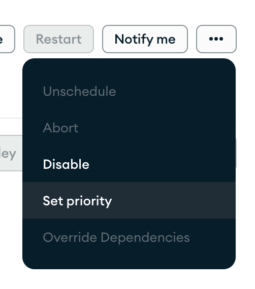

# Task Priority

Evergreen orders its task queues by taking into account a number of properties
of a task. These properties are given weights and are summed. Evergreen orders
the queues according to this sum. Weights are editable by Evergreen admins.
This process means that it's not possible for an Evergreen user or admin to
easily reason about the relative positions of specific tasks in the queue.

Properties of tasks that can influence their order include the following.
However, note that these properties can overlap in complex ways.

- Tasks that generate tasks are prioritized over tasks that do not.
- Patches are prioritized over mainline commits.
- Merge queue patches are prioritized over patches and mainline.
- Newer mainline builds are prioritized over older mainline builds.
- Stepped back tasks are prioritized over non-stepped back tasks.
- Tasks with more dependencies are prioritized over tasks with fewer dependencies.
- Tasks with longer runtimes are prioritized over tasks with shorter runtimes.
- Tasks with higher priorities set by users are prioritized over tasks with lower priorities.

It is possible for a user to change the priority of their task, which affects
one part of the sum. The default priority is 0. Valid priorities are 0-100 for
standard users, and higher for project admins. -1 will prevent a task from being
scheduled, e.g., by stepback.

To enforce responsible use of this feature, task priorities cannot be set above 50 in
the config YAML. If a value above 50 is used, the task will fall back to 50. Higher priorities
can be set in important circumstances by admins.

Please be conservative when setting high priorities, as this will deprioritize
other users' tasks relative to yours. Please stay below 50 if the change is not
high priority.

Priority can be set in the UI on the version and task pages from the three dots
menu -> Set priority.

It can also be set with the
[API](../API/REST-V2-Usage).
