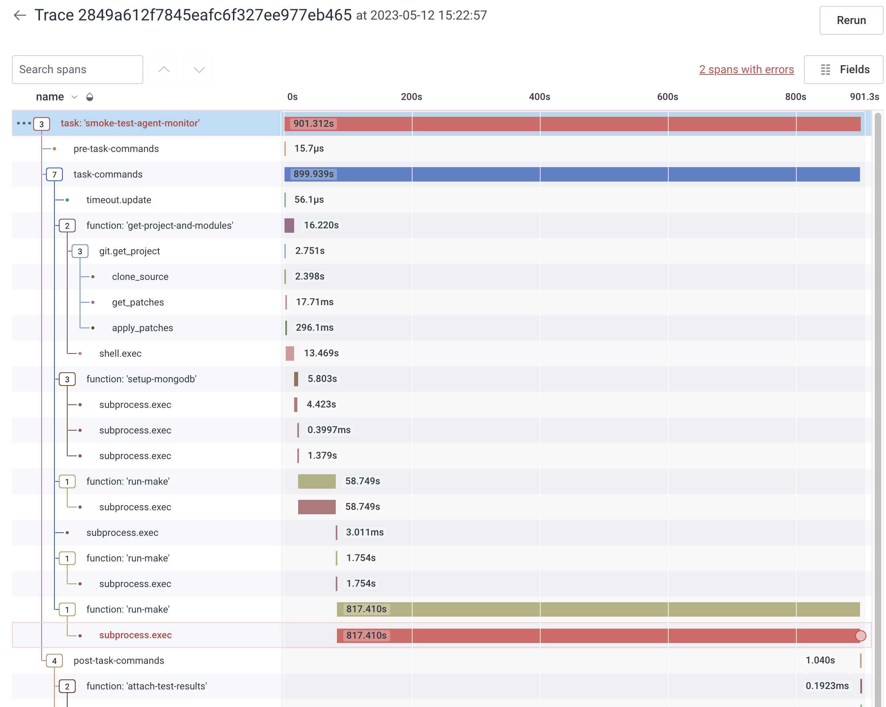

# Task Traces

Evergreen creates a trace for each task execution.


A task's execution is decomposed to the level of commands. If a command 
encounters an error the error is recorded as a [span link](https://opentelemetry.io/docs/concepts/signals/traces/#span-links) on the span.

## Sending traces
Evergreen provides two ways to send traces to the trace backend, 1) an [OTel collector](#otel-collector) and 2) [trace file parsing](#trace-file-parsing)

### OTel collector
Evergreen provides an [OTel collector](https://opentelemetry.io/docs/collector/) to capture traces. The gRPC endpoint is exposed to tasks as the `${otel_collector_endpoint}` [default expansion](Project-Configuration-Files#default-expansions).

### Trace file parsing
When a task finishes Evergreen will check the task's [working directory](../Reference/Glossary) for any [encoded](#json-protobuf-encoding) trace files written to a `${workdir}/build/OTelTraces` directory, parse them, and send them to the collector. This can be useful if a test is running without a connection to the network. Only trace files are supported, and OTel metrics/logs files in the directory will be skipped.

#### JSON protobuf encoding
OTel defines [JSON protobuf encoding](https://opentelemetry.io/docs/specs/otlp/#json-protobuf-encoding) for serializing traces to files. Some OTel SDKs support this natively (e.g. the Java SDK provides the [OtlpJsonLoggingSpanExporter exporter](https://javadoc.io/static/io.opentelemetry/opentelemetry-exporter-logging-otlp/1.10.0-rc.2/io/opentelemetry/exporter/logging/otlp/OtlpJsonLoggingSpanExporter.html)). If this isn't an option (e.g. the SDK for go doesn't provide a JSON protobuf exporter) another option is to configure the test to send its traces to a local collector running alongside the test and configure the collector to use the [file exporter](https://pkg.go.dev/github.com/open-telemetry/opentelemetry-collector-contrib/exporter/fileexporter). The file exporter is only available in [the collector's "contrib" distribution](https://github.com/open-telemetry/opentelemetry-collector-contrib) (release builds for many OS/architectures are available [here](https://github.com/open-telemetry/opentelemetry-collector-releases/releases)).


## **OpenTelemetry Best Practices**

### **Spans**

Span names should be descriptive and concise, clearly describing the operation being performed.  
#### **Examples:**  
- **Bad:** `span1`, `operation_x`, `unknown_process`  
- **Good:** `test`, `test_span`, `task_execution`

---

### **Attributes**

Attributes provide additional context to a span. They should be:  
- Key-value pairs (e.g., string, number, boolean).  
- Descriptive, concise, and relevant.  
- Consistent across spans to simplify search and analysis.

#### **Examples:**
- **Bad:**  
  - Attribute names: `attribute1`, `attr2`  
  - Lengthy names: `this_is_a_very_long_attribute_name_that_is_hard_to_read`  

- **Good:**  
  - `test_name="example_test"`  
  - `test_status="success"`  
  - `test_duration=123`

**Consistency Tip:** Use the same attribute names across spans performing similar operations. For example, all spans representing tests should use `test_name` for the test name. Avoid inconsistent naming like `test_name` in one span and `test_case_name` in another.

**Why It Matters:**  
Inconsistent attribute naming can:  
- Make it difficult to compare spans.  
- Lead to exceeding Honeycomb's global limit of 10,000 attributes, causing trace drops.  
> **Tip:** Avoid dynamically setting field names from your instrumentation code or generating field names on the fly. This can lead to runaway schemas, making the dataset difficult to navigate and causing Honeycomb to throttle the creation of new columns. Be cautious not to accidentally send a timestamp as a key instead of a value, and avoid sending unsanitized user input as a field name.

### **Tips**
#### **1. Use Namespaces for Context**

When defining span attributes, it's essential to provide context by using namespaces. This helps clarify the origin and purpose of the attribute, making it easier to interpret in analytics. Learn more about namespaces [here](https://docs.honeycomb.io/get-started/best-practices/organizing-data/#namespace-custom-fields).

##### **Bad Examples:**
- `function.name`
- `function.status`

##### **Good Examples:**
- `resmoke.function.name`
- `resmoke.function.status`

By including a namespace (e.g., `resmoke`, `e2e`), attributes are contextualized, making their purpose within the system clear. This also simplifies data filtering and analysis. For instance:  
- `task.status=success`  
- `project.identifier=evergreen`

---

#### **2. Avoid Excessive Dot Nesting**

While namespaces are useful, over-nesting with too many dots can lead to overly complex attribute names. This makes them harder to read and analyze.

##### **Bad Examples:**
- `host.is.volume.migration`
- `host.is.unexpirable`

##### **Good Examples:**
- `host.is_volume_migration`
- `host.is_unexpirable`

In these examples, underscores replace excessive dot nesting, keeping the attribute names concise and manageable.

---

#### **3. Use Snake Case**

When defining multi-word attributes, use `snake_case` to separate words. This ensures attributes are easy to read and understand.

##### **Examples:**
- **Bad:** `TestStatus`, `testStatus`, `test-status`  
- **Good:** `test_status`, `test_duration`

---

#### **4. Strive for Balance**

Balance the need for context with simplicity. Use namespaces thoughtfully to provide clarity without overcomplicating attribute structures. This approach ensures readability and utility in analytics. Learn more about OpenTelemetry attribute naming [here](https://opentelemetry.io/docs/specs/semconv/general/attribute-naming/).

---

### **Events**

Events record significant occurrences during a span's lifetime. Use them to capture meaningful moments, such as when a test starts, finishes, or fails.

#### **Examples:**
- **Bad:** `event1`, `event2`  
- **Good:** `test_started`, `test_completed`, `test_failed`

Events should have clear and concise names that describe the recorded event. Include relevant attributes for additional context.

---

### [When to use span events versus span attributes](https://opentelemetry.io/docs/concepts/signals/traces/#when-to-use-span-events-versus-span-attributes)

---

### **Quick Reference Checklist**

| **Best Practice**          | **Do**                                              | **Don’t**                          |
|-----------------------------|----------------------------------------------------|-------------------------------------|
| **Namespaces**              | Use meaningful namespaces (e.g., `task.status`)    | Use generic names (e.g., `status`) |
| **Dot Nesting**             | Use `_` for multi-word attributes                  | Over-nest with dots (e.g., `a.b.c`)|
| **Snake Case**              | Use `snake_case`                                   | Use camelCase or hyphens           |
| **Span Names**              | Use concise, descriptive names (e.g., `test_span`) | Use vague names (e.g., `span1`)    |
| **Consistency**             | Use the same attribute names across spans          | Use inconsistent names             |
| **Events**                  | Name events clearly (e.g., `test_started`)         | Use generic event names            |

---

## Hooking tests into command spans
Evergreen exposes every command's trace and span IDs to a running command as hex encoded strings in the `${otel_trace_id}` and `${otel_parent_id}` [default expansions](Project-Configuration-Files#default-expansions). To hook a test's spans into the command's span the trace id and parent id can be added to the current context.

### Language specific examples
The following examples illustrate how to inject the trace/span IDs into the context. They assume the script has the `${otel_trace_id}` and `${otel_parent_id}` expansions expanded.

#### Python
```python
from opentelemetry import trace, context
from opentelemetry.trace import NonRecordingSpan, SpanContext, TraceFlags

span_context = SpanContext(
    trace_id = int("${otel_trace_id}", 16),
    span_id = int("${otel_parent_id}", 16),
    trace_flags = TraceFlags(0x01),
    is_remote = False,
)
ctx = trace.set_span_in_context(NonRecordingSpan(span_context))

# Now there are a few ways to make use of the trace context.

# You can pass the context object when starting a span.
with tracer.start_as_current_span('child', context=ctx) as span:
    span.set_attribute('primes', [2, 3, 5, 7])

# Or you can make it the current context, and then the next span will pick it up.
# The returned token lets you restore the previous context.
token = context.attach(ctx)
try:
    with tracer.start_as_current_span('child') as span:
        span.set_attribute('evens', [2, 4, 6, 8])
finally:
    context.detach(token)

```
(adapted from [here](https://opentelemetry.io/docs/instrumentation/python/cookbook/#manually-setting-span-context))

#### Go
```go
import "go.opentelemetry.io/otel/trace"

traceID, err := trace.TraceIDFromHex("${otel_trace_id}")
if err != nil {
    return err
}
spanID, err := trace.SpanIDFromHex("${otel_parent_id}")
if err != nil {
    return err
}

// Create a span context from the provided trace/span ids.
sc := trace.NewSpanContext(SpanContextConfig{
    TraceID: traceID,
    SpanID: spanID,
    TraceFlags: trace.FlagsSampled,
})

// Inject the span context into a context.
ctx = trace.ContextWithSpanContext(ctx, sc)

// Use the ctx when creating the each of the test's root spans.
ctx, span = tracer.Start(ctx, "test_span")
defer span.End()
```
