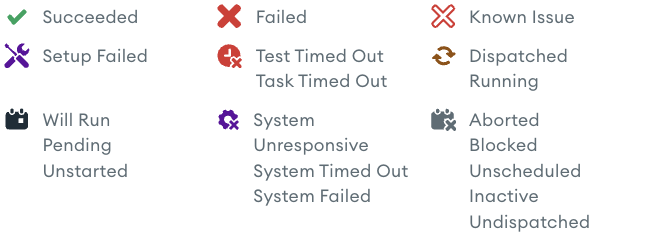

# Statuses

This document provides an overview of the various statuses used in our
system, along with their meanings, usage contexts, and the logic that determines
these statuses.

---

## Table of Contents

- [Unfinished Task Statuses](#unfinished-task-statuses)
  - [`undispatched`](#undispatched)
  - [`dispatched`](#dispatched)
  - [`started`](#started)
- [Final Task Statuses](#final-task-statuses)
  - [`success`](#success)
  - [`failed`](#failed)
  - [`aborted`](#aborted)
- [Display Status Logic](#display-status-logic)
  - [Status Determination Logic](#status-determination-logic)
  - [Display Statuses](#display-statuses)
- [Task Icon Reference](#task-icon-reference)
- [Version Statuses](#version-statuses)
- [Notes](#notes)

---

## Unfinished Task Statuses

These statuses indicate tasks that are currently in progress or scheduled to
run.

#### `undispatched`

**Description**: Indicates one of the following:

1. **Not Scheduled to Run**: The task is not activated
   (`Task.Activated == false`).
2. **Scheduled to Run**: The task is activated (`Task.Activated == true`) but
   has not yet been dispatched to an agent.

**Usage**: Reflects tasks awaiting dispatch, whether they're scheduled or not.

---

#### `dispatched`

**Description**: An [agent](./Glossary.md) has received the task, but the agent
has not yet notified the system that it's running the task.

**Usage**: Represents tasks that are assigned to agents but are not yet in
execution.

---

#### `started`

**Description**: The task is currently running on an agent.

**Usage**: Indicates active execution of a task.

---

## Final Task Statuses

These statuses indicate that a task has completed its execution.

#### `success`

**Description**: The task has finished successfully without any errors.

> `post_error_fails_task: false` will not fail the task if there is an error in
> the `post` block.

**Usage**: Denotes tasks that have met all requirements and passed all tests.

---

#### `failed`

**Description**: The task has finished but encountered failures. This status
covers any failure reason, which can be detailed in the task's end details.

**Usage**: General failure status for tasks that did not complete successfully.

---

## Display Status Logic

In addition to the core statuses, the system uses a set of **display statuses**
to provide more detailed information in the user interface. These statuses are
determined based on specific conditions derived from task properties.

### Status Determination Logic

The display status of a task is determined using the following logic, evaluated
in order:

1. **Known Issue**:
   - **Condition**: The task has annotations indicating a known issue
     (`HasAnnotations == true`).
   - **Display Status**: `known-issue`

2. **Aborted**:
   - **Condition**: The task was aborted (`Aborted == true`).
   - **Display Status**: `aborted`

3. **Success**:
   - **Condition**: The task status is `success`.
   - **Display Status**: `success`

4. **Setup Failed**:
   - **Condition**: The task failed during the setup phase
     (`Details.Type == "setup"`).
   - **Display Status**: `setup-failed`

5. **System Unresponsive**:
   - **Condition**:
     - `Details.Type == "system"`
     - `Details.TimedOut == true`
     - `Details.Description == "heartbeat"`
   - **Display Status**: `system-unresponsive`

6. **System Timed Out**:
   - **Condition**:
     - `Details.Type == "system"`
     - `Details.TimedOut == true`
   - **Display Status**: `system-timed-out`

7. **System Failed**:
   - **Condition**: `Details.Type == "system"`
   - **Display Status**: `system-failed`

8. **Timed Out**:
   - **Condition**: `Details.TimedOut == true`
   - **Display Status**: `test-timed-out`

9. **Task Timed Out**:
   - **Condition**: `Details.TimedOut == true`
   - **Display Status**: `task-timed-out`

10. **Unscheduled**:
    - **Condition**:
      - `Activated == false`
      - `Status == "undispatched"`
    - **Display Status**: `unscheduled`

11. **Blocked**:
    - **Condition**:
      - `Status == "undispatched"`
      - `OverrideDependencies != true`
      - The task has unattainable dependencies (`isUnattainable == true`)
    - **Display Status**: `blocked`

12. **Will Run**:
    - **Condition**:
      - `Status == "undispatched"`
      - `Activated == true`
    - **Display Status**: `will-run`

13. **Default**:
    - **Condition**: If none of the above conditions are met.
    - **Display Status**: The task's original status (`Status`)

### Display Statuses

Below are the display statuses derived from the logic above, along with their
descriptions.

---

#### `known-issue`

**Description**: The task has failed and is being tracked by a linked issue in
the task annotations.

**Usage**: Helps users quickly identify failures related to recognized problems.

---

#### `aborted`

**Description**: The task was aborted while it was running.

**Usage**: Used when a task is intentionally stopped before completion.

---

#### `success`

**Description**: The task has finished successfully without any errors.

**Usage**: Denotes tasks that have met all requirements and passed all tests.

---

#### `setup-failed`

**Description**: The task failed during the setup phase.

**Usage**: Highlights failures occurring before the main execution, useful for
setup diagnostics.

---

#### `system-unresponsive`

**Description**: The task failed due to a system error, specifically a heartbeat
timeout indicating the system became unresponsive.

**Usage**: Differentiates failures due to unresponsive systems for targeted
troubleshooting.

---

#### `system-timed-out`

**Description**: The task failed due to a system-level timeout.

**Usage**: Indicates tasks that failed because the system exceeded the allowed
time for operations.

---

#### `system-failed`

**Description**: The task failed due to a system error.

**Usage**: Differentiates system-level failures from other failure types for
troubleshooting.

---

#### `test-timed-out`

**Description**: The task failed because one or more tests exceeded the allotted
time (`Details.TimedOut == true`).

**Usage**: Indicates tasks that did not complete due to time constraints during
testing phases.

---

#### `task-timed-out`

**Description**: The task failed because the task itself exceeded the allotted
time (`Details.TimedOut == true`). This is configurable with the `timeout` field
in the task configuration.

**Usage**: Indicates tasks that did not complete due to time constraints during
the task execution.

---

#### `unscheduled`

**Description**: The task is undispatched and not scheduled to run
(`Activated == false` and `Status == "undispatched"`).

**Usage**: Helps users identify tasks that are inactive and won't be executed.

---

#### `blocked`

**Description**: The task cannot run because it is blocked by unattainable
dependencies.

**Usage**: Alerts users to tasks that are pending but cannot proceed due to
unmet dependencies.

---

#### `will-run`

**Description**: The task is scheduled to run eventually, assuming all
dependencies are met (`Activated == true` and `Status == "undispatched"`).

**Usage**: Indicates tasks in the queue that are pending execution upon
dependency resolution.

---

### `pending`

**Description**: A special state used for the return value of a dependent task.
This state is not shown as a Task status badge and is only used on the depends
on section.

**Usage**: Generally avoid using or relying on this status.

---

### Task Icon Reference

---

Tasks commonly appear in the UI with an icon that reflects their status. Below
are the icons used for each task status:

## 

### Version Statuses

Version statuses are very similar to task statuses, and are listed below for additional clarity. 

#### `created`

**Description**: Indicates one of the following:

1. **Not Scheduled to Run**: The version is not activated
   (`version.activated == false`), i.e. no tasks are scheduled.
2. **Scheduled to Run**: The version is activated (`version.activated == true`) but
   tasks have not yet been dispatched to an agent.

This is similar to the `undispatched/dispatched` statuses for tasks.

**Usage**: Reflects version that has been created but has run no tasks, regardless of whether they're scheduled to run.

---

#### `started`

**Description**: The version has tasks that are currently running on an agent.

**Usage**: Indicates active execution of version tasks.

---

#### `success`

**Description**: All scheduled version tasks have completed successfully.

**Usage**: Denotes version that have met all requirements and passed all tests for scheduled tasks.

---

#### `failed`

**Description**: The version has finished but all tasks have not succeeded. This
covers any failure reason, which can be detailed in the individual task's end details.

**Usage**: General failure status for versions that did not complete successfully.

## Notes

- **Display Statuses**: Statuses like `unscheduled`, `will-run`, `blocked`, and
  others under **Display Statuses** are used in the user interface for display
  purposes. They provide a more nuanced view of the task's state based on
  specific conditions.

- **Failure Reasons**: Specific failure statuses (`setup-failed`,
  `system-unresponsive`, `system-timed-out`, `system-failed`, `test-timed-out`,
  `task-timed-out`) provide more context for task failures, aiding in
  troubleshooting and diagnostics.

- **Status Determination Order**: The order in which conditions are evaluated is
  significant. The first matching condition determines the display status. If no
  conditions are met, the task's original status is used.

- **Unattainable Dependencies**: A task is considered **blocked** if it is
  undispatched, dependencies are not overridden, and it has unattainable
  dependencies.
