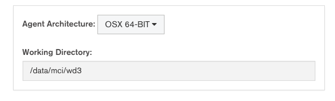

# Static Tutorial

This tutorial will guide you through setting up a static localhost distro called 'localtestdistro', designed for use with [the Evergreen sample project](https://github.com/evergreen-ci/sample). This distro will allow you to run Evergreen tasks on your _local machine_.

This tutorial assumes you've already installed Evergreen, set up your config file, and built the server, runner, and agent binaries.

## Localhost

Every project task must run on a `distro`, an environment for running the agent on. 
Distros can be dynamic cloud machines, or static hosts.
As a way to acclimate yourself to Evergreen's distro configuration, the easiest kind of host to set up is the host you're using to run Evergreen _right now_.

### Your Machine

Before you can use your local machine as an Evergreen distro, you'll have to make sure it meets a few requirements

###### SSH

The user and host you intend to use must be accessible through `ssh`.
You will need a `.pem` file containing your private key, and your public key will need to be added to `.ssh/authorized_keys`.

Once you have your `.pem` file, you must create a reference to it in you Evergreen configuration file, like
```yaml
keys:
    localhost_key: "/Users/myuser/.ssh/myuser.pem"
```

You will probably want to restart your UI server to make sure the `keys` changes to the Evergreen config file to take effect.

###### GitHub
Currently, Evergreen can only access GitHub over ssh, so your GitHub will also need to be configured to accept your user's primary SSH key.
Follow the instructions at https://help.github.com/articles/generating-ssh-keys/ for full details.

### Evergreen Configuration
Now the fun part: let's tell Evergreen how to actually use your local machine.
To set up a distro, navigate to the user dropdown in the top right and select `Distros`.
On the distros page, click the big, green button reading `+ NEW DISTRO` and fill in the following fields.


###### Identifier
This field is how project configuration files will tell Evergreen which distro to run a variant on. In this example, set the identifier to `localtestdistro`.


###### Agent Architecture
Use the dropdown to select the architecture of your current machine.

For Working Directory, we need to establish a path that your localhost user has permissions to write to.
This directory will be created at host startup and is where the Evergreen agent will run and store files.





###### Provider
Use the dropdown to select `STATIC IP/VM`.
This tells Evergreen that we are using an existing machine with a known address, not a cloud provider.

Next, click the `+ ADD HOST` button, and fill in the name of the machine to use.
In this example, you should fill in `localhost`, `127.0.0.1`, or the name of your local machine.


###### User
Fill this is with your machine user.
Evergreen will SSH as this user into the machine you listed above in "Provider."

Now select the SSH Key we set up earlier in the dropdown.


###### Finally

For the purposes of this tutorial, you can skip the SSH Options, Setup, and Expansions fields of the distro page.
Your localhost shouldn't need any additional setup at this time.

Press the `SAVE CONFIGURATION` button to save your new distro.
Now project variants can use the `localtestdistro` distro to run tasks on your local machine.

#### NOTE
Evergreen currently requires all distros referenced in a project config to exist before tasks for that project can be run.
If you are using the Evergreen sample project, you will also need to create a distro called `ubuntu1404-test`.
There will be a separate tutorial for setting up an Ubuntu Amazon EC2 host, but if you just want to run the sample project locally, you can create a new static distro called `ubuntu1404-test` with the same fields as `localtestdistro` so that your project can be executed.


