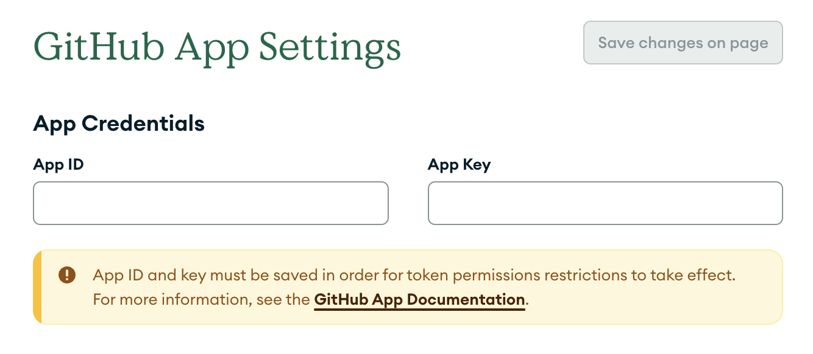

## How to set up a GitHub app

Before you can use the github.generate_token project command (documentation coming soon) you will need to set up the github app in your project settings. This feature is not available on as a [repo-level setting](/Project-Configuration/Repo-Level-Settings), it will need to be set up separately for each project where the command will be used.

If you don't already have a github app, reach out to the IT team for help obtaining one.

## Saving an app id and key

To get started, save your app ID and app Key in your project settings in the GitHub App Settings tab .
