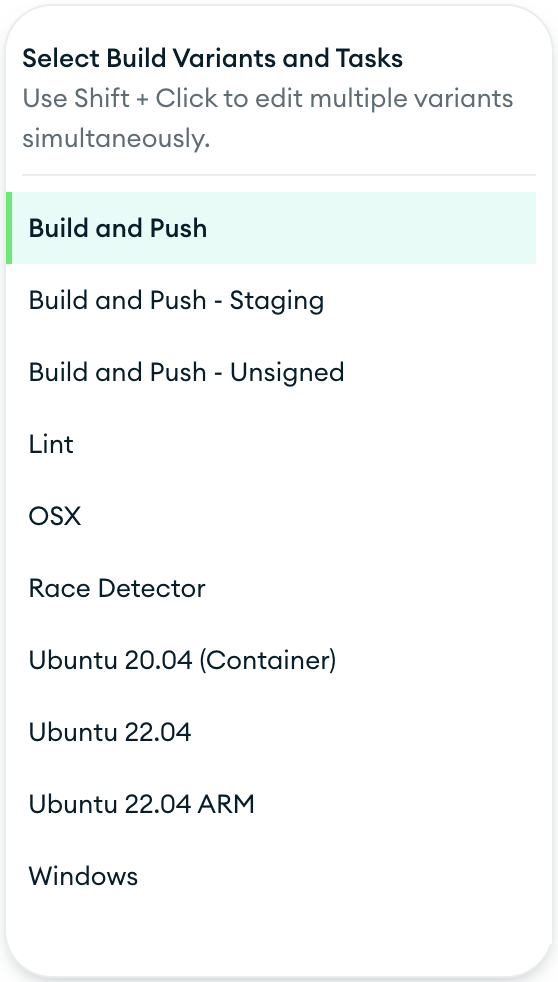
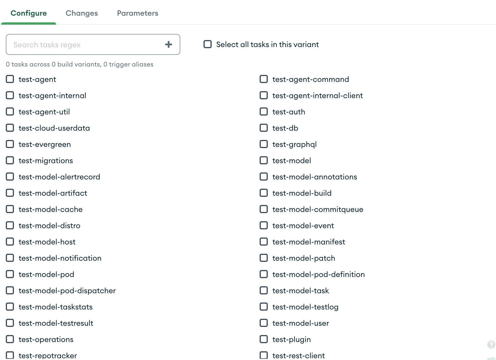

# Patch Configuration

## Overview

The Patch Configure page is where you can configure your patch builds. It is accessible from the [My Patches page](My-Patches) by clicking on a patch that has not yet been configured. The page is divided into several sections.

### Build Variant Selector

The left side panel contains the build variants that are available for the project. You can can select any combination of build variants using `Cmd` + click and `Shift` + click. If you have a task name that is reused across multiple build variants it will automatically be deduplicated in the task panel.

The right side panel contains the tasks that are available for the selected build variant. You are able to select any combination of tasks that meet your testing requirements.

### Configuration tabs

There are tabs at the top that allow you to switch between the different sections of the page. The tabs are:

- **Configure:** the default which contains the tasks that are selectable for the variant, a search bar which allows you to search for tasks by name, a button to **Select All** visible tasks, and a button to **Deselect All** visible tasks.
- **Changes** which shows the files that have been changed in the patch
- **Parameters** which allows you to specify [custom parameters](../Project-Configuration/Parameterized-Builds) to pass into your patch build.
