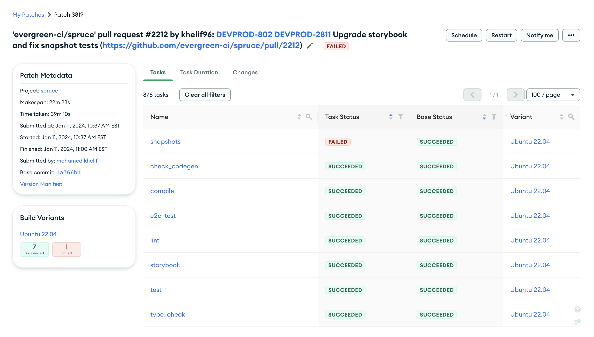
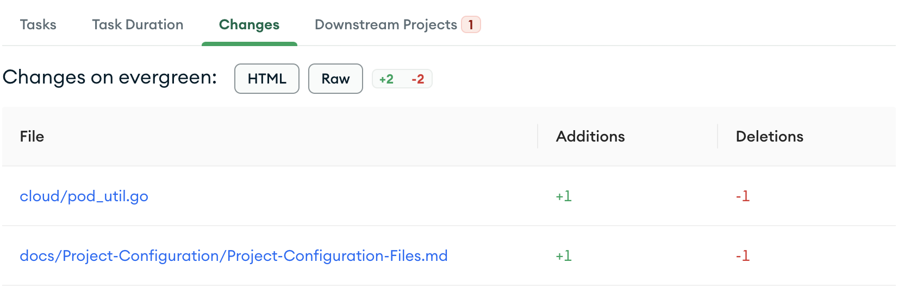
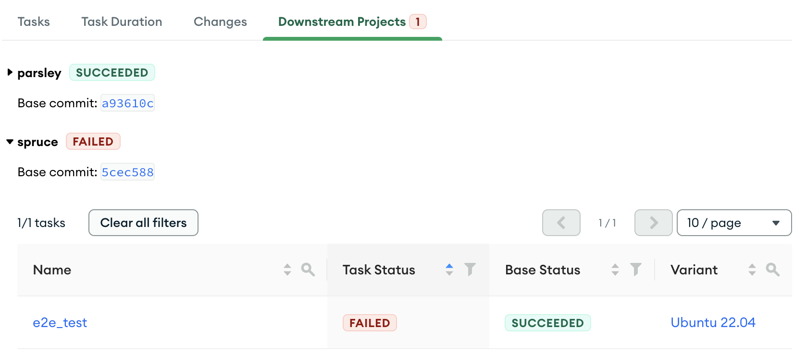

# Version Page

## Overview
The version page contains the run details for a given patch or mainline commit as well as metadata about the run. It also contains the task runs that were created by the version. The page is divided into several sections.

### Task tabs

#### Tasks
The Tasks tab contains a table of all of the tasks that ran in the version. 
* The Task name and a link to the [task page](./Task.md). 
* The Task status. 
* The Base Task status. For mainline commits this is the status of the task on the previous commit. For Patches this is the status of the task on the base commit.
* The Build Variant the task ran on.

#### Task Duration
The Task Duration tab contains a list of all of the tasks that ran in the version and how long they took to run.

 
 #### Changes
 The Changes tab contains a list of all of the files and their diffs that were changed in the patch. 

 *Note: This tab is only visible on patch versions and not mainline commits.*

#### Downstream Projects
The Downstream Projects tab contains a list of all of the projects that were triggered by the version. Note: This tab is only visible if you have [project triggers configured](../Project-Configuration/Project-and-Distro-Settings.md#project-triggers).

