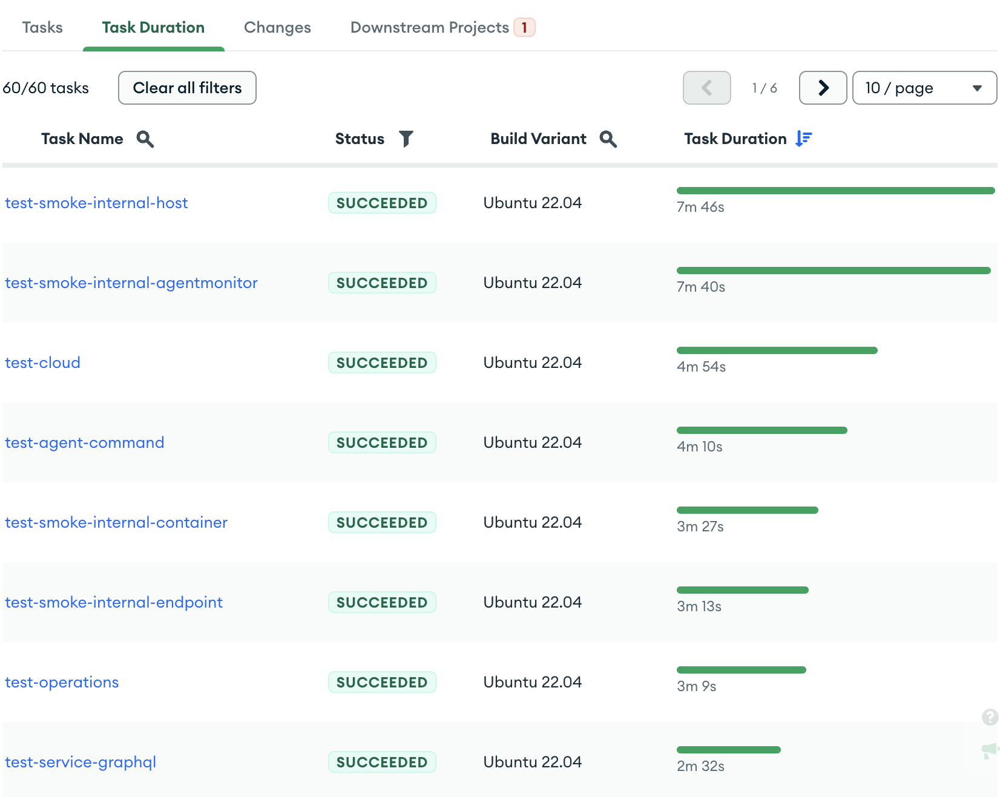

# Version Page

## Overview

The version page contains the run details for a given patch or mainline commit as well as metadata about the run. It also contains the task runs that were created by the version. The page is divided into several sections.

### Task tabs

#### Tasks

The Tasks tab contains a table of all of the tasks that ran in the version.

The table is comprised of the following columns:

- The Task name and a link to the [task page](Task).
- The Task status.
- The Base Task status. For mainline commits this is the status of the task on the previous commit. For Patches this is the status of the task on the base commit.
- The Build Variant the task ran on.

#### Task Duration

The Task Duration tab contains a list of all of the tasks that ran in the version and how long they took to run.

#### Changes

The Changes tab contains a list of all of the files and their diffs that were changed in the patch.

_Note: This tab is only visible on patch versions and not mainline commits._

_Note: This tab will not show diffs for extremely large GitHub PR changes._ If it's a GitHub patch with 300-3000 files
changed, Evergreen will only show the names of files changed but will not be able to offer the full file diffs. For
GitHub patches with 3000+ changed files or with extremely large file diffs, Evergreen will show changed files at all.
The tasks in the patch will still run with the correct set of changes, but you won't be able to view those changed files
in the UI.

#### Downstream Projects

The Downstream Projects tab contains a list of all of the projects that were triggered by the version. Note: This tab is only visible if you have [project triggers configured](../Project-Configuration/Project-and-Distro-Settings#project-triggers).

